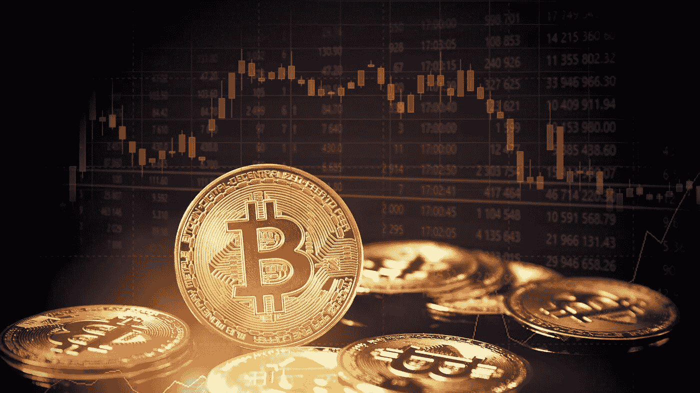

# 假加密货币无处不在，但你能拿它们怎么办？

> 原文：<https://medium.com/geekculture/fake-cryptocurrencies-are-everywhere-but-what-can-you-do-about-them-585d981c4568?source=collection_archive---------5----------------------->

## 比特币和以太坊已经存在了一段时间，但每天都有许多新的硬币冒出来。一个问题是，其中一些可能是假的或欺诈性的。

Image courtesy of [Canva](https://www.canva.com/)

加密货币是当今世界谈论最多的话题之一。

这是一个像比特币一样呈指数增长的话题，自 2008 年首次向公众推出以来，其他加密货币的受欢迎程度和价值都出现了爆炸式增长。

不幸的是，假加密货币无处不在。那么，你能做些什么呢？

我将提供识别假加密硬币的资源，这样你就不会被骗子骗走或者最终得到一文不值的代币。此外，我还会列举一些这类骗局的例子，以便我们从中吸取教训。

好了，我们开始吧。

# 如何识别假加密货币

由于数字资产越来越受欢迎，新硬币和 ico 大量涌入。有这么多新的加密货币项目，投资者很难确定哪些是合法的，哪些是骗局。你可以用很多方法做出这个决定，但是最好的方法之一是阅读他们的白皮书。

加密货币白皮书是一份概述问题、详述解决方案并概述其工作方式的文档。白皮书应该提供证据证明这不仅仅是一个骗局。它还应该足够短，可以一口气读完(几个小时)。

一份好的加密货币白皮书将包括:

*   对项目及其目标进行描述的介绍。
*   对其背后技术的详细解释。
*   参与开发的团队及其资质。
*   在向投资者请求资金后，他们打算如何使用这些资金？
*   颁发什么类型的令牌—是否有 ICO？
*   发行了多少代币？之后谁来保管它们？
*   投资者如何在 ICO 后对代币进行估值的概述。

以下是 protonchain.com XPR 公司的白皮书，作为可信文件的一个例子。

现在，一个想要欺骗投资者的团队会尽最大努力确保很难找到白皮书中提供的信息。优秀的骗子知道他们只有一次机会来讲述他们的故事。

此外，你可以通过书签网站来保护自己，这些网站列出了所有的加密货币骗局，所以在做出任何重大决定之前，一定要使用这些网站。最后，如果你打算投资加密货币，花点时间去做**尽职调查吧！**

这里有几个网站可以帮助你发现加密货币骗局:

1.  经济学— [死亡硬币&失败的 ICOs:资产墓地|经济学](https://nomics.com/deadcoins)
2.  Scam Alert.io — [Scam Alert —加密货币犯罪斗士(scam-alert.io)](https://scam-alert.io/)

总之，加密货币正变得越来越受欢迎。不幸的是，这也意味着那些想利用你在这个领域缺乏经验的骗子只会越来越多。因此，我们不能忽视更常识性的预防措施。

*   如果你不知道自己在做什么，就不要投资或汇款。
*   请熟悉交易是如何运作的，并在冒任何风险之前确保它们是合法的。
*   如果有人看起来好得不像真的，他们可能就是真的！
*   请不要点击可疑链接或下载任何人的文件，除非你 100%确定它们是安全的。
*   最后，永远不要在网上把你的钱包地址给任何人(包括交易所)——即使是另一个加密货币用户！你必须先审查他们！

# 人们最初为什么要创造假的加密货币，他们的首要目标是什么(提示，可能不是钱)

人们出于各种原因创造假加密货币，包括赚钱。然而，主要目标并不总是财务收益。在许多情况下，创作者有更多的不正当意图，并希望通过其他方式获利(如使用他们的货币来利用计算机漏洞)。此外，一些人想要臭名昭著，或者想看看他们是否可以欺骗其他人认为他们的加密货币是合法的。

以下是三种最臭名昭著的加密货币骗局/黑客:

*   比特币储蓄和信托欺诈— [得克萨斯男子因操作比特币庞氏骗局被判刑| USAO-SDNY |司法部](https://www.justice.gov/usao-sdny/pr/texas-man-sentenced-operating-bitcoin-ponzi-scheme)
*   Mt . Gox Hack—【Mt . Gox Hack 的历史:比特币最大的抢劫案(blockonomi.com)
*   Coincheck Hack—[Coincheck Hack 的历史:有史以来最大的抢劫案之一(blockonomi.com)](https://blockonomi.com/coincheck-hack/)

要记住的最重要的事情是，把你的钱托付给一个不值得信任的人或实体从来都不是一个好主意。如果某件事听起来好得不像真的，那么它很可能就是真的！此外，如果有人试图让你相信他们已经发现了下一个比特币，走开！

# 讨论合法加密货币的宝贵资源

检查加密货币的状态是确定其可行性的一个重要方面。最近的开发、更新和社区参与越多，通常情况就越好。看看别人对它的评价是至关重要的。专家和密码爱好者对此有什么看法？这些人有合理的论据吗，还是他们不讲道理？

以下是一些讨论加密货币的来源:

*   拥有超过 300 万会员的 Reddit/r/CryptoCurrency 子论坛！— [加密货币新闻&讨论(reddit.com)](https://www.reddit.com/r/CryptoCurrency/)
*   Quora 上的加密货币信息对话—【quora.com 加密货币
*   脸书的加密货币团体如[加密货币交易和新闻|脸书](https://www.facebook.com/groups/565383300477194)

如果你在这些地方没有看到讨论某个硬币，并不意味着它是不合法的。这只是意味着还没有人对它的优点或缺点进行讨论。

# 结论

要记住的最重要的事情是，把你的钱托付给一个不值得信任的人或实体从来都不是一个好主意。如果某件事听起来好得不像真的，那么它很可能就是真的！此外，如果有人试图让你相信他们已经发现了下一个比特币，走开！同样重要的是，不仅要关注是什么让一枚硬币成功，还要关注它的缺点和潜在的陷阱。投资这种货币有哪些风险？在购买之前，有什么值得考虑的危险信号吗？对于投资者来说，在没有加密货币工作原理的广泛知识的情况下，快速了解的最佳方式是阅读来自知名来源的评论，如新闻网站 [CoinDesk](https://www.coindesk.com/) 或 [CoinTelegraph](https://cointelegraph.com/) 。

此外，积极参与上面列出的加密货币社区。

最后，欢迎来到加密货币的数字世界。这可能是一个危险的地方，所以要小心，保持安全。