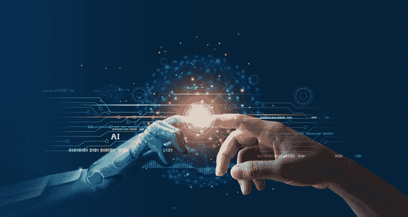

# 人工智能的黑匣子

> 原文：<https://medium.com/geekculture/fake-intelligence-612e6d63a8f2?source=collection_archive---------20----------------------->

人工智能:将人类的思维机械化为机器，并在做决定时消除情感干扰？

*我第一次听说人工智能的时候，我记得我坐在一辆公共汽车上，想知道有人如何能够充分分析人类的思想，以巩固它作为一个物体，并将其置于机器的大脑中。*

Responsible AI?