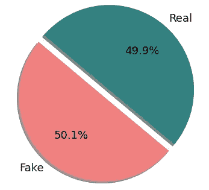
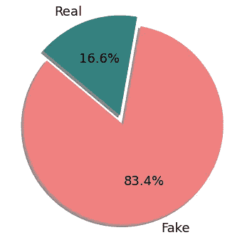
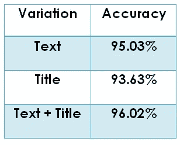
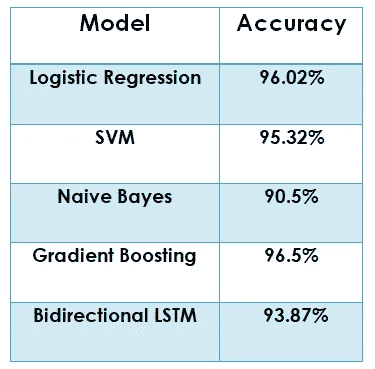
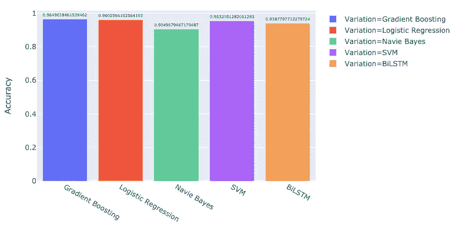

# 基于机器学习和自然语言处理的假新闻检测

> 原文：<https://medium.com/geekculture/fake-news-detection-using-machine-learning-and-natural-language-processing-68e8e485f05d?source=collection_archive---------0----------------------->

假新闻是误导性的新闻故事，来源不可靠，对我们的社会生活有重大影响。假新闻检测是一个新兴的研究领域，它正在引起人们的兴趣，但由于可用资源(即数据集、出版文献)的数量有限，因此涉及一些挑战。

为了确保我们的机器学习模型给出准确的结果，我们需要检查我们训练模型的数据集，即数据集应该无偏地包含相同数量的假新闻实例和真实新闻实例。今天，我们将研究这个问题，并提出一些机器学习算法，这有助于预测新闻是否是假的。

Unbiased Dataset (Good for training the models)

Biased Dataset (Not give accurate results on future data)

因此我们将看到各种机器学习模型的结果，为此我们首先对*无偏*数据集的文本数据应用自然语言处理技术。

# **文本预处理**

对于下面所有的函数，你可以使用像 nltk，re 等’这样的库。

1.  标记化:首先我们创建文本数据的标记。
2.  删除停用词:删除停用词，如“a、an、the、then 等”因为我们知道，这些话对一个新闻是不是假的没有影响或者影响很小。
3.  词干:将单词转换成它的基本形式，例如:将“worked”转换成它的基本形式“work”。

在上述预处理之后，我们可以使用来自 sklearn 库“sk learn . feature _ extraction . text”的 CountVectorizer 类来应用“单词包”特征提取技术。这个类也可以使用单字和双字的组合来构建单词包。为了训练模型，我们使用了这些一元和二元的组合。

我们还应用 RNN(递归神经网络)的变体“双 LSTM”，为此我们将使用“手套嵌入”来将单词转换成它们的嵌入。

# 模型

我们使用的机器学习模型:

1.  逻辑回归
2.  支持向量机
3.  多项式朴素贝叶斯(朴素贝叶斯变体)
4.  梯度推进
5.  双 LSTM(双向长短期记忆)

## 为什么我们选择文本+标题语料库来训练模型？

我们尝试了语料库的多种变体，例如选择新闻标题、新闻正文以及两者。我们使用语料库的所有三个变体来训练逻辑回归( ***LR*** )模型，并且观察到语料库的*文本+标题*组合给出了良好的结果。我们可以从下表中观察到相同的精度:

因此，为了进一步的训练，我们在上述模型上应用了文本+标题语料库，并取得了下表中提到的令人鼓舞的准确性，并且从图中也是可见的:

Table for accuracies on mentioned models

# 结论

使用上述算法，即朴素贝叶斯分类器、支持向量机和逻辑回归、梯度提升和双向 LSTM。获得的最大准确度是使用具有梯度增强分类器的文本+标题。LR 和梯度推进给出了几乎相似的准确性，SVM 和双向 LSTM 稍低，然而，从朴素贝叶斯获得的准确性相对低于其他模型。LR 和梯度提升表现更好，因为我们从语料库中提取的特征被很好地分离，逻辑回归和梯度提升都能够捕捉上下文。

## 链接到源代码:

[https://github.com/VineetMaheshwari/FakeNewsDetection](https://meet.google.com/linkredirect?authuser=0&dest=https%3A%2F%2Fgithub.com%2FVineetMaheshwari%2FFakeNewsDetection)

## 数据集来自 Kaggle 和 [Codalab 的比赛](http://constraint-shared-task-2021.github.io/)

 [## 假新闻

### 建立一个系统来识别不可靠的新闻文章

www.kaggle.com](https://www.kaggle.com/c/fake-news/data) 

## [竞赛链接(包含我们使用的数据集)](http://competitions.codalab.org/competitions/26655#participate)

# **博客作者和投稿:**

**Deepankar Kansal**([linkedin.com/in/deepankar-kansal-255911152](https://www.linkedin.com/in/deepankar-kansal-255911152)):文献调查，词袋的 Unigram & Bigram 组合，逻辑回归，多项朴素贝叶斯，报告&模型分析。

**维尼特·马赫什瓦里**([linkedin.com/in/vineet-maheshwari-9117b3180](https://www.linkedin.com/in/vineet-maheshwari-9117b3180)):文献调查，数据集处理，SVM，手套+比-LSTM，报告&模型分析。

**帕拉克提瓦里**([linkedin.com/in/palak-2810-tiwari](https://www.linkedin.com/in/palak-2810-tiwari)):文献调查、文本预处理、梯度提升、数据&结果可视化、报告&模型分析。

# 在的指导下

1.  教授:linkedin.com/in/tanmoy-chakraborty-89553324
2.  教授网站:[faculty.iiitd.ac.in/~tanmoy/](http://faculty.iiitd.ac.in/~tanmoy/)
3.  助教:Ishita Bajaj 女士
4.  助教:Pragya Srivastava、Shiv Kumar Gehlot、Chhavi Jain、Vivek Reddy、Shikha Singh 和 Nirav Diwan。

# **参考文献**

1.  圣乔治·格拉瓦尼斯、雅典娜·瓦卡利、康斯坦丁诺·迪亚曼塔拉斯、帕纳吉奥蒂斯·卡拉戴斯，“线索背后:假新闻检测的基准研究”，应用专家系统第 128 卷，2019 年 8 月 15 日，第 201-213 页。
2.  Kushal Agarwalla，Shubham Nandan，Varun Anil Nair，D. Deva Hema，“使用机器学习和自然语言处理的假新闻检测”，国际近期技术与工程杂志(ij rte)ISSN:2277–3878，Volume-7，Issue-6，2019 年 3 月。
3.  Shlok Gilda，“评估假新闻检测的机器学习算法”，IEEE 第 15 届学生研发会议(已评分)，2017 年 12 月，第 110–115 页。
4.  名词（noun 的缩写）K. Conroy，V. L. Rubin，Y. Chen，“自动欺骗检测:发现假新闻的方法”，《信息科学与技术协会学报》，第 52 卷第 1 期，第 1–4 页，2015 年。