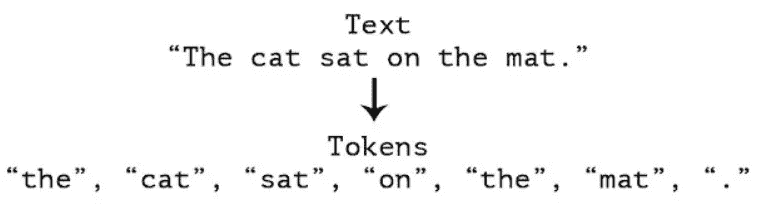
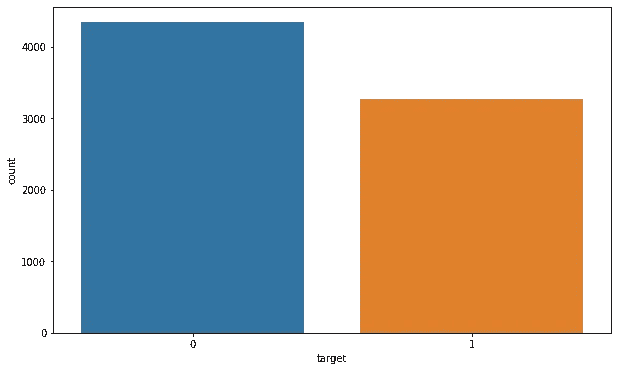
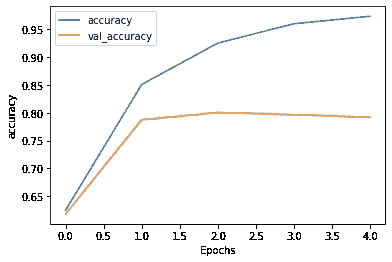
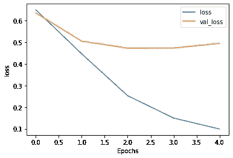

# 假的还是假的？推特灾难推文

> 原文：<https://medium.com/geekculture/fake-or-not-twitter-disaster-tweets-f1a6b2311be9?source=collection_archive---------17----------------------->

## 使用 NLTK & TensorFlow 实现自然语言处理的初学者指南

Photo by [NOAA](https://unsplash.com/@noaa?utm_source=medium&utm_medium=referral) on [Unsplash](https://unsplash.com?utm_source=medium&utm_medium=referral)

推特已经成为紧急时刻的重要沟通渠道。智能手机的邪恶使人们能够实时宣布他们正在观察的紧急情况。正因为如此，越来越多的机构对有计划地监控 Twitter 感兴趣(即救灾组织和新闻机构)。

但是，人们并不总是清楚一个人的话是否实际上是在宣布一场灾难。以下程序有助于以编程方式识别一条推文是否传达了灾难信息。

在我们建立模型之前，理解 **NLP(自然语言处理)**中的一些概念是很重要的

*   **应用正则表达式**
    在我们通过应用 NLTK 开始“文本”处理之前，我们需要从文本中删除与分析无关的垃圾字符，如 https，www，！" #$% & '()*+，-。/:;< = >？@[\]^_`{|}~…etc.请参考下面的链接来理解你需要知道的关于使用 Python 的正则表达式的所有内容

 [## Python 中的正则表达式-您需要知道的一切| Python 工程师

### 正则表达式(REs，或 regexe，或 regex 模式)是匹配文本模式的强大语言。可能…

www.python-engineer.com](https://www.python-engineer.com/posts/regular-expressions/) 

如果你正在学习“文本”预处理，下面的备忘单也会有所帮助。这些助手功能非常方便

 [## Cheatsheet -文本助手函数😍

### 使用 Kaggle 笔记本探索和运行机器学习代码|使用来自多个数据源的数据

www.kaggle.com](https://www.kaggle.com/raenish/cheatsheet-text-helper-functions) 

*   **实现‘停用词’
    停用词**是对句子没有太大意义的英语单词。它们可以被安全地忽略，而不会牺牲句子的意义。例如，像 the，he，have 等这样的词。这样的词已经被捕获到这个名为语料库的语料库中。Stopwords 是一个带有 NLTK 的子库，可以使用`from nltk.corpus import stopwords`导入
*   **标记化** 标记化是将原始文本分割成小块。记号化将原始文本分解成单词和句子，称为记号。这些标记有助于理解上下文或开发 NLP 的模型。标记化有助于通过分析单词的顺序来解释文本的意思。

Source:[Manning](https://freecontent.manning.com/deep-learning-for-text/)

*   **填充序列** `pad_sequences`用于保证一个列表中的所有序列长度相同。默认情况下，这是通过在每个序列的开头填充`0`来完成的，直到每个序列与最长的序列具有相同的长度。我们将在下面的代码中看到填充序列的实现。你可以在这里详细阅读

 [## 可变长度输入序列的数据准备-机器学习掌握

### 深度学习库假设你的数据是矢量化的表示。在可变长度序列的情况下…

machinelearningmastery.com](https://machinelearningmastery.com/data-preparation-variable-length-input-sequences-sequence-prediction/) 

# 目录

1.  [关于数据集](#90aa)
2.  [数据预处理](#6721)
3.  [探索数据分析](#87b6)
4.  [自然语言处理](#40e4)
5.  [停用词](#82f1)
6.  [培训和验证](#3c81)
7.  [结果](#d0f7)
8.  [预测](#a7dc)
9.  [总结](#b43e)
10.  [未来工作](#61d4)
11.  [参考](#f49d)

# №1:关于数据集

训练和测试集中的每个样本都有以下信息:

*   一条推文的文本
*   那条推文中的一个关键词(虽然这可能是空白的！)
*   发送推文的位置(也可以是空白的)

我在预测一条推文是否是关于一场真正的灾难。如果是，预测一个 1。如果没有，预测 0。

[转到目录](#cea4)

# №2:数据预处理

导入所有必需的库

从 Kaggle 下载数据集

解压缩文件并将其移动到 Train 文件夹

访问少量样本记录

[转到目录](#cea4)

# №3:探索性数据分析

因此，现在我们将通过探索性的数据分析，从推文中获得见解。我们的目的是将本次会议分成几个主题，以便我们可以探索每个主题的图形。

## 标签分发

标签似乎是均匀分布的

[转到目录](#cea4)

# №4:自然语言处理

## 为“文本”处理实现正则表达式

我们构建了一个助手函数来清除文本中的 URL 和标点符号

对文本列实现助手功能

[转到目录](#cea4)

# №5:停用词

前面我们简要地学习了停用词，让我们看看它在使用 NLTK 库的文本数据上的实现

在“文本”列上应用助手功能

[转到目录](#cea4)

# №6:培训和验证

## 训练和分裂

我们将数据分为训练集和验证集

让我们来看看火车句子

## 标记化

单词标记化是将大量文本样本拆分成单词的过程。我们在文章的开头简要讨论了这一点。

“测试序列”方法将句子转换成数字序列

## Pad 测序

因为不是所有的句子都是相等的，所以我们必须在将它传递给模型之前添加填充以确保对称性

“截断”选项确保句子中超过 max_length 的任何额外单词都被删除

在我们将数据传递给 Tensorflow 之前，需要将其转换为 numpy 数组

## 使用 TensorFlow 库建立和训练模型

[转到目录](#cea4)

# №7:结果

Model Results

虽然我们能够达到很好的精确度，但很明显，模型过度拟合了数据。

[转到 TOC](#cea4)

# №8:预测

训练模型的样本预测

[转到目录](#cea4)

# №9:摘要

*   我们从 Kaggle 下载了 Twitter 灾难数据集
*   我们运行了数据预处理和 EDA。
*   实现了正则表达式过滤掉加工数据。
*   实现了停用词。
*   我们在应用标记化和填充序列之后训练该模型。
*   对结果进行评估，得出模型过拟合的结论。

[转到目录](#cea4)

# №10:未来的工作

*   我们可以收集更多的数据来解决过度拟合问题。
*   通过添加 dropout 来重新运行模型，以查看性能是否有所提高。
*   实施单词袋、TF-IDF 等技术来提高模型性能，以克服过度拟合。
*   进一步简化神经网络。

[转到目录](#cea4)

# №11:参考

*   [https://www.python-engineer.com/posts/regular-expressions/](https://jovian.ai/outlink?url=https%3A%2F%2Fwww.python-engineer.com%2Fposts%2Fregular-expressions%2F)
*   [https://www.tensorflow.org/](https://jovian.ai/outlink?url=https%3A%2F%2Fwww.tensorflow.org%2F)
*   https://www.youtube.com/watch?v=fNxaJsNG3-s&ab _ channel = tensor flow
*   [https://www.youtube.com/watch?v=A9QVYOBjZdY&list = plqy 2h 8 rroyvzdbluzkbudp-mfqzwnmu 4s&index = 5&ab _ channel = tensorflowtensorflowelled](https://jovian.ai/outlink?url=https%3A%2F%2Fwww.youtube.com%2Fwatch%3Fv%3DA9QVYOBjZdY%26list%3DPLQY2H8rRoyvzDbLUZkbudP-MFQZwNmU4S%26index%3D5%26ab_channel%3DTensorFlowTensorFlowVerified)
*   您可以在这里访问和执行完整的笔记本

 [## hargurjeet/NLP-Twitter-灾难-tweets - Jovian

### 在 NLP-Twitter-灾难-tweets 笔记本上与 hargurjeet 合作。

jovian.ai](https://jovian.ai/hargurjeet/nlp-twitter-disaster-tweets) 

[转到目录](#cea4)

我真的希望你们能从这篇文章中学到一些东西。随意👏如果你喜欢你所学的。如果有什么需要我帮忙的，请告诉我。