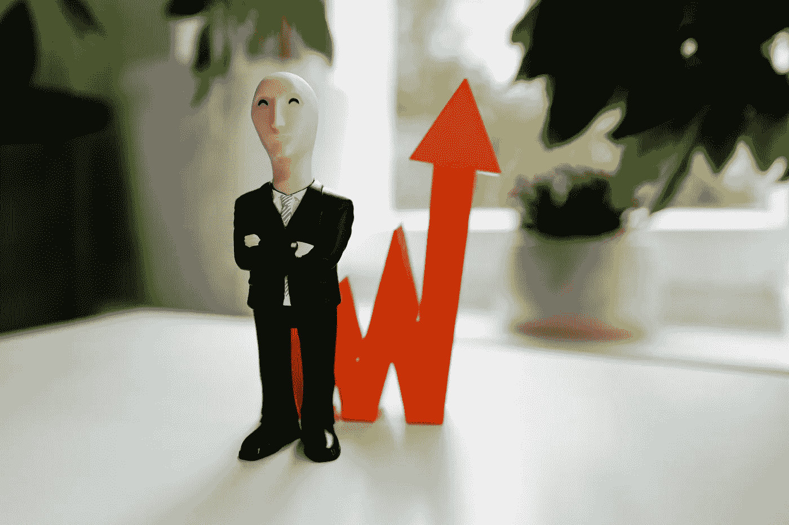

# 假的特斯拉、苹果、网飞股票都在区块链上——但不是你想的那样

> 原文：<https://medium.com/geekculture/fake-tesla-apple-and-netflix-stocks-are-on-the-blockchain-but-its-not-what-you-think-c197f9f4892?source=collection_archive---------18----------------------->

Photo by [Gilly](https://unsplash.com/@gillyberlin?utm_source=unsplash&utm_medium=referral&utm_content=creditCopyText) on [Unsplash](https://unsplash.com/s/photos/meme-stocks?utm_source=unsplash&utm_medium=referral&utm_content=creditCopyText)

在过去的一年里，特斯拉( [mTSLA](https://coinmarketcap.com/currencies/mirrored-tesla/) )、苹果([maapp](https://coinmarketcap.com/currencies/mirrored-apple/))和网飞( [mNFLX](https://coinmarketcap.com/currencies/mirrored-netflix/) )股票的合成版本已经开始在区块链交易。正式名称为加密合成资产，这些“共享”是由利用特定区块链项目(如 Synthetix 和 Mirror)提供的基础设施的用户实现的