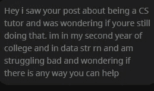
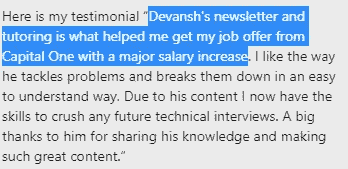
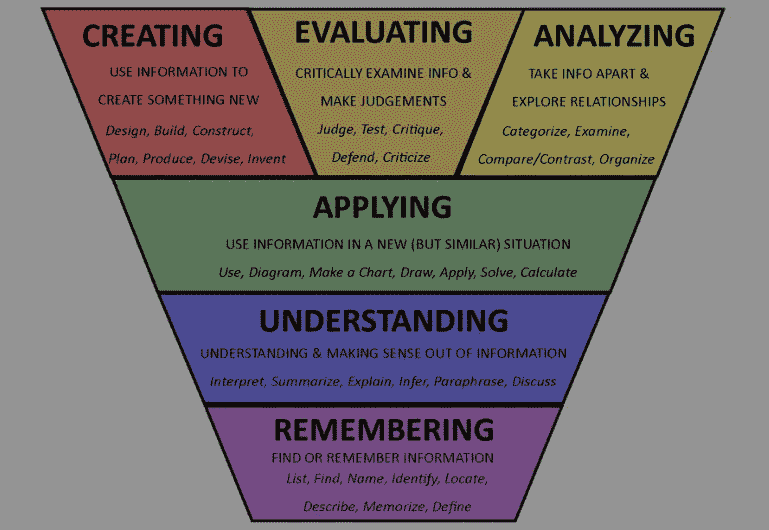
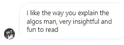

# 爱上计算机科学为了 MAANG 面试和 CS 课

> 原文：<https://medium.com/geekculture/fall-in-love-with-computer-science-for-maang-interviews-and-cs-classes-15a2c8507bf?source=collection_archive---------10----------------------->

## 如果你正在努力学习 CS 理论，请阅读这篇文章。

为了帮助我了解您[请填写此调查(匿名)](https://forms.gle/7MfQmKhEhyBTMDUD7)

我想分享一个学生向我伸出援手的故事。他有一个非常直接的开场白-

I know that a lot of people struggle with theoretical algorithms. My newsletter changes that.

我经常收到这样的信息。许多人在他们大学的第二/第三年学习理论计算机科学课程，并真正为他们所学的东西而奋斗。像有限状态机、确定性自动机、乔姆斯基范式等概念看起来都是随机的*。*

I bet I triggered some serious trauma for some of you just by mentioning those terms.

或者你是一名软件工程师，正在准备 Leetcode 风格的面试。你一直忙于生活、工作和家庭责任。浏览和研究所有这些数据结构和算法是势不可挡的。尤其是网上那么多信息，你甚至不知道去哪里。不要曲解，计算机科学理论是一门很难学习的学科，即使你有一个清晰的计划和资源。

一个我自己大学经历的趣事。大学二年级的时候，我们要上一门叫做“计算机科学理论导论”的课。开学第一天，我们班的学生比座位还多。到最后，我们有足够的空间分开坐一个座位。这就是退出那门课程的人数。许多人选择完全放弃计算机科学，包括我的一个朋友。我的大多数订户都是工作专业人士，但我相信你们所有人都曾为理论计算机科学而奋斗过。

在这篇文章中，我将分享我是如何帮助许多学生真正理解这些想法并学会**喜欢它们**(是的，这是可能的)。与流行的观点相反，理论知识是赢得面试的必备条件。你可以花几个月的时间练习 300 多个 Leetcode 问题。或者你可以花几个小时学习理论，用 75 个问题来赢得面试。想想区别。

Everything I share with you is backed up by results.

# 为什么人们会纠结于理论计算机科学

一个很好的问题。毕竟，好的诊断先于好的治疗。答案比你想象的要简单得多。简单地说，这是因为他们无法理解他们所学内容的背景。他们的课程内容会谈到这些想法，有时会简单地涉及这些想法的应用。但仅此而已。这些想法是如何产生的背景很少被赋予任何分量。无论学生在理论 CS 课程中做得多好，他们都不会查看他们的代码编译，也不会想到 Backus–Naur 形式，该语言的开发人员可能会使用它。

大学/教科书能够逃脱惩罚，因为他们可以争辩说他们有一个课程计划。因此，个别课程可以专注于其特定的课程，并让其他一些教授处理其他观点。然而，虽然这允许他们教你更多的东西，但它严重阻碍了你在不同想法之间建立联系的能力，以及实际上看到问题如何有用的能力。这个问题不仅在计算机科学中很突出，在数学等其他理论领域也很突出。下一次你听到有人说，“像三角函数、微积分和线性代数这样的想法是没有用的”，记住这篇文章。这是完全相同的问题，**人们学习事实和理论，而不是问题的解决方案**。

# 我们如何改变这种情况？

是时候告诉你我们如何改变这一切的秘密了。我如何让那些一听到正则表达式就做噩梦的人爱上图灵机？答案比你想象的要简单。但这可能不是你所期待的。

你能做的第一件也是最重要的事就是放慢脚步。不要试图在一两个月内学会这些。罗马不是一天建成的，试图在短时间内把你需要的东西都塞进去只会适得其反。当然，你将能够学到很多事实，但这对于在任何地方利用它们都没有太大的帮助。如果你花了很多时间学习关于图的基本知识，但当你尝试任何图的问题时都失败了，你已经知道我在说什么了。

这就是你如何解决这个问题。花更多的时间学习基础知识。当你遇到一些想法时，试着去阅读它的发展历史。思考为什么一个特定的想法/框架是强/弱的，以及变体是如何调整属性的。这会让你的整个过程慢很多。然而，你会发现你的学习质量在飙升。为什么？

# 学习水平

信不信由你，学习是有层次的。他们生来并不平等。走得越高，学得越深。你学得越深，你就越有可能在压力较大的情况下(面试、工作等)记住它，并在不明显的背景下发现一个想法的效用([还记得我们昨天如何谈论掌握吗](https://codinginterviewsmadesimple.substack.com/p/nextjs-?r=4tnbw&s=w&utm_campaign=post&utm_medium=web)？).

大多数人停留在记忆和应用上。他们偶然发现想法，在某些环境中测试它们，然后继续前进。如果您只关心表面级别的使用，这没问题。然而，当涉及到像理论计算机科学这样的基础信息时，这是一个可怕的想法。它适用于在你的课程中获得 A，然后在两个月内忘记你所学的一切。不是因为知道在混乱和模糊的现实生活中该做什么。

将此与我推荐的方法进行比较。当你学习一个想法背后的历史，强迫自己评估优势和劣势，并试图思考如何发展变体时，你正在进行更高层次的学习。即使你不成功(你可能不会得到全部的范围)，你的学习也会像类固醇一样。

这个帖子到此为止。我将以一句简单的话结束。当谈到这些基本技能时，你最好的选择是追求对知识的掌握。从很多方面来说，这是一个不可能的话题，因为它有无限的深度和宽度。但是，愿意慢慢来，深入了解基础知识会比其他任何事情都更有回报。

以上是我的简讯[中的一段，技术采访变得简单](https://codinginterviewsmadesimple.substack.com/)。更多此类高水平的免费分析，请查看。时事通讯不需要名字，不需要个人信息。只有你的邮件。而且没有垃圾邮件。永远不会。

对于机器学习来说，结合软件工程、数学和计算机科学的基础至关重要。它将帮助你概念化，建立和优化你的 ML。我的每日时事通讯，[Technology interview simpled](https://codinginterviewsmadesimple.substack.com/)涵盖了算法设计、数学、最近的科技事件、软件工程等主题，让你成为更好的开发人员。 [**我目前正在进行全年八折优惠，所以一定要去看看。**](https://codinginterviewsmadesimple.substack.com/subscribe?coupon=1e0532f2)

我创造了[技术面试，使用通过指导多人进入顶级技术公司而发现的新技术，使面试变得简单](https://codinginterviewsmadesimple.substack.com/)。时事通讯旨在帮助你成功，避免你在 Leetcode 上浪费时间。我有一个 100%满意的政策，所以你可以尝试一下，没有任何风险。[您可以阅读常见问题解答并在此了解更多信息](https://codinginterviewsmadesimple.substack.com/p/faqs-and-about-this-newsletter?r=4tnbw&s=w&utm_campaign=post&utm_medium=web)

如果你也有任何有趣的工作/项目/想法给我，请随时联系我。总是很乐意听你说完。

以下是我的 Venmo 和 Paypal 对我工作的金钱支持。任何数额都值得赞赏，并有很大帮助。捐赠解锁独家内容，如论文分析、特殊代码、咨询和特定辅导:

https://account.venmo.com/u/FNU-Devansh

贝宝:[paypal.me/ISeeThings](https://www.paypal.com/paypalme/ISeeThings)

# 向我伸出手

使用下面的链接查看我的其他内容，了解更多关于辅导的信息，或者只是打个招呼。另外，查看免费的罗宾汉推荐链接。我们都得到一个免费的股票(你不用放任何钱)，对你没有任何风险。**所以不使用它只是失去免费的钱。**

查看我在 Medium 上的其他文章。:【https://rb.gy/zn1aiu 

我的 YouTube:[https://rb.gy/88iwdd](https://rb.gy/88iwdd)

在 LinkedIn 上联系我。我们来连线:[https://rb.gy/m5ok2y](https://rb.gy/f7ltuj)

我的 insta gram:[https://rb.gy/gmvuy9](https://rb.gy/gmvuy9)

我的推特:[https://twitter.com/Machine01776819](https://twitter.com/Machine01776819)

如果你正在准备编码/技术面试:[https://codinginterviewsmadesimple.substack.com/](https://codinginterviewsmadesimple.substack.com/)

获得罗宾汉的免费股票:[https://join.robinhood.com/fnud75](https://join.robinhood.com/fnud75/)