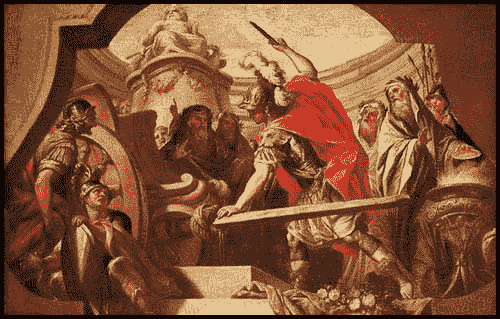

# 著名的脚本小子

> 原文：<https://medium.com/geekculture/famous-script-kiddies-ba568e0fd2cf?source=collection_archive---------0----------------------->

> 没有什么比太多的聪明更可恨的了。

作为我在一家数据安全公司营销工作的一部分，我为我们的博客撰写有新闻价值的违规和黑客事件。这样做一段时间后，你会注意到出现了不太微妙的模式。

不止几起[攻击](https://www.wired.com/2015/12/the-years-11-biggest-hacks-from-ashley-madison-to-opm/)涉及从大型零售商或…