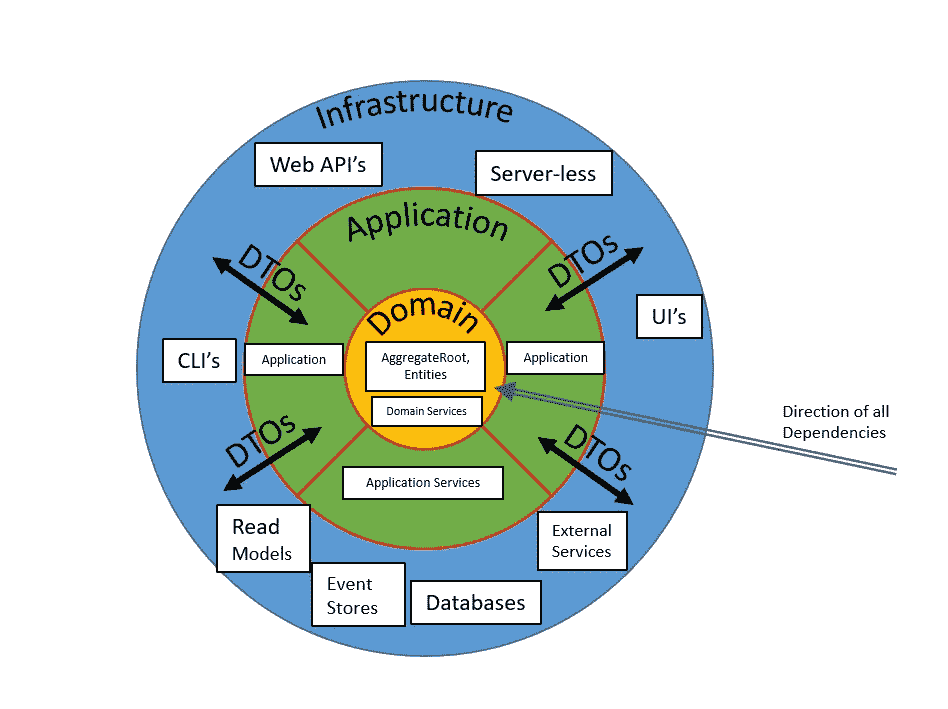

# 幻想建立一个框架？

> 原文：<https://medium.com/geekculture/fancy-building-a-framework-41ff47dcd6be?source=collection_archive---------49----------------------->

The Clean Hexagonal Onion Architecture

你对触发短语“固执己见”框架的反应是什么？

你的意见对我的意见！

这个主题是关于在实际代码中为大型系统定义架构模式的现实(这在软件企业中是很常见的需求，在这种情况下，您试图在许多软件产品/项目中重用所学的模式和实践以获得一些效率)。

这将是许多人熟悉的经历:

我们都见过它们的各种形式，那些很酷的框架，我们中的一些人多年来广泛地使用了它们，所以我们开始了解它们的深奥，错综复杂，以及它们在我们坚持使用它们的几个月到几年中强加给我们的限制和约束。当蜜月结束，我们不再需要它们的时候，它们会变得特别辣，但是一旦它们对我们不忠，我们就无法摆脱它们。最终，好的很少，能持续很长时间的更少。

我们中的许多人已经触及了他们的极限，甚至不得不绕开它们(用显式)。这是大多数程序员都会遇到的一个常见问题。

> 我们爱他们，我们恨他们。

我们中的一些人甚至去找那些框架的作者，恳求他们让我们的特定用例足够重要，以考虑改变他们的框架来适应它。许多人在这个追求上失败了(在许多情况下，非常正确地，没有改变框架，因为它从来没有打算处理他们的用例)。有些人巧妙地成功扩展了它们，世界变得更加美好。

唉。采用第三方框架(开源或专有)是一个普遍问题，似乎持续了几十年。

如果你坚持这项事业，你也可能会把这些尝试(构建一个有用的框架)中的每一个都看作是值得称赞的失败，天哪！对于一些程序员在使用它们时所经历的痛苦，肯定有很多不被欣赏和不缺少的悲伤。

一些程序员甚至将他们自己使用框架的经历和痛苦视为整个行业所有程序员都需要解决的一个普遍问题。天真地追求某种完美做事方式的圣杯。对于一些人来说，这场运动变成了对他们的个人挑战，他们需要定义*终极*框架来解决这种痛苦，这肯定会消除这种不公正，作为副作用，他们将被誉为英雄。唉，这才是他们真正学习的开始。

> 所有的模型都是错的，有些是有用的

Map of the London Underground

事实是，无论你对编程中的任何问题有什么样的心理模型，当你致力于编写一些代码来解决该问题时，你将不得不在实现该模型时做出一些妥协。这是为什么呢？为什么我们不能拥有美好的事物？

A.因为“为什么”所有的模型都是错的！

模型只是一组问题的抽象，它帮助你清楚地理解和描述那些问题。该模型不能准确和精确地定义这些问题中的任何一个的细节，因为这将要求你的模型具有无限的保真度，这将最终汇聚到仅仅描述现实(即没有抽象)。因此，如果你想用一个模型来简化问题，就要预料到它不会捕捉到所有的细节。这在很多情况下都很有用。但是请记住，在编程中:

> 魔鬼总是在细节中

因此，您创建的任何抽象都必须牺牲某些东西来实现有用性，从而实现高可用性。

这需要一些学习，让我告诉你。早在 21 世纪初，我就开始为企业构建大规模的架构框架，我很快认识到，无论我有多勤奋，无论我的抽象有多聪明，无论我测试了多少用例，总有一些边缘情况或用例是我无法在抽象中优雅地处理的。是的，当然，您可以创建扩展点来容纳它们，在许多情况下，您就是这样做的。但是无论你如何精炼你的抽象，它们永远不够好或者不够纯粹。

然后，你的框架有一些抽象，这些抽象必然会损害你的核心设计原则。这些是真正的杀手，因为通常情况下，您的框架的目的之一是减轻某种特定的复杂性/耦合方面，而您显然违反了特定的耦合方面，或者向解决方案添加了更多意外的复杂性，以尝试在您的框架中优雅地实现这一点。

当然，软件中的任何问题，总有解决的办法。

> 创建一个更好的抽象。

我们可以在软件中创建任何我们想要的抽象，这只是你想要容忍多少间接层的问题。对于那些必须使用你的框架的人来说，你可能只是创造了一个无用的怪物，没有人能够理解或者想要理解。太复杂了，没用。

# 那么该怎么办呢？

好吧，如果你以前从来没有做过，你可能不知道这种活动有多难，所以你不太可能同情那些做这种事情的人。你可能会继续认为你自己总是可以做得更好，也许你可以，也许你不会。

但是让我们不要偏离主题，把这变成*“谁是房间里最聪明的人”*类型的解决方案。相反，让我们找到一个更简单实用的解决方案。

Square Peg, Round Hole?

重用框架的真正问题来自于框架中的假设和框架消费者的实际环境之间的不匹配。如果这两件事在每种情况下都能很好地结合，那么这个框架在任何情况下都是完美的。

那么，我们如何实现这一点呢？

只有一个办法。

让我们将该框架构建到您自己的代码库的代码和上下文中。

*   你有你需要的所有代码。它就在那里，你拥有它，你可以改变它。您可以很容易地调试它，并可以看到它是如何工作的。
*   如果您需要了解它做什么和如何做，它就在您的代码库中！没有时髦的调试符号需要设置，也没有反汇编需要挑选。
*   如果它坏了，你可以修理它。没有等待一些项目维护者为你做，也没有合并请求！恳求帮助！自己做就好了。
*   如果它不符合你的背景，那就让它精确地符合你的背景。它将随着使用它的代码的发展而发展。从来没有任何不匹配。

但是有一个主要的警告。

永远，永远，永远不要把框架代码放在一些可重用的包中(比如一组 nu gets/NPM ),并对其进行版本化，以便您可以共享它，并在其他上下文中获得一些共享的好处。为什么不呢？

好吧，如果你的意图是与其他代码库上下文共享框架，那么你只是无意中授权了其他一些可怜的 sole 现在成为该框架的项目维护者——你又回到了起点。(不完全符合您的背景，并游说他们根据您的背景进行更改)。你看到了吗？

> 你能把代码放在一个适合你的环境的可重用包中吗？是的，你当然可以。你可能想这么做。但是，预计版本化和为您的环境维护它的版本将成为您的一个巨大的皮塔饼，并使您走上锁定部署的丑陋道路。但是，这确实意味着您不必每次都用您的代码库重新编译它——如果这在您的环境中是某种重要的优化的话。

# 概括起来

构建在其他环境中重用的框架是困难的。容易提供有用的抽象，节省程序员的时间。很难处理他们不同的背景。让你的框架成为他们的瓶颈和阻碍，改变你的框架以适应他们的特定环境。他们可能会超越你的框架，他们会因此而讨厌你。

构建可用的框架很难。当生产力是目标时，很难保持清晰的抽象(在实际代码中)。您将不得不做出妥协、权衡并应用新的约束来提高效率，并创建人类乐于使用的可用抽象。做得不好，他们会因此而恨你。

构建框架很容易。很容易在你自己的代码库中和你自己的上下文中维护它们。但是抵制分发它们并在其他环境中重用它们的冲动又变得困难了。所以，就别做了。