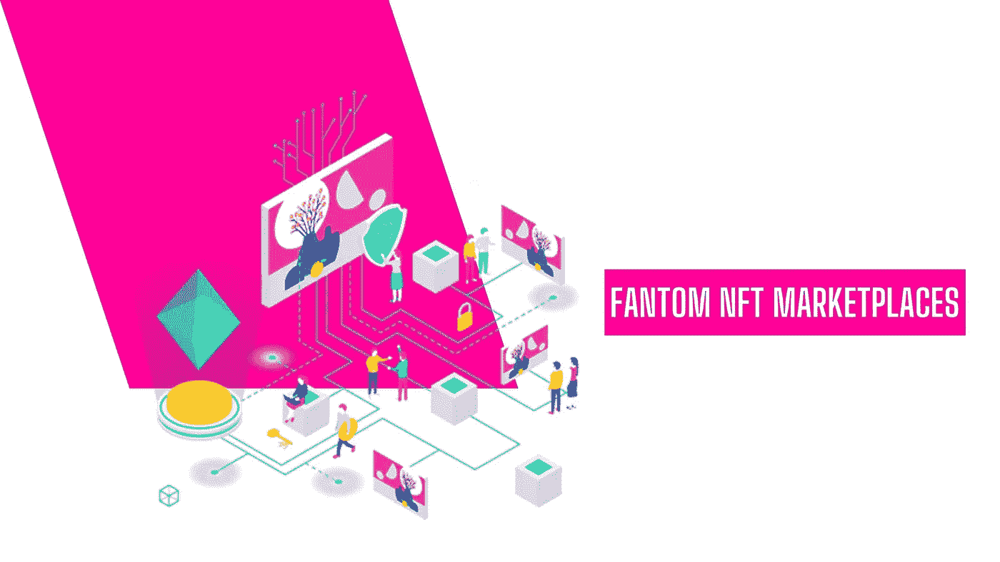

# Fantom NFT 市场- 2022 年

> 原文：<https://medium.com/geekculture/fantom-nft-marketplaces-2022-407f3a4beb33?source=collection_archive---------8----------------------->

**Fantom NFT Marketplaces**

世界正在经历一场入侵，所有的人都开始适应最新的原版。当你听到入侵的时候，你可能会想到“乌克兰战争”。然而，这与那边的行动完全不同。这里的入侵是一种不可替代的令牌，它使人们被数字化。

有许多区块链，而贸易在它们所形成的每一个生态系统中都是例外的。然而，那些试图进入的人有些犹豫。

你可能想知道这是什么？这是由于某些区块链的高汽油费造成的麻烦。但是没有必要担心周围发生的事情。有一点是你应该意识到的独特之处，也可能是最有效的。

欢迎来到 Fantom 的世界，这是一个低成本、高效率、持久的加密货币生态系统。

这篇文章将向你展示目前 FTM 生态系统中一些最好的 Fantom NFT 市场。文章将从定义 Fantom NFT 市场开始。

# Fantom 和 FTM 到底是什么？

Fantom 是一个分布式分类帐网络，它通过采用有向无环图(DAG)来解决区块链的去中心化、可伸缩性和安全性三难问题。Fantom 的网络能够以更快的速度和更低的成本处理交易。它的原生令牌是 FTM。

许多人倾向于了解以太坊、索拉纳和许多顶级区块链的市场。然而，他们不知道的是，一个是给他们最好的结果，在有限的费用。是的，它们是 NFT 的超市。

# 区块链说了什么吗？

在大多数情况下，区块链是分布式账本技术的一个子集。虽然这些区块链代表了这些分类账，但它们确实无法代表可能改变游戏规则的东西。

没错，就是有向无环图，又名 DAG。

这些 Dag 能够解决可伸缩性、分散性和安全性之间的区块链三难问题。

尽管有更多的项目在 DAG 上工作，但 Fantom 是第一个基于 DAG 构建的智能合约平台。

这一点很重要，因为 NFT 市场和分散应用(dApps)是许多受欢迎的区块链变得越来越拥挤并收取高额汽油费的主要原因之一。

因此，一个高效快速的基于 DAG 的解决方案可能正是我们一直在等待的，尤其是在 NFT 球迷中。

有一些你应该知道的 Fantom NFT 市场。让我们开始吧。

# 有八个奇妙的 NFT 市场值得注意。

NFT 市场有两种类型，要么是开放的，要么是封闭的。

一个开放的 NFT 市场允许你带来你自己的 NFT 和智能合约，并把在他们平台上创建的 NFT 输出到其他 NFT 市场。

然而，封闭的 NFT 市场为你提供了与其他平台相同的工具，但是它们阻止你在其他平台上交易你的非交易市场。

只要没有竞争，早期采用者就被鼓励将用户锁定在他们的“围墙花园”中，因为这增加了他们产品的“粘性”。

凡托姆 NFT 市场也是封闭和开放市场的一部分。本文将根据市场的重要性对其进行排名，并重点关注 Fantom 生态系统。

# 目前 Fantom NFT 市场列表:

**1。** [**NFTkey**](https://bit.ly/3LSQUQA)

NFTkey 并不是 Fantom 用户想到的第一个，因为和谐区块链的项目占据了主导地位。它还支持其他生态系统，如以太坊、BSC 和雪崩。然而，它们是 Fantom 项目中大量交易的亚军。主要功能包括:

*   几种上市选择。
*   藏品排名。
*   排序和稀有过滤器。
*   价格的历史。
*   给创作者的版税。
*   2%的佣金。

**2。**

**托丰特被称为 NFT 市场的币安。然而，它们支持着 20 多种不同的区块链生态系统，包括 Fantom。TofuNFT 继续支持 Fantom NFT，尽管它不是一个纯粹的市场。**

**尽管这种策略可能有助于吸引更多用户，从而增加整体流动性，但大多数人倾向于坚持一个 NFT 生态系统。**

**如果你想交易 Fantom NFTs，这可能是一个很好的套利机会。它们的重要功能包括许多列表选项、收藏排名、NFTs 验证、launchpad 和 0-5%的费用结构。**

****3。** [**AirNFTs**](https://www.airnfts.com/)**

**AirNFTs 可以被认为是名单上的最后一个平台，因为它不仅是一个 Fantom NFT 市场，也是一个多链 NFT 市场。它支持 BSC、Fantom 和 Polygon，但受 BSC 项目支配。他们的核心目标之一是用户体验，这并不奇怪，因为他们的网站是如此的光滑和干净。重要的功能包括**

*   **几个列表选项**
*   **一键铸造**
*   **移动应用程序**
*   **NFT 验证**
*   **发射台**
*   **$AIRT 本地令牌，带标桩**
*   **2.5%的服务费**

****4。****

****Fantom NFT 市场 Ovre 是第一个服务于 FTM 生态系统的市场。然而，它受到了基金会市场界面的启发。他们显然想创造一种更具策划性的艺术体验，这通常需要更多一点的简洁和美感。然而，除非你是一个真正的艺术家，否则避免使用 Ovre，因为你必须先填写艺术家申请表。它的功能包括基本列表选项和一个关注质量的市场。****

******5。** [**ZooPet**](https://pet.zoocoin.cash/explore)****

****Zoopet 是一个顶级的 Fantam NFT 市场，而 Ovre 市场是由 Zoopet(Zoocoin)的创造者提供支持的。动物园是一个建立在 Fantom Opera 网络之上的分散式应用生态系统。他们也有自己简单的 NFT 市场，尽管 Fantom 的用户需要购买新的代币，因为这是一个 NFT 市场。交易是用本地动物园代币进行的。这些功能包括多个列表选项、铸造工具、验证收藏和艺术家小费。****

******6。Syfin******

****Syfin 是最好的 Fantom NFT 市场，它是一个更大的产品生态系统的一部分，类似于一个 Zoopet。这里的重要挑战是，在本地硬币中交易的东西是 NFT，它是 Syfin 生态系统的一种货币。****

****重要的功能包括基本的列表选项。****

******7。油漆交换******

****它最初是作为 Fantom 网络的 DeFi 平台启动的。然而，他们确实有自己的 Fantom NFT 市场，具有令人兴奋的功能。而且，需要注意的是，搭建 DeFi 平台的人和理解创作者的人并不一样。这就是为什么功能在网络上受到限制。这些功能包括基本的列表选项、独家铸造工具、IPFS 存储、创作者版税、原生 token $BRUSH with staking 以及 2.5%的佣金。****

******8。Artion******

****因为 Artion 来自 Fantom 网络的原始创建者，所以它可能是最受欢迎的 Fantom NFT 市场。****

****然而，它并不是功能最丰富的市场，看起来也没有太多的发展。****

****更好的是，它是一个零费用的平台，这意味着 Artion 不会在你做一笔交易时向你收取任何费用。****

****这也可能是开发该平台缺乏动力的主要原因。重要的功能基本选项的清单和工具的铸币，重要的是，没有服务费。****

## ******结论******

****重要的是，Fantom 的存在是为了解决区块链面临的挑战。但是他们没有被考虑。Fantom 也是 NFT 的顶级市场，运营效率更高，费用更低。在这里，你可以开始用合适的资源创建你的 NFT 市场，成为神秘世界的一部分。NFT 市场是未来，他们已经以各种形式进入市场。****