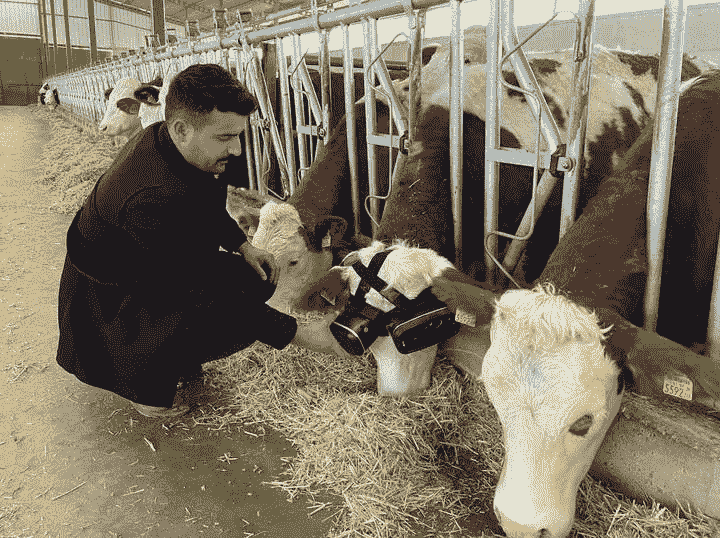

# 农民给奶牛虚拟现实耳机以增加牛奶产量

> 原文：<https://medium.com/geekculture/farmer-gives-cows-vr-headsets-to-increase-milk-production-83f26ebc51de?source=collection_archive---------13----------------------->

## 元宇宙有动物生存的空间吗？

Farmer setting up the VR Headsets on Cow’s head (Source: [Twitter](https://twitter.com/anadoluajansi/status/1479097926597189636?ref_src=twsrc%5Etfw%7Ctwcamp%5Etweetembed%7Ctwterm%5E1479097926597189636%7Ctwgr%5E%7Ctwcon%5Es1_&ref_url=https%3A%2F%2Fmetro.co.uk%2F2022%2F01%2F07%2Ffarmer-gives-cooped-up-cows-vr-headsets-to-increase-milk-production-15880604%2F))

所有行业都在实施技术，一些农民非常欣赏虚拟现实为提高农场效率带来的可能性。一名土耳其农民发布了一段展示他的一只奶牛的视频后，他的推特迅速走红