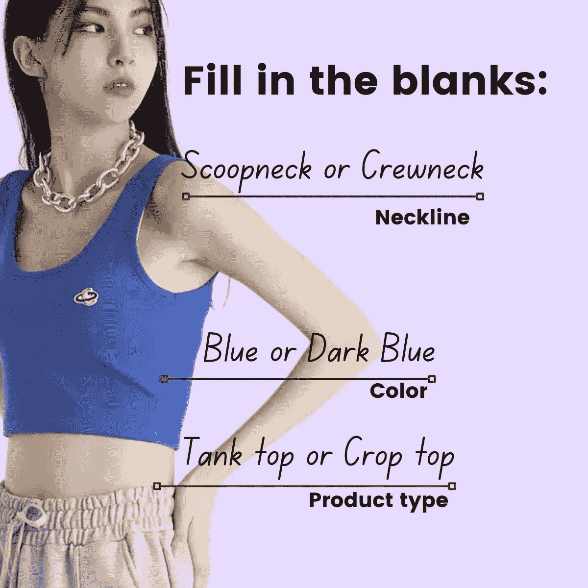
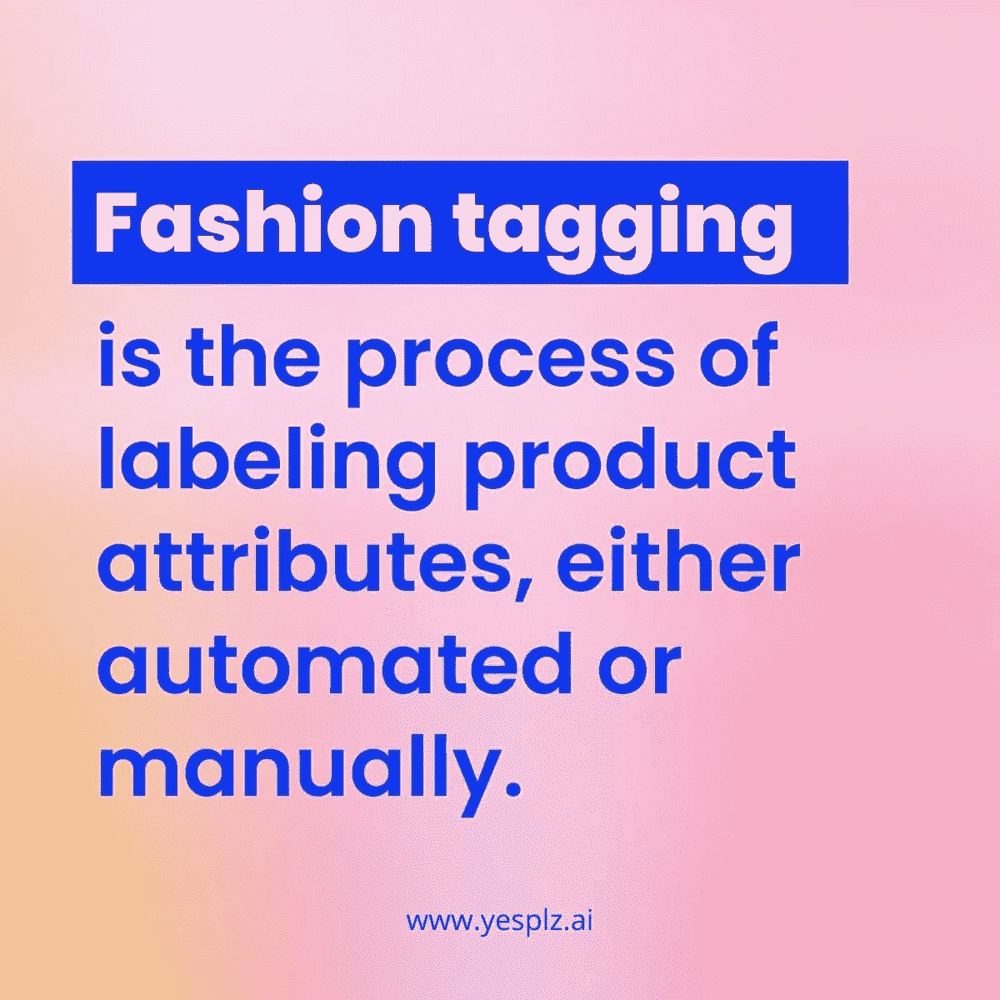
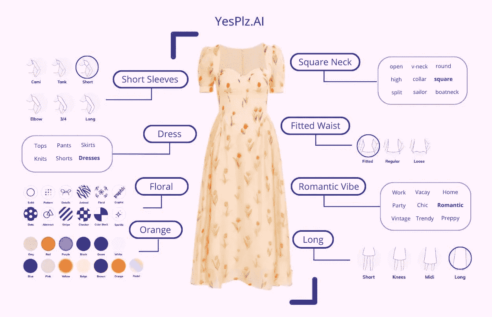
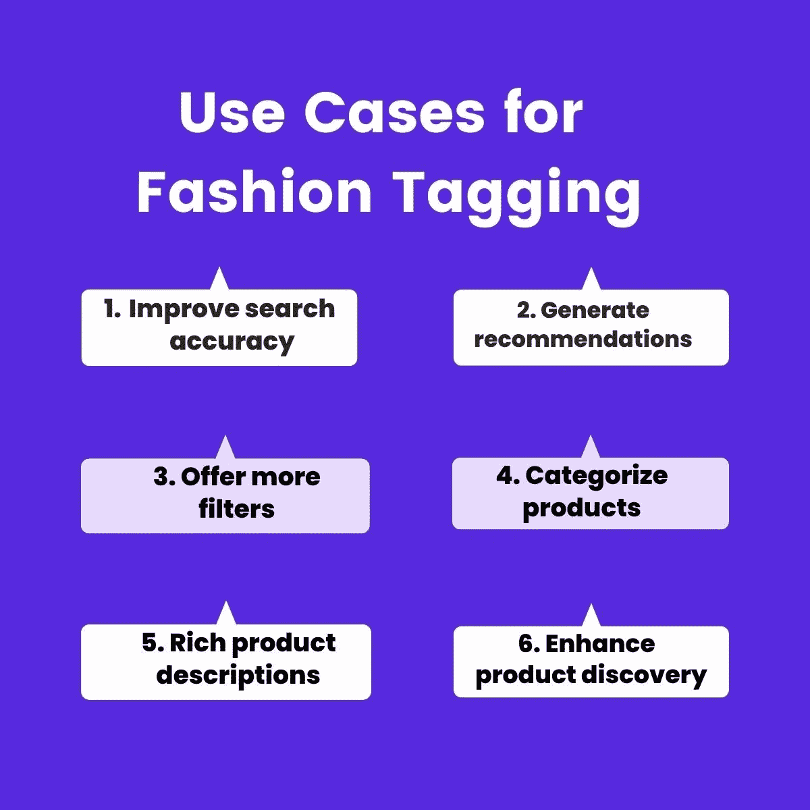
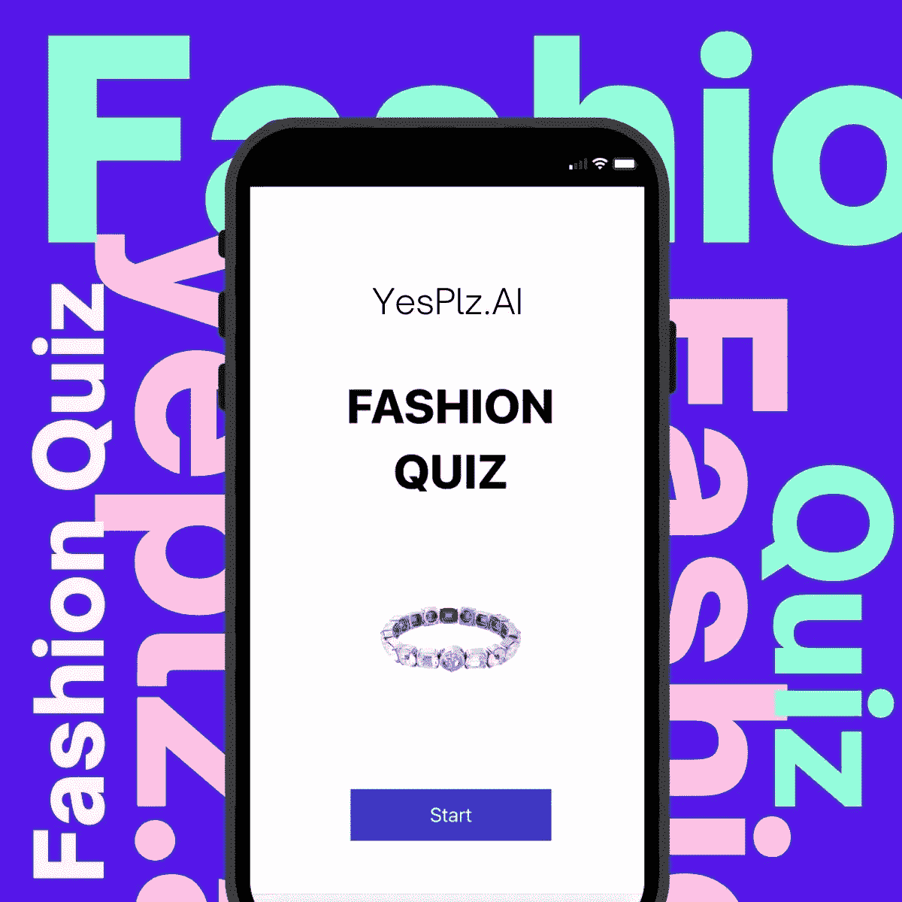

# 2022 年时尚标签必备

> 原文：<https://medium.com/geekculture/fashion-tagging-essentials-for-2022-e0c51f3311bb?source=collection_archive---------14----------------------->

您如何描述上述产品类型、颜色和领口？

“时尚标签”这个词经常会引起疲惫的电子商务经理的本能反应，他们被要标记的产品属性的数量所淹没，对不准确的技术感到沮丧，对标记(无论是手动还是自动)所需的时间感到不耐烦。

时尚标签不需要成为你的电子商务的致命一击——事实上，它可以打开所有类型的个性化体验的大门。清楚地了解它是什么以及标记解决方案之间的差异后，您将能够更好地找到最佳的标记解决方案，而不会感到沮丧、不耐烦或不知所措。

在本指南中，YesPlz 将带你了解时尚标签的基本要素，从它对购物者体验的影响到更多。请将本指南收藏起来，我们会不断更新最新的新闻和信息。

# 时尚标签的要素:

时尚标签(或产品标签)是自动或手动标注产品属性的过程。一件白色 t 恤可以有 20 到 60 种不同的产品属性，包括合身、款式、颜色、长度，甚至场合(后面会有更多介绍)。虽然一开始手动标记这些产品属性可能是可以管理的，但库存的绝对数量和体积使得这种做法从长期来看是不可持续的。

而且，人类(不可避免地)容易出错。即使是最细心的产品标签员也会笨手笨脚，把圆领误认为圆领。除了错误，[复杂的分类法](https://yesplz.ai/resource/demystifying-fashion-taxonomies-what-do-customers-really-want.html)导致我们每个人对产品给出不同的术语——一双“中跟”对一个人来说可能是另一个人的“低跟”。然后，加上主观性的问题:一件“工作”服装也可以是一件“白天”的服装，这取决于人的标签。

来自供应商的第三方产品信息也充斥着不一致和不准确的标签——这取决于他们自己对术语的定义。

手动产品标签难以跟上分类、人为错误和大量产品，导致零售商的产品目录杂乱无章。对于购物者来说，这意味着糟糕的搜索结果，导致错过转化和购物者满意度低。

产品标签的最大挑战是保持大量产品的准确性。

# 为什么时尚人工智能很重要

手动标记的替代方法是自动标记(也称为技术支持)。然而，每个自动标记工具背后不一定有相同的人工智能。

当我们讨论“产品标签”时，[我们指的是](https://yesplz.ai/resource/fashion-ai-dictionary.html):

计算机视觉:一种人工智能，反映了人类视觉识别和处理信息的复杂方式。这是人工智能时尚标签背后的驱动力，因为它可以分析和解释图像。

**自然语言处理(NLP):** 人工智能的一个分支，专注于创造让计算机理解文本和语音的方法，就像人类一样。自然语言处理有助于解释产品的文本信息。

理想的人工智能标签解决方案可以识别以下产品属性:

-所有类型的图像质量

-用户生成的内容和专业照片

-有和没有人体模型的照片

-文本信息，如产品标题和元数据

但是，正如许多技术评论家可能指出的那样:人工智能在实现产品标签方面可能不够完美。这是真的:技术只能在一定程度上有所帮助。

这就是人类的用武之地:人工智能将不可避免地得出错误的推论——这没关系。因为，理想情况下，受过时尚训练的专家会在那里纠正和训练人工智能。

在 YesPlz AI，我们拥有一切:[时尚标签，包括计算机视觉、自然语言处理和真人专家](https://yesplz.ai/resource/image-tagging.html)——为您的电子商务创建完美的产品标签解决方案。

# 自动化时尚标签有多快？

电子商务营销团队的一个常见异议是，时尚标签解决方案可能需要太长时间，所以他们仍然喜欢手动标签，知道有些结果会不准确。

在选择解决方案时，一定要询问速度——像 YesPlz AI 这样的技术可以在毫秒内标记 10 到 20 个产品属性。

# 当今时尚搜索的问题是

任何有经验的购物者都能说出困扰搜索和发现的问题:

1-搜索不准确——尤其是当使用可能有不同定义的术语时

2-它可能会让人感觉没有人情味——购物者对合身和款式有特定的偏好，而零售商很难做到这一点。

3-推荐不相关——大多数推荐仍然错过了神奇的“啊哈”时刻，在这个时刻，推荐符合风格、氛围和最重要的产品属性

但是，为什么 2022 年时尚搜索依然问题重重？

答案是:糟糕的时尚标签。

当关键产品规格因产品标签不当而缺失时，购物者会看到混杂、不一致的搜索结果。对“衬衫式连衣裙”的搜索可能包括诸如衬衫、连衣裙和衬衫式连衣裙的搜索结果。

现代搜索的另一个不可避免的问题是不断变化的分类法——最新的抖音趋势可以产生新的趋势术语，但很难手动重新标记产品以纳入新的术语。

通过自动化的人工智能时尚标签，产品标签可以自动更新，以包括新的术语，从而实现更好的搜索过滤器。

还有，那些神奇的产品推荐？优秀产品推荐的基础是准确标记的产品数据。

# 时尚标签是开启个性化的秘密。

准确的搜索结果、让购物者惊叹的推荐以及个性化的购物体验都是建立在准确的产品数据之上的。虽然时尚图像标签是“幕后”，但你的客户每次搜索都会受到其质量的影响。

# 幕后:YesPlz 时尚标签

每个时尚标签解决方案都有不同的成分。

以下是使 [YesPlz 的图像标记解决方案](https://yesplz.ai/resource/image-tagging.html)如此独特的原因:

**第一步:**在建立之前，我们通过用户访谈定义了购物者关心的关键属性

**第二步:**我们用图像和文本来训练人工智能

第三步:时尚专家纠正人工智能的错误

**第 4 步:**我们为零售商提供数据丰富和图像标记输出

**奖励:** YesPlz 坚持不懈地探索一种创造性的方法来标记用户关心的信息，使用各种工具进行顶级时尚标记。

# 时尚标签有哪些用例？

时尚标签为以下内容奠定了基础:

1-有效分类产品

2-创建丰富的产品描述

3-提高搜索结果的准确性

4-提供更多过滤选项

5-产生强有力的建议

此外，通过自动化的时尚标签，提高了效率，节省了宝贵的时间。

但是，最重要的是，产品标签是理解购物者需求的关键因素，也是提高产品发现质量的关键因素。它用于创建搜索、过滤、推荐和超精确的个性化。

[查看我们关于搜索和推荐的博客](https://yesplz.ai/resource/fashion-search.html),了解更多使用案例和示例。

# 主题过滤器是每个购物者想要的

根据 YesPlz 的研究，[购物者喜欢场合过滤器](https://yesplz.ai/resource/fashion-tagging-for-occasion.html)——但他们想看到更多！如果零售商知道顾客希望看到主题过滤器，为什么他们不更普遍呢？为什么现有的主题过滤器不准确？

主题滤镜不常见(且不准确)有两个原因:

1-不同场合的主观定义

2-未经训练的技术无法识别情绪/氛围

**1-场合的主观定义:**每个购物者对某些场合都有不同的定义，当零售商只使用 1 或 2 个商家的定义时，我们会看到不准确的场合搜索结果。例如，你如何定义工作服？一件白天穿的衣服有哪些产品属性？

**解决方案:**通过人群培训和用户访谈来验证过滤器的众包定义。

在 YesPlz，我们通过询问大群购物者如何定义不同的场合来消除主观性问题——并使用这些信息来训练我们的人工智能。

但是……如果有一种更具互动性的方法来消除主观性的问题并了解购物者的偏好呢？

YesPlz 时尚测验询问购物者的偏好——然后用于训练时尚人工智能，并创建购物者希望看到的搜索过滤器。

**2-未经训练识别情绪/氛围的技术:**并非所有的标签工具都能准确识别情绪/氛围。这需要严格的训练，直到人工智能能够完全理解产品图像和文本的共鸣。

解决方案:一种混合方法，结合人群和技术培训，以及时尚人工智能，创造成功的场合，情绪和氛围过滤器。

# 时尚标签如何成为你的电子商务的竞争优势

在竞争激烈的环境中，[时尚标签是一个强大的工具](https://yesplz.ai/resource/image-tagging.html)，可以为其他类型的个性化打开大门。作为搜索和推荐的基础，为您的电子商务选择准确、高效、紧跟最新时尚潮流的解决方案至关重要。