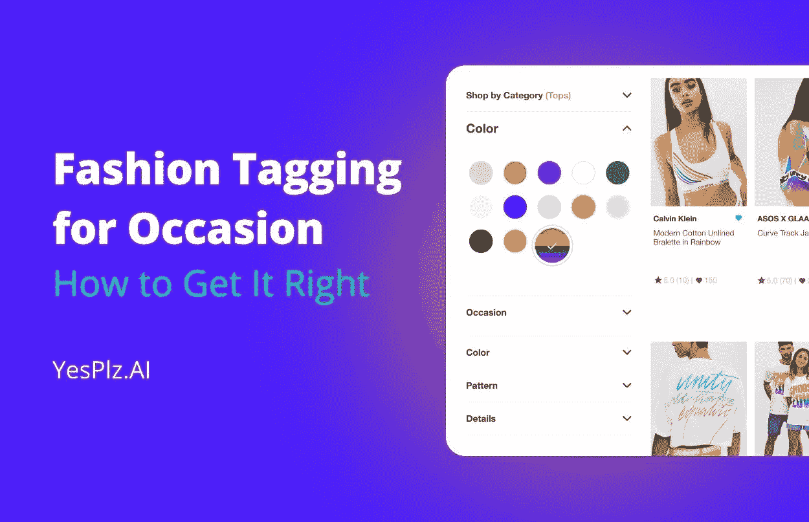
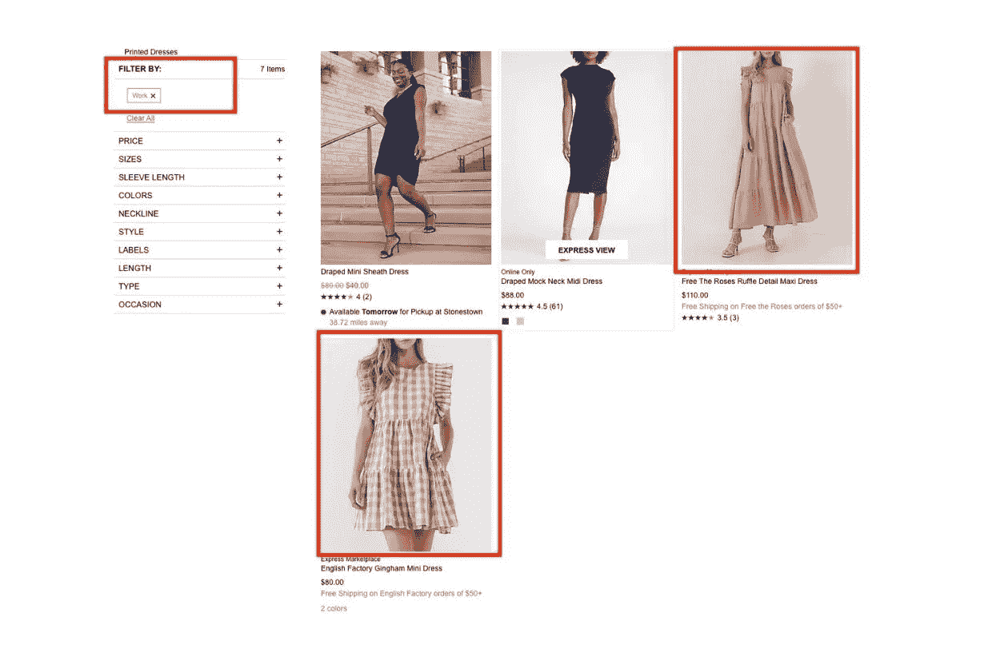
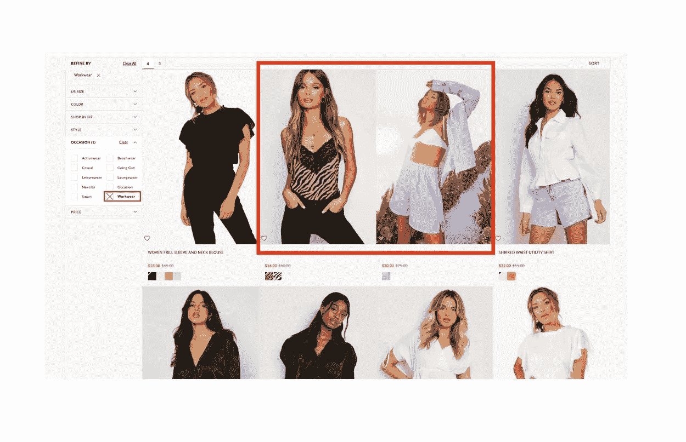
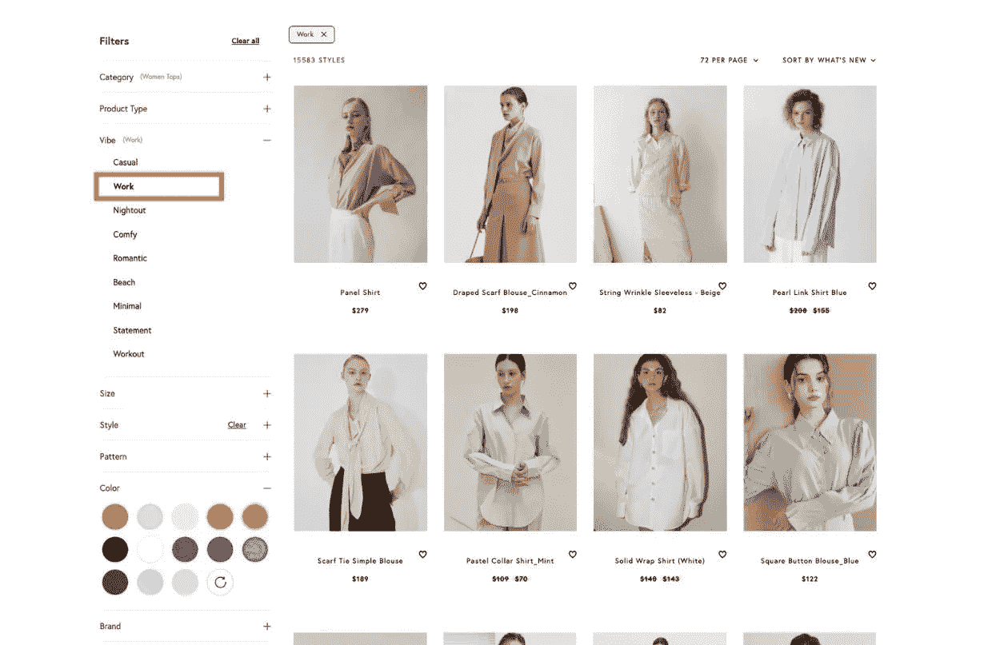

# 适合特定场合的时尚标签

> 原文：<https://medium.com/geekculture/fashion-tagging-for-occasion-431fa5342c02?source=collection_archive---------19----------------------->

## *如何做好*

*本文由* [*YesPlz AI*](http://www.yesplz.ai) *、次世代时尚搜索*撰写

*沮丧购物者的一天:*

**下午 5:00**:从 Slack 中注销，开始打开几十个标签，寻找一天在办公室穿的衣服……也许是一些对身体有利的衣服，但要隐藏手臂？

当我看到它的时候我就知道了。

**下午 6:00:**开始质疑她为什么开了 20 个标签。关闭一些商店，去她最喜欢的时尚电子商务商店。

**下午 6:15:**找到右上角的搜索栏，导航到“场合-工作”，但搜索结果包括与办公室无关的礼服，包括荷叶边迷你礼服。为什么这些礼服都在“工作”场合过滤器下？

购物者放弃并关闭标签。

这家零售商似乎拥有一切:强大的产品目录、时尚标签和场合过滤器——那么哪里出了问题？

在这篇文章中，我们将仔细看看[适合场合的时尚标签](https://yesplz.ai/resource/image-tagging.html)以及如何正确使用。具体来说，我们将涵盖:

时机搜索中顾客期望与现实之间的差距

*   时机搜索中顾客期望与现实之间的差距
*   101 场合的时尚标签
*   常见客户痛点:场合过滤器
*   是什么让 YesPlz 时尚标签与众不同
*   为什么特定场合的时尚标签对零售商和顾客很重要

> “我们的研究表明，顾客倾向于开放的搜索思维，记住特定的产品属性。”

# 时机搜索中期望与现实的差距

当前的产品和搜索过滤器令客户失望。

我们的研究表明，客户往往有一个开放的搜索心态，在头脑中有特定的产品属性。例如，“我愿意穿适合工作的衣服，只要我能遮住胳膊，而且轮廓讨人喜欢。”

但是，让我们走一步，看看当前搜索的现实。寻找适合工作的服装的顾客将需要找到正确的关键词组(“工作服装长袖”)；“办公室装谄媚”；“工作服合身”)或需要通读[长长的文本过滤选项列表](https://yesplz.ai/resource/fashion-search.html)并单独选择她想要的产品属性集。这两种选择都令人沮丧，需要客户重新加载、重新选择和重新阅读产品列表。

随着客户期望和数字复杂性的增加，客户希望能够在他们选择的参数内搜索，同时受到启发去发现。

时尚标签作为一种方式出现，允许顾客在一个主题(“工作服”)内搜索，并探索零售商的全部目录。

场合过滤器提供了乏味的关键字驱动搜索过程的替代方法。

> “我们采访了真正的购物者，以提炼场合过滤器搜索结果，并将反馈应用于人工智能训练，从而产生准确、强大的场合过滤器。”

有兴趣了解更多关于时尚电子商务场合过滤器的信息吗？ [**预约 20 分钟免费咨询。**](https://yesplz.ai/contact.html)

# 101 场合的时尚标签

实施场合或“主题”过滤器是时尚电子商务的最佳实践，但很难做到。购物者表示需要根据场合或主题进行过滤，如“假期”或“工作”——零售商可以通过在这些过滤器下对产品进行分组来提供过滤器。此外，场合/主题过滤器一直被列为电子商务过滤器的最佳实践。

如果有明显的好处——而且顾客也想要——为什么不提供更多的场合过滤器呢？

简而言之:创建场合过滤器比简单地选择产品并将其添加到主题中更复杂。对于复杂、深入的产品目录，零售商正在考虑花费数百个小时尝试[手动标记产品属性](https://yesplz.ai/resource/image-tagging.html)。

而且，如果零售商正在使用自动时尚标签，还有另一个更抽象的问题需要算法来回答:什么构成了“度假”服装？是特定的图案，面料，还是剪裁？时尚标签的主观性阻碍了许多零售商实施它们，尽管购物者有偏好。

幸运的是，更先进的算法，如 YesPlz 的时尚训练人工智能，不仅可以识别单个产品属性，还可以将这些属性放在一起，以创建标准来确定哪些产品是度假服装。我们采访了真正的购物者，以完善场合过滤器搜索结果，并将反馈应用于人工智能训练，从而产生准确、强大的场合过滤器。

场合过滤器不再是一个“好东西”——它们已经融入了购物之旅。购物者希望看到整合的体验，他们可以过滤主题、事件、场合和情绪/氛围。

# 常见客户痛点:场合过滤器

我们通过场合过滤器确定了 3 个常见的客户痛点:

**问题 1:过滤器类别有限且混乱**

根据零售商的不同，产品过滤器类别可能过于有限。用户希望看到超过 3 个非常基本的类别。例如，用户可能希望看到“工作休闲”或“度假”，而不是“休闲”根据我们的研究，用户经常根据场合开始搜索过程(“我姐姐毕业时的一件衣服”)，但当前的产品过滤器和搜索选项并不能满足他们的需求。

此外，时尚搜索语言的问题也存在于场合过滤器中。购物者被要求解释零售商的语言，这导致了挫败感。

**问题二:搜索结果不准确**

搜索结果是搜索和发现体验的核心——无论搜索工具/过程多么令人愉快，用户仍然希望看到准确的搜索结果。不准确的搜索结果将对时尚电子商务的品牌认知产生负面影响，并导致用户立即反弹。

当前的时尚标签会导致不准确的搜索结果，这让购物者感到沮丧。

**问题 3:缺乏氛围和情绪过滤器**

用户访谈显示，目前的场合类别仍然过于局限——理想情况下，用户希望根据氛围和心情进行过滤。例如，用户希望看到简约的工作服、度假时尚的两件套服装或宣言衫，而不仅仅是“休闲”或“上班穿”类别。

通过在 LinkedIn 上关注 YesPlz AI，了解最新的时尚和零售科技新闻。

# 是什么让 YesPlz 的时尚标签与众不同

主题和场合过滤器是主观的。一个购物者对“浪漫”衬衫的定义可能与另一个不同——这使得时尚标签的问题变得棘手。“复古”服装可以被定义为不会改变的永恒风格，或者破旧的二手服装，这取决于你问谁。

许多零售商仍在为场合过滤器手动标记产品信息，将场合映射到品牌风格。结果如何？搜索结果不准确。

我们做主题过滤的方式不同。

以下是 YesPlz 如何为客户解决常见问题:

**第一步:YesPlz 众包场合定义，打造精准过滤器**

为特定场合贴上时尚标签的最大问题之一是定义特定场合和主题的主观性。当零售商仅使用 1 或 2 个商家的单个定义时，我们会看到不准确的搜索结果。

YesPlz 通过使用人群培训和用户访谈来验证场合和主题过滤器，解决了主观性的问题——也就是说，不再有主观性。这些定义是基于足够大的受访者群体，我们可以确定共同语言。

**第二步:严格的时尚人工智能训练，了解情绪和氛围**

我们训练我们的时尚人工智能，并不断重复，直到人工智能能够从产品图像和信息中理解这种氛围。通过自动化时尚标签流程(结合来自用户的信息)，我们可以提供符合心情/氛围的准确搜索结果。

YesPlz Statement Filters for Occasion

**第三步:为取悦顾客的场合准确标记时尚**

我们的混合方法结合了人群训练和时尚人工智能，是 YesPlz 成功实现场合、主题、情绪和氛围过滤的秘方。

通过结合人群训练和时尚人工智能，我们以闪电般的速度提供准确、自动化的主题过滤器，这些过滤器引领时尚并与购物者的偏好相关。

# 寻找工作装:YesPlz 与其他零售商

Accurate thematic filters that shoppers love

# 为什么特定场合的时尚标签对零售商和顾客很重要

随着产品过滤和搜索的现状令顾客失望，零售商需要找到一种方法来吸引沮丧的购物者。场合过滤器反映了顾客自然搜索产品的方式，从而产生更快乐、更满意的顾客。

具体来说，事件过滤器通过以下方式改善客户搜索体验:

1-提供更多个性化，这是 2022 年客户的必备之物

2-允许客户探索产品，从而花更多时间浏览页面和查看产品

3-为顾客提供快速、轻松找到所需产品的途径。

为特定场合添加时尚标签并不一定很难实现。通过使用像 YesPlz AI 这样的人工智能解决方案，购物者和零售商可以享受时尚标签的好处。

[联系我们，了解更多关于特定场合的时尚标签。](http://www.yesplz.ai/contact.html)