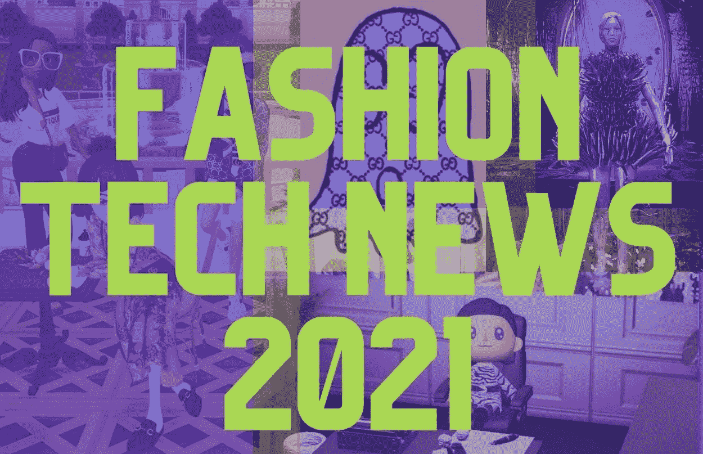
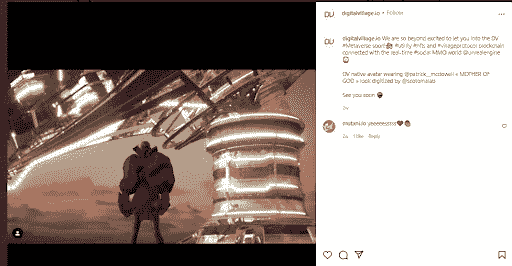
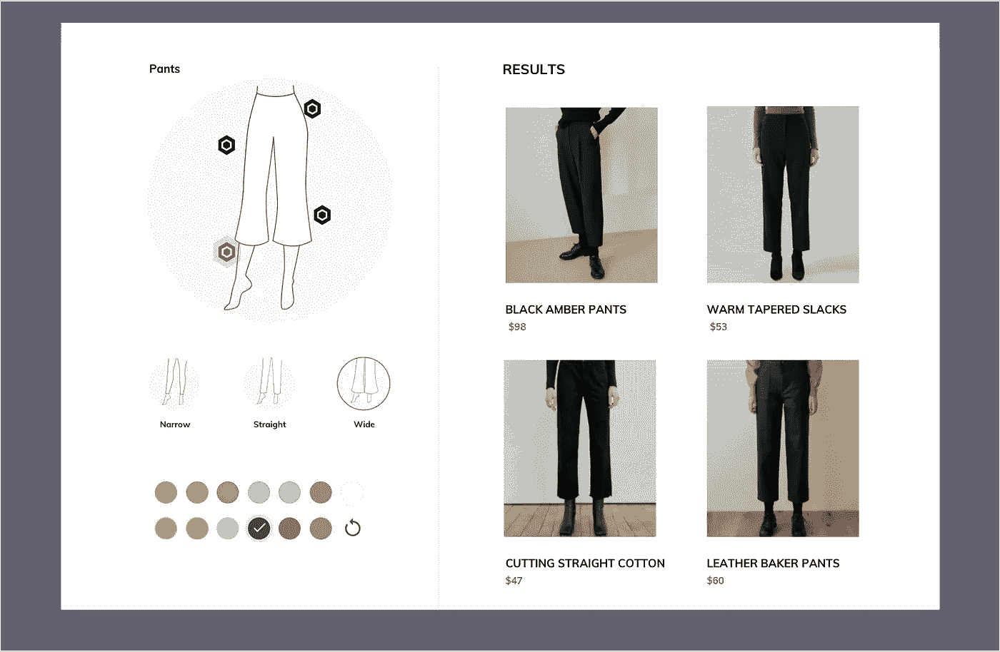
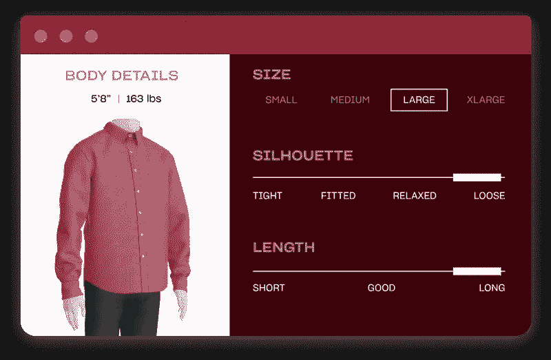
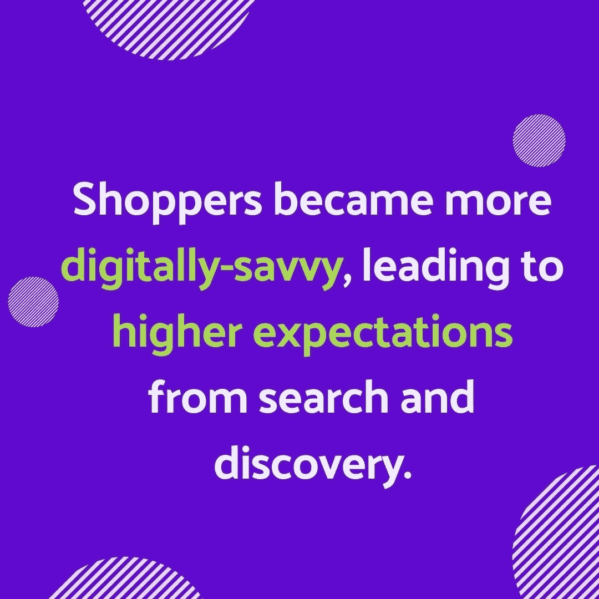

# 时尚科技新闻 2021:一年回顾

> 原文：<https://medium.com/geekculture/fashion-tech-news-2021-year-in-review-93a6d36b3903?source=collection_archive---------26----------------------->

时尚科技在 2021 年取得了突破，投资活动超过了 2020 年。尽管疫情早期放缓了电子商务销售，但该行业学会了调整，依靠科技作为重新吸引消费者的机会。

世界在快速发展，为了迎头赶上，大公司迫切需要技术来领先于竞争对手。

所有人都在关注时尚科技，各大品牌希望通过收购来获取先进的科技知识，而不是从零开始。毫无疑问，对于时尚科技和电子商务行业来说，2021 年代表着此前黑暗时期的一盏明灯。

品牌正在继续拥抱技术，如人工智能驱动的个性化技术、视觉搜索技术、数字服装技术和虚拟服装技术。

2021 年的顾客比以往任何时候都更加老练，为了吸引她的注意力，他们向零售商提出了更多要求。随着购物者更加谨慎地选择商品，零售商需要一种方法来证明他们的价值。

2021 年的投资活动是该行业价值向数字机会转移的一个明确指标，特别关注获取可以策划独特数字体验的新技术。

与时尚科技领域的新兴技术保持同步— [**在 LinkedIn 上关注 YesPlz AI。**](https://www.linkedin.com/company/yesplz)

在这篇新闻综述中，我们将回顾:
-数字服装在不断变化的行业中的作用
-视觉搜索更新
-超个性化投资活动
-改变消费者对可持续发展的看法
-2022 年的关键要点

# 数字服装在不断变化的行业中的作用

2021 年最大的机会之一是[数字服装](https://yesplz.ai/resource/trend-report-fashion-tech-and-digital-clothing.html)，因为传统奢侈品牌和新的纯数字品牌都创造了非实体服装。在非常有限的一年里，元宇宙的设计师和品牌的创造力是无限的。

随着 70%的美国消费者认为他们的数字身份很重要，数字服装代表了一种全新的服装渠道和媒介。事实证明，数字体验是品牌在消费者心目中保持领先地位的一种方式。

# 🔥2021 年 M&A 交易:数字服装

[专注于数字运动鞋和虚拟配件的服装品牌 RTFKT](https://jingdaily.com/rtfkt-nft-luxury-chinese-new-year/) 被耐克收购，暗示时尚行业正在看到数字服装的价值。

# 2021 年数字服装亮点:

*   一个数码古驰包[在 Roblox](https://www.thefashionlaw.com/a-digital-only-gucci-bag-sold-for-4115-on-roblox-as-brands-continue-to-look-to-gaming-as-reach-gen-z/) 卖了 4117 美元，只有数码形式
*   到 2030 年，元宇宙博彩和 NFTs 将占据奢侈品市场 10%的份额
*   拉尔夫·劳伦[在 Roblox 推出新的数字服装系列](https://wwd.com/business-news/technology/ralph-laurens-roblox-metaverse-virtual-fashion-1235012236/)

**元宇宙:**

当然，元宇宙和数字服装是携手并进的。打开报纸很难不看到“metaverses”这个词，零售业完全拥抱了新的数字前沿。

[数字村](https://digitalvillage.io/)，一个电子商务的社交元宇宙，获得了资金，证明了元宇宙可以成为展示和销售数字时尚的新渠道。

# 视觉搜索在 2021 年逐步显示出其价值

[视觉搜索](https://yesplz.ai/resource/2-ways-to-search-clothes-by-image.html)从“不错到有”转变为向购物者提供价值的明确方式，购物者在网上花费的时间比以往任何时候都多，但在搜索服装时仍会遇到挫折。

到 2021 年，零售商开始意识到无缝搜索体验的重要性，搜索和导航一直被列为电子商务体验最重要的属性。

零售商在 2021 年之前就开始玩起了相机搜索。通过相机搜索，购物者可以上传服装的图像，人工智能可以从零售商的产品中找到类似的结果。

但是，在 2021 年，视觉搜索加速发展，变得更加先进，并向零售商证明了它的价值。相机搜索的下一次发展是视觉界面搜索——一种直观、互动的产品搜索方式。用户可以在虚拟人体模型上选择他们想要的属性，而不是上传图像，并获得相关的准确搜索结果。

[**联系 YesPlz AI，免费咨询您的电子商务视觉搜索**](http://yesplz.ai/contact.html)

**视觉搜索的更多用例出现:**

视觉界面有助于吸引 2021 年比以往更多的在线购物者。而且，随着零售商开始将视觉搜索集成到他们的产品发现中，更多的用例出现了。

YesPlz 人工智能视觉搜索帮助零售商在 2021 年解决了两个问题:
1)当前的搜索导航无法满足客户和零售商的需求
2)产品更新和标记需要数小时

这一点尤其重要，因为越来越多的购物者希望在线商店提供更好地发现产品的方法。

[YesPlz 风格的过滤器于 2021 年首次亮相 Kolon Mall，最近](https://yesplz.ai/resource/case-study-2021.html)两家大型韩国零售商正在努力寻找吸引客户的方法。

风格过滤器填补了文本搜索的空白——购物者只需在虚拟人体模型上展示他们喜欢的风格，而不是尝试多个关键词组合并收到不准确的搜索结果，经过时尚训练的人工智能可以找到相关产品。

# 视觉搜索的 2021 年亮点:

*   **一个日趋成熟的行业:**跨平台的视觉搜索变得更加丰富，甚至谷歌也在搜索中整合了视觉产品发现，这表明视觉搜索将成为新的规范。
*   根据视觉搜索专家 Clark Ken 的说法，“视觉搜索 M & A 场景无疑正在升温。有一种感觉是，该行业正在走向成熟——或许可以进行一些整合。”
*   人工智能搜索和发现平台 Algolia 最近为其平台筹集了 1.5 亿美元，使其价值超过 20 亿美元。

# 🔥视觉搜索 M&A 2021 年交易

[栋德搜索](https://www.dondesearch.com/)，一个从产品图片中提取视觉属性的 SaaS 平台，被 Shopify 收购，标志着整个行业朝着视觉产品发现的方向发展。

向视觉搜索优先格局的转变将逐渐发生，然后突然发生，这使得零售商很容易错过早期预警信号。

当转变发生时，不要被落下。

[**安排与 YesPlz AI 的对话，了解视觉搜索**](http://yesplz.ai/contact.html)

# 超个性化竞赛

2021 年的另一个主题是超级个性化工具的[竞赛。零售商意识到了个性化的价值——获得这些先进的技术工具比不可能的内部开发要容易得多。](https://yesplz.ai/resource/trend-report-fashion-tech-and-hyper-personalization.html)

对于技术提供商来说，问题是:谁能更无缝地提供更好、更快的工具？仅仅有一个技术工具是不够的——超个性化工具需要高效且易于集成到遗留系统中。

更好地了解客户概况、偏好和购买模式也有助于零售商减轻供应链问题带来的成本飙升。通过更好地了解客户行为，零售商可以更好地预测购买模式，提高订购效率，以抵消不可预测的供应链。

# 🔥2021 年 M&A 交易:超个性化

虚拟试穿初创公司 [Drapr](https://www.drapr.com/) 被 Gap 收购，表明购物者想要更具视觉吸引力的工具。此外，此次收购也表明，在拥挤和竞争激烈的零售环境中，传统品牌正试图通过创造性地使用技术来区分自己。

# 2021 年超个性化亮点

*   **虚拟试衣**:沃尔玛也涉足虚拟服装试衣游戏，收购了 [Zeekit](https://techcrunch.com/2021/05/13/walmart-acquires-virtual-clothing-try-on-startup-zeekit/)
*   Snap 收购了 FitAnalytics ，这是一家柏林初创公司，帮助购物者从网上零售商那里找到适合他们尺码的服装
*   **购物平台:**个性化购物平台也在 2021 年变得流行起来，Lyst 筹集了 8500 万美元
*   **分析:** Gap 收购人工智能分析初创公司 [CB4](https://www.gapinc.com/en-us/articles/2021/10/gap-inc-acquires-ai-startup-cb4) 以获得更好的消费者分析和洞察
*   **数码批发:**B2B 批发平台 Nyon[被 Fashioncloud 收购。](https://fashion.cloud/en/nyon-merger/) [Joor](https://aithority.com/technology/augmented-reality/vntana-partners-with-joor-to-enable-the-first-3d-and-ar-b2b-sales-platform/) 在其 B2B 批发平台上整合了来自 Vntana 的 3D 和 AR 技术。

在时尚技术的超个性化领域，我们看到了以下主要趋势:

1-更直观的个性化工具让客户惊叹不已

2-技术交叉(AR 和 AI；人工智能和数据分析；3D 和人工智能)来创建高性能的工具

3-用户旅程中自始至终的个性化。无论用户只是在探索还是有特定的想法，这些工具都被整合到每一个步骤中。

对虚拟试衣创业公司的日益关注也表明，品牌正在倾听消费者的需求:符合他们偏好的特定类型的轮廓和服装。

在 YesPlz AI，[我们的工具允许购物者根据合身程度和轮廓进行筛选](https://shop.yesplz.ai/women)。我们的研究表明，购物者更喜欢既直观又注重轮廓的搜索。

# 改变消费者对可持续发展的态度

2021 年，随着二手时尚平台的成功，技术和可持续发展的结合成为人们关注的焦点。疫情期间，消费者减少了购买，并打算通过修补衣物、减少购物频率和从二手商店购买来继续减少消费的模式。

这种态度的转变是由疫情时期出现的新价值观推动的。收入减少的消费者希望购买有意义的商品，并在购买前进行调查。

二手购物以前与去当地旧货店和筛选旧衣服联系在一起——但随着技术的加入，二手服装平台在 2021 年开始流行。

点击此处，采访时尚潮流专家 Agnes Kubiak，了解更多疫情流行趋势。

# 🔥2021 年 M&A 协议:可持续性

Etsy 收购了二手服装平台 [Depop](https://www.crunchbase.com/acquisition/etsy-acquires-depop--9b6f7041) ，此举显示了向二手服装的转变。

# 2021 年可持续发展亮点

*   奢侈品二手时装平台 Vestiaire [为其二手时装平台筹集了 2.16 亿美元](https://techcrunch.com/2021/03/02/vestiaire-collective-raises-216-million-for-its-second-hand-fashion-platform/)，表明二手服装可以存在于奢侈品领域。
*   二手服装也开始出现在 Farfetch 等电子商务平台上。

我们希望看到[可持续发展趋势继续发展，](https://yesplz.ai/resource/year-in-review-fashion-and-ecommerce-trends-2021.html)随着新技术开始发展，以满足购物者对二手服装的需求。

# 2022 年关键时尚技术要点:

2021 年是时尚和科技电子商务领域的突破之年，新技术不断涌现，传统品牌开始融入新技术，以跟上更灵活的电子商务平台。古驰等品牌试图通过在元宇宙和数字服装领域尝试新技术，向消费者证明自己的价值。

到 2021 年底，我们在时尚科技和电子商务新闻中看到了 3 大主题:

1-传统品牌迅速融入新技术，如视觉搜索和个性化，以保持新鲜

2-数字服装和 NFT 为奢侈品牌提供了一种新的方式来策划没有实体店的购物体验

3-主要零售商、电子商务平台和新品牌竞相吸引购物者的注意力，整合新技术作为在过度拥挤的空间中脱颖而出的一种方式

在整个疫情，购物者被推进到一个数字优先的世界——我们正在时尚和科技电子商务领域看到这种转变的影响。

通过 [**在 LinkedIn 上关注 YesPlz AI，了解时尚科技领域的最新技术。**](https://www.linkedin.com/company/yesplz)