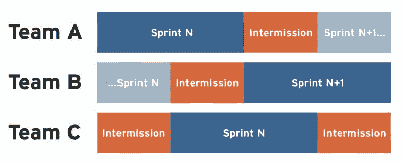

# 快速迭代，缓慢进展

> 原文：<https://medium.com/geekculture/fast-iterations-slow-progress-55acdfd62237?source=collection_archive---------8----------------------->

“对不起，星期五不能谈，时间很紧。我们有自己的冲刺规划。”你对别人说过多少次了？许多公司的冲刺计划和收尾仪式几乎每隔几周就要花上一整天。那是你 10%的时间！尽管有巨大的投资，在所有的盛况之后，你有什么可以展示的呢？

我不介意持续关注快速迭代——只要它能实现有意义的、切实的影响。没人在乎你的 R&D 组织在每个冲刺阶段都完美地把它承诺的任务 100%放在完成的任务堆里。世界上没有一个 CEO 决定组建一个工程团队，因为他们喜欢编写代码的想法。这是实现目标的必要条件。没有这一点，快速迭代就成了一种弊病，并且困扰着太多的团队。

# 快速迭代的问题是

不要误解我。带着紧迫感和专注感工作并不是一件消极的事情。事实上，为了创建一个极具影响力的团队，这是非常基本的。然而，当我们误解了快速发展背后的意图并进入货物养殖模式时，问题就开始了。

想象一下下面的场景，我发现这种场景很普遍，考虑一下听起来是不是很熟悉。一个团队将要结束一个为期两周的迭代，并在这个时间框架的末尾部署它所处理的新特性或变更。通常，冲刺和日历重叠，所以工作周的结束就是冲刺的结束。团队刚刚完成代码部署，几分钟后，他们坐下来与产品讨论下一个 sprint，这将在周末后开始。

因为代码在生产中是全新的，所以计划的和现在正在进行的后续工作不是基于任何学习。用户没有时间看到新功能的效果。你的领导和产品经理甚至在看到工作之前就急着想出工作计划，因为你必须*喂野兽*——给你的工程师提供吃东西的门票。

在这个 sprint 过程中，你可能最终意识到之前 sprint 的工作表现如何，然后根据 sprint #3 的反馈安排改进。底线是，你经常最终会致力于一堆你并不真正知道是否需要或正确的工作。我们没有花时间去看我们的劳动成果。

如果你回想敏捷宣言背后的概念，我不相信那些聪明人想要我们死在快速迭代的山上。从根本上来说，实践的理由是我们需要实现*紧密反馈循环*。为了快速工作而快速工作是不够的。我们需要从我们所做的事情中吸取教训，然后结合这些反馈来决定接下来的步骤，同时牢记 it 的明确业务优势。

# 为反馈留出时间

那什么才是继续前进的正确方式呢？团队正在完成工作；我们需要等待收集结果和反馈。在此期间，团队应该做些什么？

至少，假设您已经知道应该采取什么步骤，您应该避免继续在同一个特性上工作。如果团队可以在不同的事情上工作一段时间，那很好。其他团队采用不同的工作节奏来适应反馈时间。在一个开发周期之后，团队得到某种形式的休假去做其他事情。“产品”利用这段时间来学习、收集见解，并正确规划下一阶段。

在我最近出版的书中，我讨论了间歇的概念。它对每个参与其中的人都有很多好处，其中一些我已经在[这里](https://avivbenyosef.com/managing-non-feature-work-part-3suggested-approach/)介绍过了。其中之一就是在进入下一个冲刺阶段之前获得完成学习阶段的必要资源。有了间歇的级联设置，你可以在任何一个学习阶段拥有不同的团队。在此期间，您的团队可以执行一些不太紧急的重要工作(更多细节请参见之前的链接文章)。

# 元评论

间歇期的补充是*元评论。我假设你听说过回顾和事后分析，并经常练习。然而，这些通常只关注于执行及其有效性——把事情做对。缺少的是更高层次的对*功效*的考量——我们做的事情对吗？*

元评审是你的领导和产品人员应该坐下来评审工作的实际结果的地方。这个特性按时完成并且没有错误，这很好，但是它真的达到了预期的效果吗？在元综述中，我们着眼于前一段时间所做的工作及其效果。这些效果证明投入更多时间来改进和调整它是合理的吗？是不是应该彻底抛弃？

只有掌握了来自元综述的见解，你的领导团队才能决定正确的前进道路。过早地承诺工作计划，你仅仅是在快速行动，打破常规，但是行动到哪里呢？当你不知道你要去哪里的时候，“没有风就是正确的风。”

*Aviv Ben-Yosef 2021 —最初发表于* [*科技高管最佳时事通讯*](https://avivbenyosef.com/newsletter/)