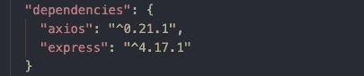
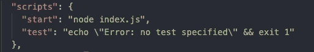
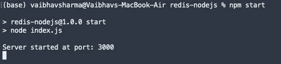
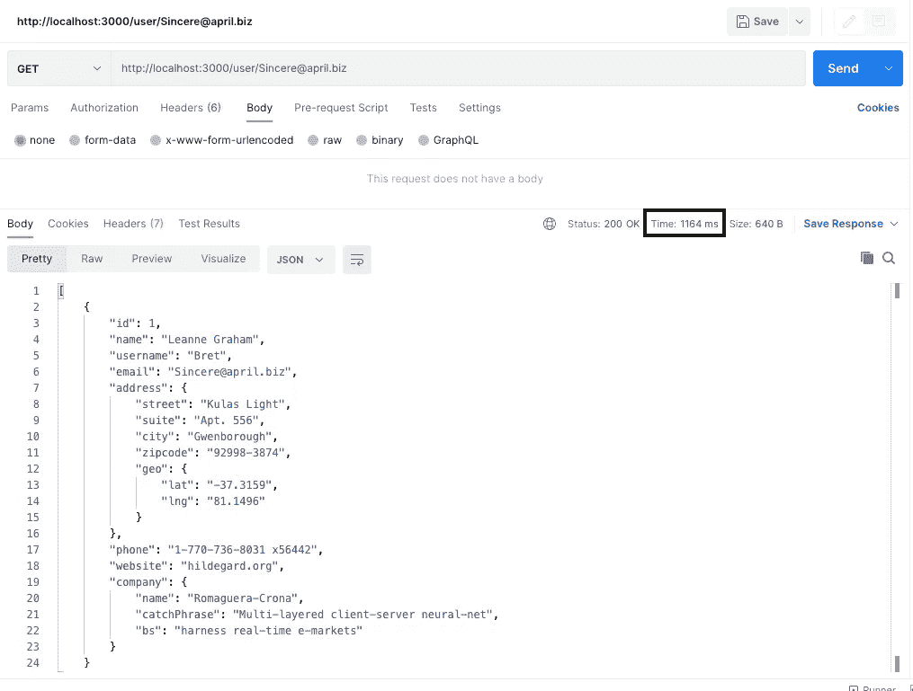
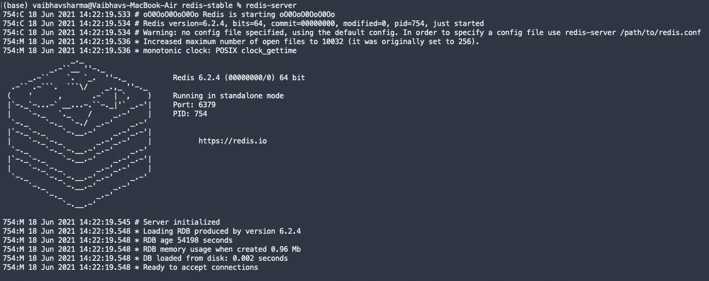
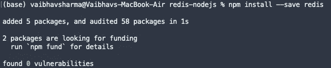
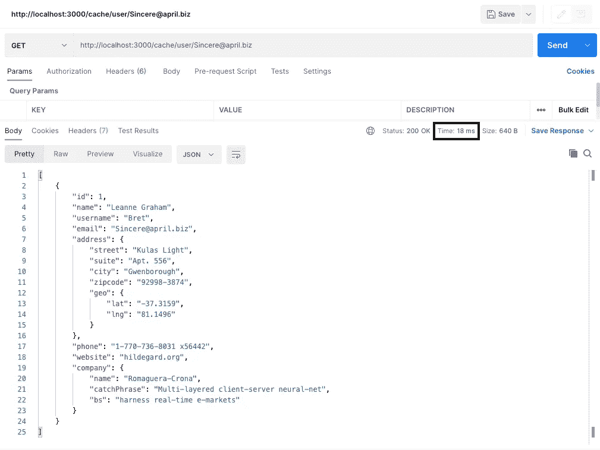

# 使用 Redis 的强大缓存机制来保护您的 Node JS 应用程序

> 原文：<https://medium.com/geekculture/fasten-your-node-js-application-with-a-powerful-caching-mechanism-using-redis-fd76b8aa482f?source=collection_archive---------1----------------------->


Redis Official Logo

# 为什么缓存如此重要:

缓存是将文件和数据的副本存储在缓存或某个临时空间中的过程。通过使用缓存，我们可以非常快速地获取数据。缓存工具最好的例子就是 [**Cloudflare**](https://www.cloudflare.com/learning/cdn/what-is-caching/) **。**我知道 Cloudflare 不是唯一的缓存工具，它还有其他功能。

在应用程序中使用缓存有两个主要原因:

1.  节约成本。通过网络发送的数据量减少。
2.  响应时间更短。

# 缓存过程:

缓存的过程非常简单。假设您想从一个 API 获取一些数据。在第一次调用中，您将点击 API 并获取数据，之后您将在缓存中设置或保存该数据。以后想得到同样的数据，不需要打 API 了。首先，您将检查缓存中是否有可用的数据。如果数据在缓存中可用，那么你将从缓存中获取数据，否则你将命中 API。

> **在本教程中，首先，我们将从没有 Redis 的假 API 中获取数据，然后使用 Redis，并使用可视化表示检查响应时间的差异。**

# 在 Express JS 中创建一个简单的服务器:

如果你是 NodeJS 世界的新手，请阅读我的教程[](https://vsvaibhav2016.medium.com/create-crud-application-in-express-js-9b88a5a94299)****。**在本教程中，你将学习如何创建 express js 服务器和 CRUD 操作。否则，按照下面的步骤在 express js 中创建一个简单的服务器。**

## **创建 package.json 文件:**

```
npm init -y
```

**上述命令将创建 package.json 文件。**

****

**The output of **npm init -y****

## **安装所需的软件包:**

```
npm install --save express axios
```

****

****Express JS** 是 Node JS 的框架，而 **Axios** 是浏览器和 node.js 的基于承诺的 HTTP 客户端**

## **使用下面的代码片段创建一个简单的服务器:**

**在根文件夹中创建一个 index.js 文件，并将以下代码写入该文件。**

**在运行服务器之前，请将启动脚本添加到 **package.json** 文件的脚本部分中**

****

**运行以下命令启动服务器**

```
npm start
```

****

# **从假 API 获取数据:**

**在本节中，我们将从一个名为 [JSONPlaceholder](https://jsonplaceholder.typicode.com/users) 的假 API 中获取数据。这个 API 对于获取假数据非常有用。**

**在这个 API 调用中，我们将通过提供电子邮件地址来获取用户数据。请参考以下代码:**

**在上面的代码中，我们需要 Axios 包，并为假 API URL 创建 MOCK_API。在 API 调用中，我们将电子邮件作为参数传递，并过滤出用户的详细信息，然后在响应中获取它。**

****

****It’s taken 1164 ms for sending the response****

**我正在使用调用 REST API 调用的 **POSTMAN** 工具。在上面的截图中，我们可以清楚的看到**的响应时间**也就是 ***1164 ms*****

# **Redis 简介:**

**Redis 是一个开源的内存数据存储，用作数据库、消息代理和缓存。Redis 以其强大的高速缓存管理而闻名，因为它非常快。**

**Redis 数据库的其他特点是:**

1.  **发布/订阅**
2.  **处理**
3.  **自动故障转移**

# **安装 Redis:**

```
wget [http://download.redis.io/redis-stable.tar.gz](http://download.redis.io/redis-stable.tar.gz)
tar xvzf redis-stable.tar.gz
cd redis-stable
make
make install
```

**之后，您可以运行该命令**

```
redis-server
```

****

**Running redis server**

# **使用 Redis 创建 API:**

**首先，我们需要通过运行下面的命令来安装 **redis** 包:**

```
npm install --save redis
```

****

**Installing npm package for Redis**

**安装 Redis 包之后，我们需要安装并创建 Redis 客户机。**

```
const redis = require('redis');
const redisClient = redis.createClient(6379);
```

> **Redis 的默认端口是 6379**

**之后，我们用 Redis 数据库创建了一条路由。首先，我们将检查 Redis 中的数据是否可用。如果数据在 Redis 中可用，则从 Redis 获取，否则从 API 获取。**

****

**Getting data from the cache using Redis**

**请注意，这只是如何用 Redis 缓存节点 JS 中的 API 结果的一小部分工作。如果你想增加关于 Redis 的知识，请阅读 Redis 的 [***文档***](https://redis.io/documentation) 。**

**如果你想访问整个代码，请检查 [***我的 Github repo***](https://github.com/imvsharma/redis-nodejs) 给我一个开始，叉它使用代码。**

# **任何自由工作，请给我一个机会**

**如果你有任何自由职业者的工作或项目。请与我联系或发电子邮件到 thedeveloperfamily@gmail.com。**