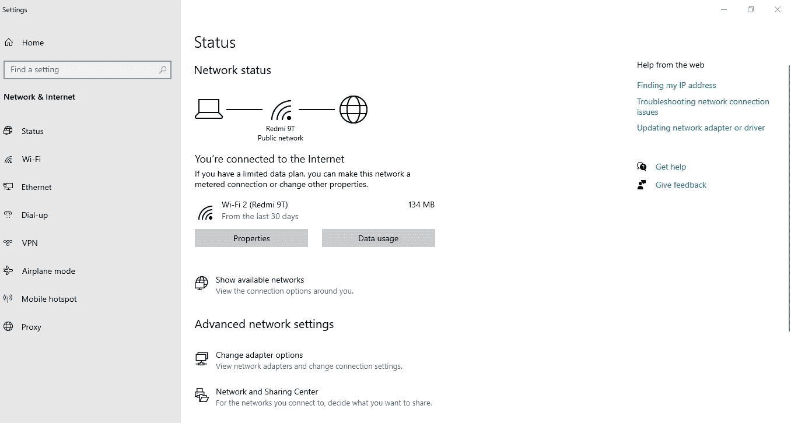
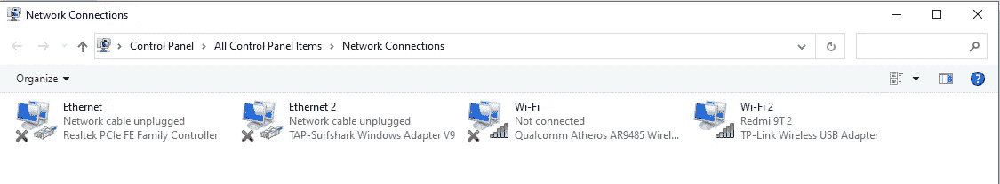
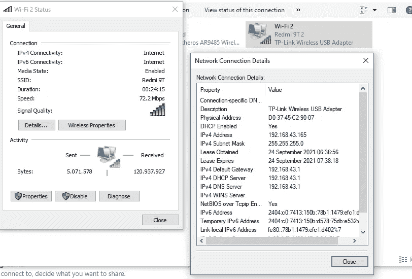
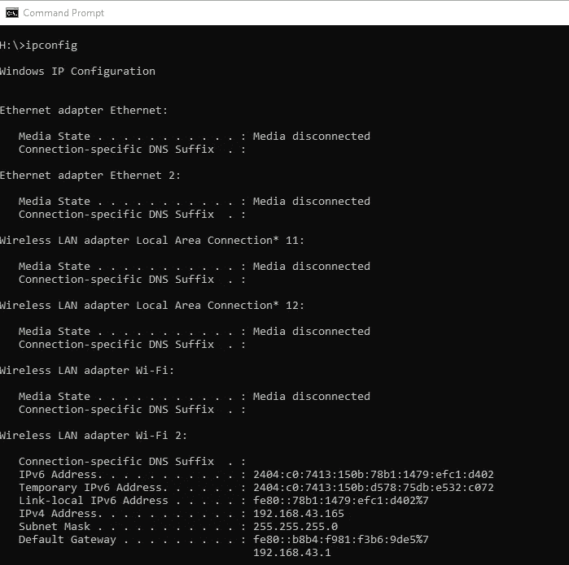
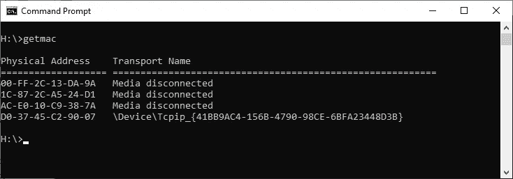
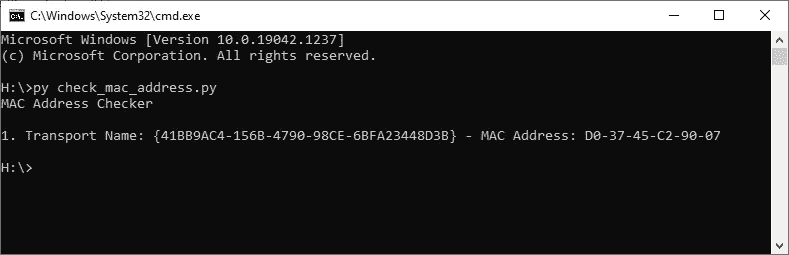

# 检查 Windows MAC 地址的最快方法

> 原文：<https://medium.com/geekculture/fastest-way-for-checking-windows-mac-address-a86e716e9aac?source=collection_archive---------19----------------------->

Photo by [Thomas Jensen](https://unsplash.com/@thomasjsn?utm_source=unsplash&utm_medium=referral&utm_content=creditCopyText) on [Unsplash](https://unsplash.com/s/photos/wifi?utm_source=unsplash&utm_medium=referral&utm_content=creditCopyText)

MAC 地址是计算机通信的方式，它是每个设备拥有的唯一数字序列。在 Linux 中，您可能记得真正帮助我们显示所有 MAC 地址设备的`ifconfig`命令。嗯，Windows 有`ipconfig`但是命令有时候真的让人不知所措。

在这篇文章中，我想分享一下如何用几种不同的方法来检查 Windows MAC 地址。实际上，这是给我自己一个提示，因为有时候我对如何检查我的 MAC 地址有点困惑。所以，在看了大卫·邦巴尔的一些课程后，我认为让每个人都能接触到这些知识是件好事。

# 指南

好了，在任何自动化之前，让我们手动检查 MAC 地址，要检查您的 MAC 地址，您可以打开**设置>状态>更改适配器选项**

嗯，在你点击它之后，网络连接会像这样显示出来

您可以通过双击您想要检查的设备来检查特定设备的 MAC 地址，并打开您的 MAC 将显示的详细信息

在我的设备中，MAC 地址是 D0–37–45-C2–90–07

# **自动**

## 用于查看本机的 IP 信息

有两种方法可以更自动地检查 MAC 地址。第一个是使用`ipconfig`命令，显示你设备中所有的 MAC 地址和所有的配置，这对我来说真的很烦人。

从上面的图片，我们很容易看到 MAC 地址，但每当你安装 Docker，VirtualBox，VMWare 等。界面会让人应接不暇。

## getmac

好的，第二种方法，我今天发现在 Windows 中检查 MAC 地址最快的方法是`getmac`命令。Windows 使用此命令来显示计算机中每个网络适配器的 MAC 地址。这是

## 计算机编程语言

实际上，这是使用 Python 脚本检查的额外部分。这个脚本是对 David Bombal 的改进，它只显示 MAC 地址。这是剧本。

该脚本是初学者友好的权利？也许正则表达式只是让你感到困惑。该脚本将使用`subprocess`模块来运行`getmac`命令。与`getmac`不同的是这个脚本将检查设备是在线还是离线。如果设备在线，将会显示，否则将会跳过。

# 结论

路径，你将使用在检查你的设备的 MAC 地址是由你决定。但是，我推荐 python 的方式，因为它将只显示活动的设备，这实际上帮助你隐藏你的设备网络。信不信由你，好人身边总会有坏人。

#保持安全