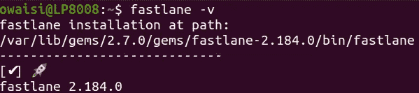
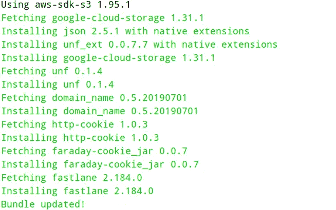
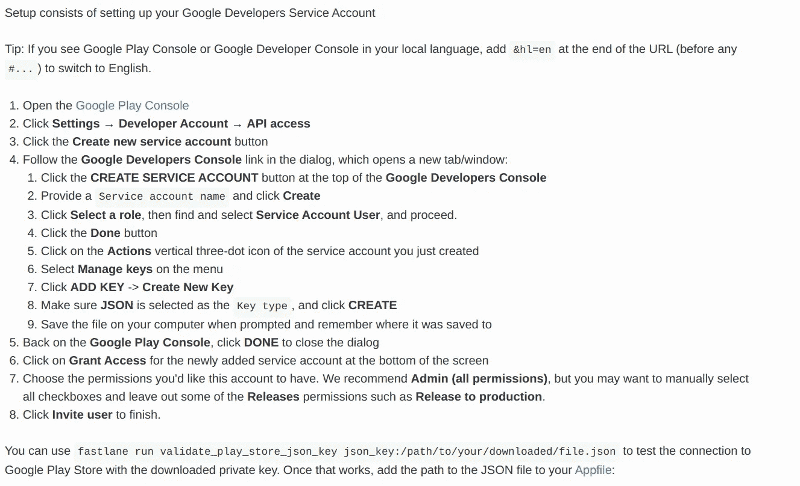
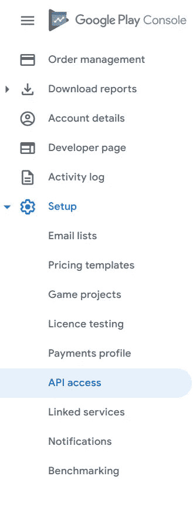
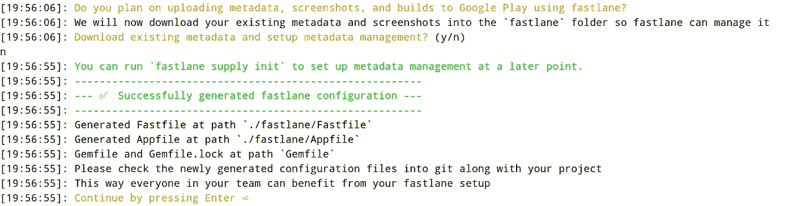
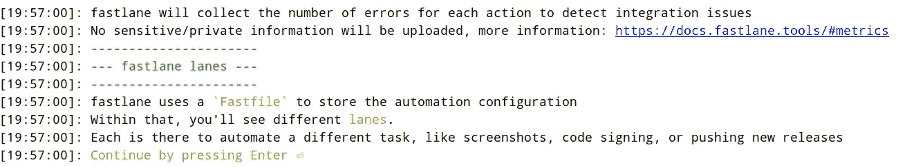
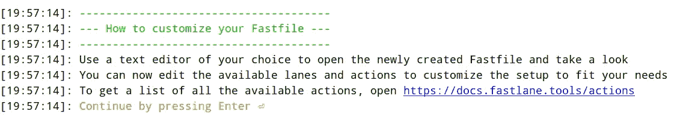
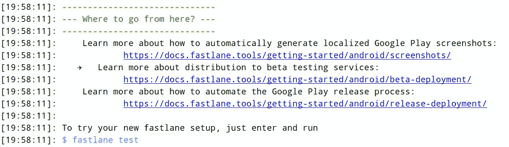
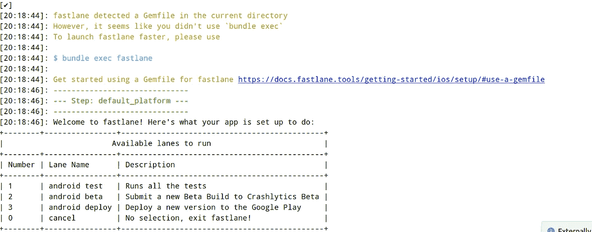

# Android 的浪子设置

> 原文：<https://medium.com/geekculture/fastlane-setup-for-android-20615722843d?source=collection_archive---------12----------------------->

为您的 Android 项目设置 fastlane 的简化步骤。

这是浪子系列的第二部分。您可能想在之后结账

1.  [***在 Ubuntu 中安装浪子***](https://owaistnt.medium.com/installing-fastlane-in-ubuntu-c3a7044356d2)

**先决条件**:

*   ruby 2.5 或以上版本
*   Ubuntu 16.04 或以上

完成设置需要以下步骤。

1.  安装鲁比和浪子。跟随这篇文章[在 Ubuntu 中安装浪子](https://owaistnt.medium.com/installing-fastlane-in-ubuntu-c3a7044356d2)
2.  安装捆扎机
3.  设置您的 Android 项目
4.  使用 Google 控制台创建服务帐户
5.  使用 4 中的 Json 初始化项目中的快速通道

# 安装红宝石和浪子

这应该给你一个输出



From previous article

# 安装捆扎机

> sudo 宝石安装捆扎机

# 设置您的 Android 项目

在你的项目根目录下创建一个 **Gemfile** 。包含以下文本

```
source "https://rubygems.org"

gem "fastlane"
```

运行以下命令，并将 **Gemfile 和 Gemfile.lock** 添加到您的版本控制中

> 捆绑包更新

以下是我的输出，以包更新结束



output of bundle update

# 创建服务帐户 Google 控制台

实际文件实际上有相当好的解释，所以我不会做任何额外的事情。[跟随此处](https://docs.fastlane.tools/actions/supply/)



Steps to create json secret file



fastlane 初始化期间需要这个 json 秘密文件。浪子需要该文件的路径才能工作。

该图显示了您将在新的 Google Play 控制台上找到 API 访问的起点。

# 使用 4 中的 Json 初始化项目中的快速通道

> 快车道初始化

上述命令将被执行，它将要求 2 件事情
1。包名(com.krausefx.app):
2。json 机密文件的路径。(在步骤 4 中创建)

如果一切顺利，剩下的执行就像是快速通道文件的演练。



Meta data and screenshots



Lanes



Customise Fastfile



Final output

最后测试你的浪子

> 快车道

上述命令给出了以下输出。无论它是如何被推荐使用

> 捆绑销售高管快车道

