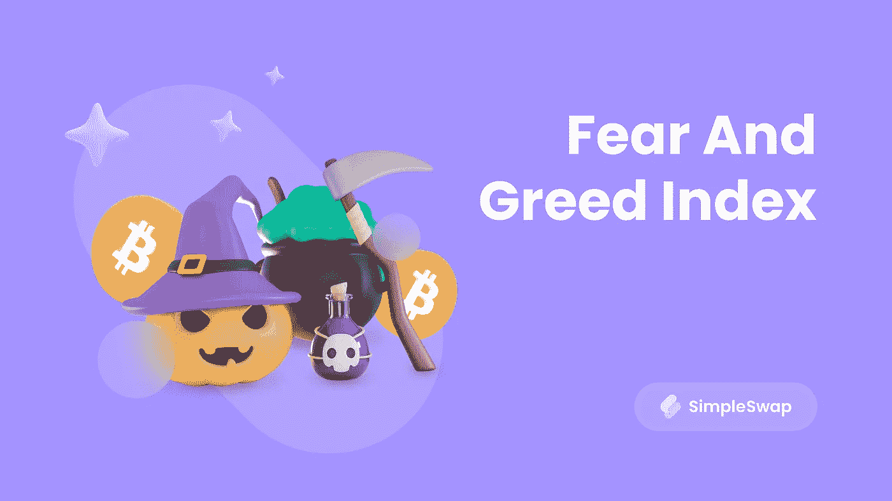

# 恐惧和贪婪指数:它如何跟踪加密？

> 原文：<https://medium.com/geekculture/fear-and-greed-index-how-it-tracks-crypto-eb73c7194e16?source=collection_archive---------15----------------------->

因为快到万圣节了，不谈[恐惧和贪婪指数](https://alternative.me/crypto/fear-and-greed-index/)简直是犯罪。听起来很诡异，对吧？在本文中，我们将了解它是什么以及如何使用它。

# **什么是指数？**

如果你对加密货币行业感兴趣，那么你可能不止一次遇到过“指数”这个词。这个话题可能很棘手——尤其是对初学者来说。这个术语在 Crypto World 中是什么意思？

市场指数是传输不同加密货币价格和资本化客观数据的平台。你需要一个加密货币的指数来了解一些资产的价值。通常一个指数可以让你分析几个因素。这样的我们:

*   目前的市场价格。
*   硬币的总数。
*   每日交易量。

然而，不同的平台根据其用户群提供不同的信息。例如，如果指数关注的是交易者，那么它可以显示一枚硬币在过去 24 小时内的最高价和最低价。与此同时，为长期投资者开发的另一个平台可能会涵盖硬币的具体特征。

# **F&G 指数是真的吗？**

沃伦·巴菲特曾经说过，投资者“在别人贪婪时恐惧，在别人恐惧时贪婪”是明智的。这是一个很好的建议，但是我们怎么知道什么时候我们应该是这样或那样的呢？ [CNNMoney](https://money.cnn.com/data/fear-and-greed/) 开发了一个解决方案——恐惧和贪婪指数。它跟踪指导市场投资者的两种主要感觉。指数有助于了解价格是否公平。背后的想法很简单，开发商假设强烈的恐惧是资产变得比应有价格更便宜的原因。以及强烈的贪婪把价格抬得太高。

# **F&G 指标如何工作？**

恐惧和贪婪指数从 0 到 100 不等，低指数表示市场上存在恐惧，高指数表示贪婪。所以，很明显，50 是中间值，0-24 是中度恐惧，25-49 是极端恐惧。贪婪也是如此——51 到 74 岁是中等，75 到 100 岁是极端。

为什么监控恐惧和贪婪指数是个好主意？当它发出极度恐惧的信号时，意味着资产价格正在下跌，因为交易者正在出售他们的密码。那是买东西的好机会。反之亦然——在市场极度贪婪的时候卖掉你的资产可能是个好主意。这样你可以获得更多的利润。

# **数据从哪里来？**

恐惧和贪婪指数考虑了哪些数据？让我们来了解一下！

排名第一的波动

它是影响指数的主要因素之一(占 25%)。开发人员监控比特币价格，并将其与 30 天和 90 天的数据进行比较。快速波动表明市场上的恐惧信号。

#2 市场势头和数量

占指数 25%的一个更重要的因素。它将当前的 BTC 交易量与 30 天和 90 天的数据进行比较。大量购买表明市场是贪婪的。

第三大社交媒体

15%的研究来自社交媒体。Index 分析了带有硬币标签的 Twitter 帖子。发布的帖子越多，市场就越贪婪。

第四大优势

占指数的 10%。这一因素表明了比特币在市场总容量中所占份额的变化。高优势说明市场上有恐惧。

#5 趋势

这个因素占 10%。它使用谷歌趋势数据。

此外，据该网站称，不久前 F&G 指数还在研究中使用调查，但目前这种研究方式已经暂停。

# **结论**

F&G 指数有助于跟踪交易者在市场中的情绪变化。低值表明加密资产的价格正在下降，高值意味着目前价格的上涨。有了它，你就能了解市场何时过热，从而及时卖出或买入资产。

F&G 指数最适合日内交易。密码爱好者不建议将其用于长期投资。该指标仅分析市场参与者的当前情绪。注意，技术和基本面分析不依赖于交易者的情绪，更适合长期预测。

别忘了，专业交易者从来不会只用一个指标。为了获得更可靠的结果，最好同时考虑几个调查和参数。

**SimpleSwap 希望你有一个有趣又恐怖的万圣节！订阅** [**我们的推特账号**](https://twitter.com/simpleswap_io?utm_source=publish0x&utm_medium=portal&utm_campaign=fgindex)**——下周你会发现很多关于万圣节的帖子，甚至还有赠品！**

**别忘了，购买或兑换硬币最简单的方法就是使用**[**simple swap services**](https://simpleswap.io/?utm_source=mediumx&utm_medium=portal&utm_campaign=fgindex)**。**

**SimpleSwap 提醒您，本文仅供参考，不提供投资建议。所有购买和加密货币投资都是你自己的责任。原载于** [**Publish0x 博客**](https://www.publish0x.com/simpleswap-blog/fear-and-greed-index-how-it-tracks-crypto-xpzlmmw) **。**