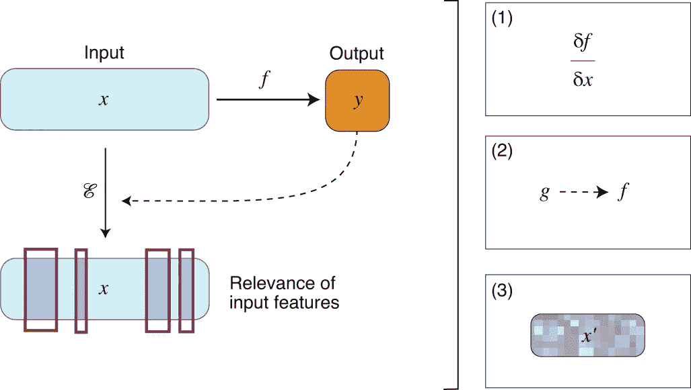

# 可解释人工智能中的特征属性

> 原文：<https://medium.com/geekculture/feature-attribution-in-explainable-ai-626f0a1d95e2?source=collection_archive---------4----------------------->

特征重要性形式的模型解释。它是什么&如何实现的？

Photo by [**Miriam Alonso**](https://www.pexels.com/@miriam-alonso?utm_content=attributionCopyText&utm_medium=referral&utm_source=pexels) from [**Pexels**](https://www.pexels.com/photo/wooden-container-with-various-beads-7585703/?utm_content=attributionCopyText&utm_medium=referral&utm_source=pexels)

似乎我们有多重现实，因为我们能够在生活中扮演许多不同的角色——阿特·霍克伯格

想象一下，一个基于人工智能的模型经过训练，可以从提供的图像中识别盒子中的食品是披萨还是汉堡。现在，开发人员要求他们的朋友和家人分享他们拍摄的照片，以建立训练数据集。此外，两个特定的比萨饼和汉堡制造商在他们的镇上很受欢迎，因为他们有限的地理位置和广泛的特许经营系统。很明显，这些品牌的标志也出现在训练图像中。盒子上标志的存在和形状应该是食品是比萨饼还是汉堡的标志吗？或者换句话说，*如果把盒子上的 logo 作为分类图像的特征之一，训练出来的模型输出会被认为是正确的吗？数据中的这种不可预测性会导致不适当的训练和可能的偏差，这是可解释人工智能(XAI)旨在解决的问题。*

接下来是更复杂的模型，需要从图像中检测肿瘤，或预测某些化学组合的结果以发现药物。这种基于人工智能的模型的人类或算法用户会有一些期望，如模型如何得出特定答案的透明度，为什么输出应该被接受的理由，支持决策的信息，以及不确定性估计。特征属性是后建模(也称为事后)解释生成的一个重要部分，并且促进了这种需求。

**特征属性方法是一种接受模型输入并根据特征对模型输出的贡献给出每个特征属性分数的函数。**分值的范围可以从正值(表示其对模型预测的贡献)到零(表示该特征没有贡献)，再到负值(表示移除该特征将增加预测类的概率)。例如，图像背景已经被用作某些对象识别任务中的特征。如果一个属性算法为手势识别模型分配了一个负分，这将意味着移除背景像素将改善手势类别的识别。在汉堡和比萨饼图像上的不正确训练的模型的实例中，属性算法将把品牌标志呈现为具有显著正得分的特征。

关注某个特征的重要性及其对特定输入的训练模型结果的影响的特征属性类型被称为**局部特征属性**。它被称为是局部尺度的，因为范围限于一个观察，即特定的输入集。一个流行的方法是[本地可解释的模型不可知解释(LIME)](https://arxiv.org/abs/1602.04938) 。通过**全局特征属性**检查模型自身结构或其代理之一，可以解释模型的全局行为，而不是从局部属性开始并向上聚合。这种方法确保人类理解解释所有输入的模型行为的全貌。

然而，只有当一个简单的模型只有少量的参数时，才有可能传达整个模型。对于一个复杂的模型，全局属性可以从它的简单代理中提取，但是这样生成的重要性可能不会覆盖所有复杂的场景。如果我们认为一个模型可以解决金融服务中的关键问题，那么在寻求解释时，替代模型可能是不可接受的。

我所解释的特征归因过程一定会让你回想起类似的事情。正在分析特征对预测的贡献并分配分数；此外，还有一项规定是淘汰那些得分低的学生。

> 你觉得这听起来像特征选择吗？

嗯，这些技术是相似的，一些研究人员已经尝试使用归因技术进行选择，但两者之间的主要区别在于它们在模型训练生命周期中的位置。特征选择通常在模型训练之前或期间使用，而特征属性用于解释已经训练的模型(事后解释)。

有许多方法可以生成特征属性，列表只会随着时间的推移而增长。给定计算输入样本 *x* 的预测*y*=*f*(*x*)的神经网络模型 *f* ，特征归属方法 E 输出 *x* 的每个输入特征的相关性用于预测。这样做的三种基本方法是:

(1) Gradient-based methods, (2) Surrogate methods, (3) Perturbation-based methods. [source](https://www.nature.com/articles/s42256-020-00236-4?proof=t)

*   **基于梯度的方法:**这种方法测量输入的局部邻域 *x* 的变化对应于模型输出 *f* ( *x* )的变化。深度学习实践者中的一种**常见方法**依赖于**使用神经网络输出相对于输入的导数，即δ *f* /δ *x* 来确定特征重要性。**一些值得注意的方法包括 LIME，深度学习重要特征( [DeepLIFT](https://arxiv.org/abs/1704.02685) )， [Grad-CAM](https://arxiv.org/abs/1610.02391) ， [SmoothGrad](https://arxiv.org/abs/1706.03825) ，以及逐层关联传播( [LRP](https://arxiv.org/abs/1604.00825) )。
*   如前所述，这种方法通常用于复杂的模型。**原始函数 *f* 由人类可解释的模型 *g*** 近似，并用于生成属性。

以上两种方法提供了局部解释。虽然已经提出了通过决策树或决策集模型来描述 *f* 的全局代理解释模型，但是这些近似可能缺乏精确性。由此我们得出第三种基本归因方法:

*   **基于扰动的方法:**此类方法**修改或移除部分输入，旨在测量其在模型输出**中的相应变化；该信息随后用于评估特征的重要性。虽然基于扰动的方法具有直接估计特征重要性的优点，但是当输入特征的数量增加时，它们的计算速度很慢，并且最终结果往往会受到一起扰动的特征数量的强烈影响。

最近，沙普利加法解释( [SHAP](https://arxiv.org/abs/1705.07874) )被提出来解释集成方法和深度学习模型等复杂模型的预测。该解决方案以各种排列组合了现有方法，如 DeepLift、LIME、Shapley 值和 LRP，以实现模型不可知的估计。

特征属性方法的可解释性受到原始特征集(模型输入)的限制。现在，随着输入的复杂性或不透明性的增加，我们可能需要一种不需要解码输入类型的不同方法。

[source](https://www.nature.com/articles/s42256-020-00236-4?proof=t)

基于实例的方法计算必须存在的相关特征的子集，以保留或移除给定模型的预测中的变化。实例可以是真实的，也可以是为该方法而生成的。这种方法可以为人类提供自然的模型解释，因为它们类似于[反事实推理](/geekculture/the-philosophy-behind-ai-explainability-a774d084bbc3)，即产生替代的行动集来实现类似或不同的结果。

*   **锚算法:**锚算法提供了对分类器模型的模型不可知的可解释的解释。他们根据一个或多个特征来计算 if-then 规则的子集，这些特征表示足以保证某个类别预测的条件。与许多其他本地解释方法相比，锚点因此明确地对解释的覆盖范围进行建模。
*   **反事实实例搜索:**给定分类器模型 *f* 和原始数据点 *x* ，反事实实例搜索旨在找到示例*x*’，使得(a)*x*’尽可能接近 *x* ，并且(b)分类器为其产生与分配给 *x* 的标签不同的类别标签。换句话说，**一个反事实描述了样本 *x* 中的微小特征变化，使得 *f* 对其进行不同的分类**。
*   **对比解释方法:**这些**通过生成相关的正负集，提供分类器基于实例的可解释性。**这种方法与锚点和反事实搜索方法相关。相关阳性被定义为模型预测“阳性”结果(类似于锚)的实例中应该存在的最小特征集。相反，相关的否定构成了最小的特征集，该特征集对于模型来说应该是不存在的，以便能够充分地与其他类别区分开来(类似于反事实实例)。

对比解释方法通过解决两个独立的优化问题来找到这样的集合，即通过(1)扰动原始实例，直到其被预测为不同于其原始类，以及(2)在原始输入中搜索关键特征，即保证预测具有高度确定性的那些特征。

评估属性的一种流行方式是评估与人类判断的一致性，但是 T2 模型和人类可以使用完全不同的推理得出相同的预测。一个例子可以是癌症预测模型对科学知识的特征属性，因为即使表现良好的模型也可能依赖于不同的特征集合。

另一种常见的方法**是连续删除具有最高属性值的特征，并评估某些度量指标**。

第一个度量是模型预测变化。这些评估没有考虑非线性相互作用。例如，如果模型学习两个特征的 or 函数，并且两个特征在实例中都是活动的；该评估将错误地认为首先被移除的特征是无用的，因为它的移除不影响预测。

第二个度量是模型再训练性能。当重新训练的模型可以依赖不同的特征而仍然达到相同的精度时，它失败了。例如，一个模型可能通过仅使用特征 x1 来达到一定的精度。如果仅使用 x2 的再训练模型实现了相同的精度，则评估框架会由于相同的再训练精度而错误地拒绝 x1 上的基本事实属性。

来源:

*   [用可解释的人工智能发现药物](https://www.nature.com/articles/s42256-020-00236-4?proof=t)
*   [作为分类模型解释的特征重要性度量的比较](https://link.springer.com/article/10.1007/s42452-021-04148-9)
*   [特征归属方法是否正确归属特征？](https://arxiv.org/abs/2104.14403)
*   [谷歌云人工智能解释白皮书](https://cerre.eu/wp-content/uploads/2020/07/ai_explainability_whitepaper_google.pdf)