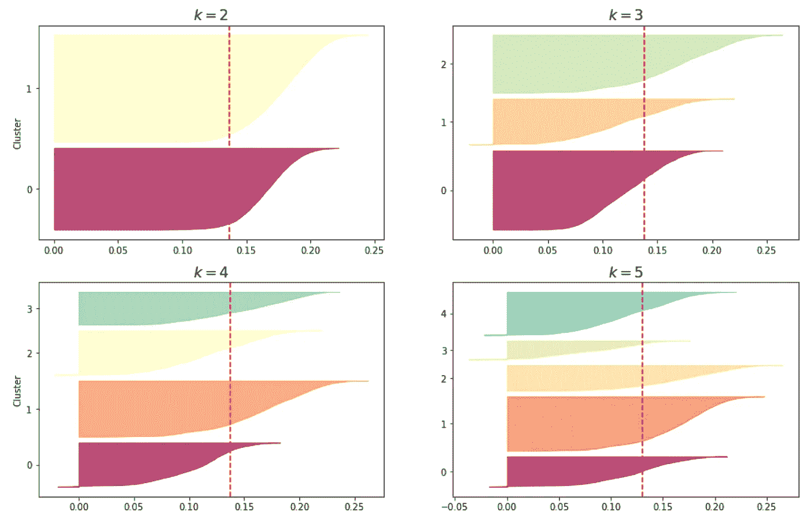
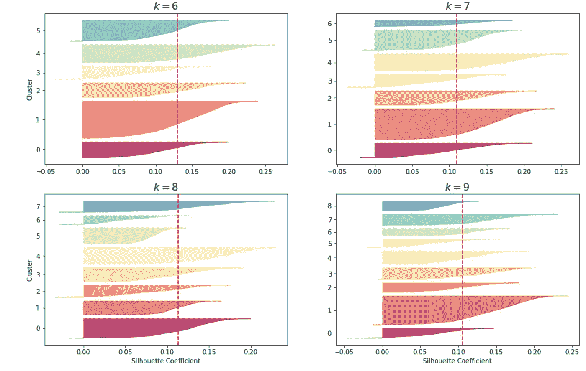

# 分类数据的特征工程

> 原文：<https://medium.com/geekculture/feature-engineering-for-categorical-data-a77a04b3308?source=collection_archive---------4----------------------->

## 除了一键编码之外，还有几个有用的技巧

Photo by [Alex Motoc](https://unsplash.com/@alexmotoc?utm_source=medium&utm_medium=referral) on [Unsplash](https://unsplash.com?utm_source=medium&utm_medium=referral)

在机器学习中，特征是指机器学习模型的输入或原始数据的数字表示。表格数据中有两种主要的特征:数值特征和类别特征。特征工程是从原始数据中提取特征并将其转换为适合机器学习模型的格式的过程。对于数字特征，最常用的特征工程是对数变换、标准化和规范化。对于分类特征，我们有很多方法可以将它们转换成数字，但是何时以及如何使用这些方法呢？这篇文章是关于为分类特性实现特性工程的。

在我们深入研究技术之前，让我先介绍一下我们用于说明的数据集:[车载优惠券推荐](https://archive.ics.uci.edu/ml/datasets/in-vehicle+coupon+recommendation)。该数据集是通过王等人(2017)对亚马逊机械土耳其人的调查收集的。调查描述了不同的驾驶场景，包括目的地、当前时间、天气、乘客等。，然后询问该人如果他或她是司机，他或她是否愿意接受优惠券。车载优惠券推荐数据集中的几乎所有特征都是分类的，这些特征可以分为三种类型:用户属性、上下文属性和优惠券属性。为简单起见，我将跳过关于这些功能的详细介绍，有关原始数据集的更多信息，可以查看上面的数据集链接，或检查我的 [Kaggle 笔记本](https://www.kaggle.com/iyet1killer/classification-on-categorical-data-part-1-sklearn/notebook)。

## 顺序编码

顾名思义，这种方法只适用于序数数据。有序数据是一种具有内在顺序的分类数据。例如等级、年龄范围和收入范围。在我们的数据集中，我们有那些顺序列:**餐馆 20 到 50** ，**餐馆 20** ，**外卖**，**咖啡馆**，**酒吧**，**年龄**，以及**收入**。下面是我对这些列的顺序编码的实现:

## 一键编码

名义数据是另一种分类数据，对于名义变量，最简单的编码方法是一热编码。如果一个变量有三个类别，那么一键编码将把它转换成三个新的类别。例如，名为 color 的变量有三个类别:红色、绿色和蓝色。在一次性编码之后，新变量应该是这样的:

一键编码的主要缺点是增加了维数。如果您有一个包含许多类别的变量，那么在一次性编码之后，数据集将比以前更加稀疏。通过`sklearn.preprocessing.OneHotEncoder`可以实现一键编码。这里有一个用`sklearn.Pipeline`和`ColumnTransformer`实现混合数据类型的特征工程的例子。

## 频率编码

频率编码是另一种用于名义数据的技术，它对类别的频率进行编码，因此不会增加数据集中的维数。这里有一个简单的例子:

Original Dataset

频率编码后，原始数据集将是:

After Frequency Encoding

类别被该类别在该变量中出现的频率所取代。请注意，当一些类别有相同的频率时，就像这个例子一样，我们确实丢失了原始数据的信息。下面是参考 [Bhavika 的代码](https://www.kaggle.com/bhavikapanara/frequency-encoding)的频率编码的实现。

## k 折叠目标编码

目标编码是分类数据特征工程中的神奇方法之一，其基本思想是利用类别相对于目标的统计量对原始类别进行编码。下面是一个简单的目标编码的例子。假设我们有一个二元目标变量和三个类别:红色、绿色和蓝色:

如果我们用均值目标编码，用目标变量的期望值对三种颜色进行编码，我们会得到`red_target = 0.5`、`green_target = 0.25`、`blue_target = 0.4`。

After target encoding

至于目标编码的缺点，第一个缺点就像序数频率编码一样——不健壮。在这个转换过程中，信息可能会丢失，特别是当目标的期望值对于许多类别来说非常接近时。另一个缺点是，由于在计算中涉及目标变量，存在数据泄露的风险。为了缓解这个问题，可以使用 k 折叠技术来交叉计算目标变量的期望值。[这里有一篇 Pourya](/@pouryaayria/k-fold-target-encoding-dfe9a594874b) 的文章，清晰地解释了 k fold 目标编码的机制，并提供了实现它的代码。基于他的工作，我添加了一些文档字符串和注释，使代码更具可读性:

下面是我为训练和测试数据实现它们的代码:

## 基于 K 原型聚类的特征扩展

除了编码方法，还有其他特征工程技术，如降维和特征扩展。在本文中，我们将介绍一种有效的混合数据类型特征扩展方法——基于 k 原型聚类的特征扩展。

对于数值数据，k-means 算法是最常用的特征扩展聚类方法。与层次凝聚聚类相比，k-means 更有效，因为它是线性复杂度，而层次聚类是二次复杂度，这使得它对于大数据集是昂贵的。

要用 k-means 聚类实现特征扩展，我们只需简单地添加聚类标签作为新特征。如果目标信息是可用的，我们也可以包括它来改进聚类过程。通过这样做，目标信息将被泄露到聚类成员中，但是在大多数情况下，我们不需要关注它，因为聚类算法的有损压缩将已经提取出一些目标信息。当数据集较小时，k 重交叉验证可用于减少因包含目标特征而引入的偏差。

但是，k-means 算法对分类数据没有意义。为了扩展 k-means 算法的使用，[黄](https://link.springer.com/article/10.1023/A:1009769707641)发明了 k-modes 和 k-prototypes 算法。引用他的论文:“k-modes 算法使用简单的匹配相异度来处理分类对象，用模式代替聚类的均值，并在聚类过程中使用基于频率的方法来更新模式，以最小化聚类成本函数。通过这些扩展，k-modes 算法能够以类似于 k-means 的方式对分类数据进行聚类。k-prototypes 算法通过定义一个组合的相异度，进一步整合了 k-means 和 k-modes 算法，以允许对由混合数字和分类属性描述的对象进行聚类。因此，在大多数情况下，k-prototypes 对于混合数据的聚类是一个不错的解决方案。

k-modes 和 k-prototypes 算法的 Python 实现可以在 [kmodes](https://github.com/nicodv/kmodes#id2) 包中找到。要实现 k-prototypes 算法，我们需要做的第一件事是找到一个合适的 k。剪影图可以用于它。下面是使用我们的数据集找到合适的 k 的代码，绘制剪影图的代码是从[用 Scikit-Learn、Keras 和 TensorFlow 进行动手机器学习，第二版由 Aurelien Geron](https://github.com/ageron/handson-ml2/blob/master/09_unsupervised_learning.ipynb) 编写。

为了使用 k 原型，我们需要指出分类特征的列索引。使用 sklearn 的预处理器后，列名和索引发生了变化:

然后我们包括目标特征，并绘制 k 从 2 到 9 的轮廓图:

剪影系数的范围从-1 到+1，剪影分数是聚类中所有实例的平均剪影系数。接近+1 的系数意味着该实例在自己的分类内，远离其他分类，而接近 0 的系数意味着它接近分类边界，最后接近-1 的系数意味着该实例可能被分配到错误的分类。

根据数据计划 a 的轮廓图，当𝑘=2,3,4,5 作为红色虚线指示平均轮廓分数时，轮廓分数看起来良好。我们选择𝑘=4as 作为我们 k 原型聚类的聚类数。

在挑选了 k 的数量之后，现在我们可以实现 k-prototypes 算法来进行特性扩展。下面的特征器是基于 Alice Zheng 和 Amanda Casari 在[机器学习的特征工程中的 k-means 特征器，我修改了代码使其适合 k-原型。](https://www.oreilly.com/library/view/feature-engineering-for/9781491953235/)

以下是我们使用车载优惠券数据集的方式:

## 方法比较

我们将计划 A 中的数据应用于频率和目标编码，而将计划 B 中的数据应用于一次性编码。功能扩展版本基于计划 a。以下是通过五个不同的基本模型测试分类的准确性。频率和目标编码版本在 k 最近邻分类器上获得了最高的准确率，而特征扩展版本在决策树归纳模型上获得了最高的准确率。

## 摘要

本文介绍了分类数据的一些特征工程技术。有关车载优惠券数据集的分类任务以及这些特征工程方法和机器学习模型之间的交互的更多信息，请查看[我的 kaggle 笔记本。](https://www.kaggle.com/iyet1killer/classification-on-categorical-data-part-1-sklearn#Model-Training)

欢迎评论，分享你的观点！