# 机器学习中的特征工程

> 原文：<https://medium.com/geekculture/feature-engineering-in-machine-learning-dfd5611bd4d5?source=collection_archive---------14----------------------->

## **什么是特性？**

特征是样品中的每一个单独的部分。我喜欢把它看作是数据集的最小单位，帮助我们分析数据并加以利用。例如，为了确定患者的肿瘤是良性还是恶性，要考虑每个细胞核的特征，例如半径、周长、纹理、面积等。

该博客将涵盖:

*   特征缩放
*   数据插补
*   极端值
*   编码技术

## **特征缩放**

特征缩放适用于数值变量。通常，我们数据集中的无数要素都有助于最终预测。这些特征的量值之间的巨大差异、非常大的范围或可用特征单位的不一致将导致不正确的预测。以 cm 为单位的身高等特征(取值:180、168 等。)和以千克为单位的重量(值:40、50 等。)，它们的量级有着巨大的差异。如果我们使用基于欧几里德距离的算法，例如 K 最近邻算法，在这些数据上，我们将得到数据点之间非常巨大和不一致的距离，导致某些特征的无意优势。因此，我们必须努力缩小这些特征。在使用使用梯度下降(线性回归、神经网络)、主成分分析或距离测量(KNN、K 均值、SVM)等概念的算法时，特别推荐使用这种方法。集成技术不一定需要特征缩放，因为它们不是基于距离的。

**通用术语**

缩放:将特征缩小到一个确定的范围，通常是 0 到 1 或-1 到+1。

标准化-它对数据值进行缩放，使它们的平均值为 0，标准偏差为 1。

归一化-它可以应用于非正态分布的特征，以便将其转换为高斯或正态分布。使用对数变换、倒数变换、平方根变换、指数变换、boxcox 变换可以实现*。*

特征缩放的类型:

1.  标准化(也称为 z 得分标准化)-这将要素的值替换为其 z 得分。

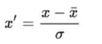

其中 x 是数据点，x̄是特定特征的整个列的平均值，σ是标准偏差。应用此技术后，分布以均值=0 和标准差=1 的方式进行转换。它利用了 sklearn 的标准标量库。

2.均值归一化-按比例缩小的值代表正态或高斯分布(钟形曲线)。

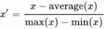

其中 x 是原始值，x '是归一化值。

3.最小最大缩放-这是一种标准化。

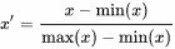

这里，平均值被其最小值代替。x= min(x)的最小值将 x '表示为 0，x= max(x)的最大值将 x '表示为 1。因此，该方法将值从 0 缩小到 1。

4.健壮的缩放器-它根据中位数和分位数缩放要素。它计算特征值和中值之间的差值，并将该差值除以分位数区间(IQR)。这是一种扩展带有异常值的数据的可靠方法。

5.单位向量

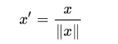

这也将值转换为 0 到 1 的范围，通常用于图像数据。

*其他技术包括* Max Abs 定标器、分位数变压器定标器和电源变压器定标器。

例如:考虑一个巨大的数据集，预测一个人是否幸存。

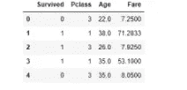

这是清洗后的样子。

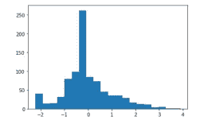

Histogram for age after Standardization

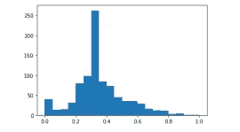

Age after Min max scaling

注意数据的范围和使用 fit_transform 而不是 fit。

## 数据插补

数据集中缺失值的存在通常会导致不令人满意的模型性能。有多种技术可以处理这些缺失值。

第一种是删除包含缺失值或空值的行或记录。当我们有一个大的数据集和最小数量的缺失记录时，这可能是偶然的。在小数据集上这样做会导致有价值的数据丢失，从而对模型性能产生不利影响。但是，当某个特定要素有许多缺失值时，可以在某些情况下使用它。

另一种选择是创建一个单独的模型来处理这些值。

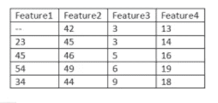

假设在要素 1 的情况下有一个缺失值的数据集。为了处理它，我们将创建一个模型，其中

训练集=没有缺失值的行

测试集=缺少值的行(即第 1 行)

该模型将根据特征 2、3 和 4(根据训练数据)进行训练，并将根据测试数据预测特征 1 的值。这种方法非常准确，但是大量缺失值的要素需要为每个要素设计大量的模型，这可能是一个繁琐的过程。

第三个选项是用集中趋势的度量(平均值、中值、众数)替换缺失值。这是一种有效且广泛使用的数据插补方法。让我们在糖尿病数据集的帮助下进一步探索这个概念。

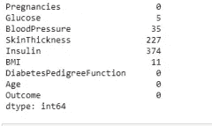

最初有 5 列缺少值。首先，我进一步研究了葡萄糖柱。

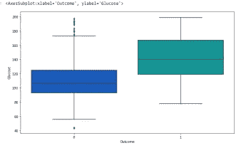

该箱形图在 x 轴上具有结果，在 y 轴上描绘了患者是否患有糖尿病(0 或 1)和葡萄糖水平。它显示了这两类患者的中位血糖水平。对于有缺失值的记录，我用它们所属的相应类的中值替换它们，而不是采取更随意的方法，用整个列的中值替换空值。

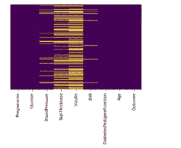

Map for missing values

热图显示其余 4 列有缺失值，但葡萄糖没有。

## 处理异常值

位于数据集分布之外的任何数据点都属于异常值类别。这些数据点并不总是毫无结果。在我们之前看到的糖尿病数据集中，任何患者被诊断为糖尿病的记录都是必须的，必须加以考虑。然而，由于人为错误或不正确的数据输入而导致的异常值通常会阻碍我们模型的性能。[这篇文章](https://statisticsbyjim.com/basics/remove-outliers/)给出了关于是删除还是保留数据中的异常值的宝贵见解。总而言之，

如果异常值是数据输入错误的结果，或者对于手头的研究问题不重要，则必须修复或删除异常值。然而，某些仅仅是数据自然变化的结果的异常数据点必须保留，因为它们准确地代表了数据中现有的可变性和不确定性。删除它们会提高模型的性能，但会使过程看起来比实际更可预测。

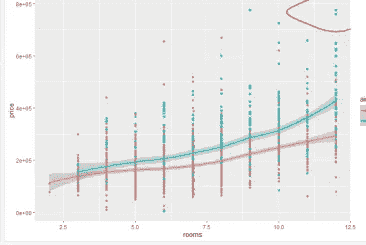

图中旁边的圆圈区域代表异常值。

识别和处理异常值-

1.四分位数间距(IOR)可以通过从第三个四分位数(Q3)中减去第一个四分位数(Q1)来计算，即第 75 个和第 25 个百分位数之间的差值。可以通过从分位数 1 减去 1.5*IQR 的乘积来计算下限值，并且可以通过将 1.5*IQR 的乘积加到分位数 3 来计算上限值。超出这些下限和上限的任何值都被归类为异常值。

2.z 分数-

在分布曲线中，任何超出-3 标准偏差或+3 标准偏差的点都被归类为异常值。

3.散点图、箱线图、线形图

**处理异常值-** 朴素贝叶斯、支持向量机、决策树、随机森林、GBC 等算法对异常值不敏感。然而，其他如线性回归、逻辑回归、k 均值、神经网络对异常值敏感。

## 编码技术

编码技术处理分类变量或特征。其中顺序不相关的特征被称为名义变量(例如，性别)，而其中排名重要的特征是序数(例如，工资水平、教育水平等)。

为了在我们的模型中有效地使用，这些变量需要被转换成整数值或浮点值。这是使用编码技术完成的。编码技术的类型:

**名义编码技术**

1.  一种热编码——考虑一个 7 行的数据集，其中一列是“Country”。

对每个国家使用虚拟变量，

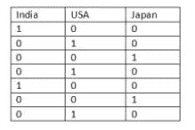

乍一看，这似乎很有效。然而，删除第三列“日本”会有什么不同吗？还是可以从前两列推导出来？

这被称为虚拟变量陷阱。在一个热编码中，我们只需要 n-1 列，其中 n 是特定分类变量中的类的数量。这种方法的一个缺点是，随着不同类数量的增加，列的数量也会增加。

1.一个热编码有多个类别

这种方法需要将一个热编码仅应用于最经常出现的类别。

2.平均编码

考虑数据集中存在的每个不同类别的名义要素。计算每个类别输出标签的平均值(可以是 0 或 1)。假设我们有 X，Y 和 Z 类，它们各自的平均值分别是 0.7，0.6，0.59。这些类别中的每一个的输出值将被先前计算的它们各自的平均值所代替。

**序数编码**

1.标签编码

教育水平，如学士、硕士、博士等，将根据其等级的增加分别编码为 1、2、3。

2.目标导向编码

这与均值编码的工作方式类似。然而，我们不是用计算出的平均值代替输出值，而是用它们来分配等级。我们找到每个类别的输出值的平均值(0/1 ),并相应地分配一个等级。

考虑数据:

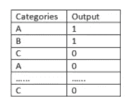

计算 A、B 和 C 的输出值的平均值。假设 A 类的输出标签的平均值为 0.8，B 类为 0.5，C 类为 0.45。这些将分别被列为 3、2、1。