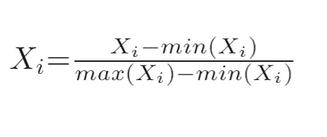
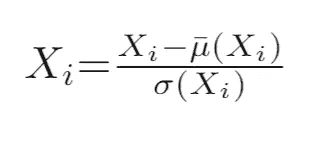
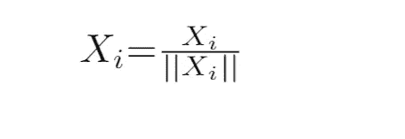
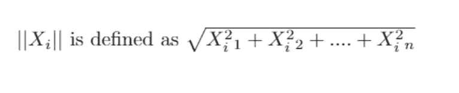
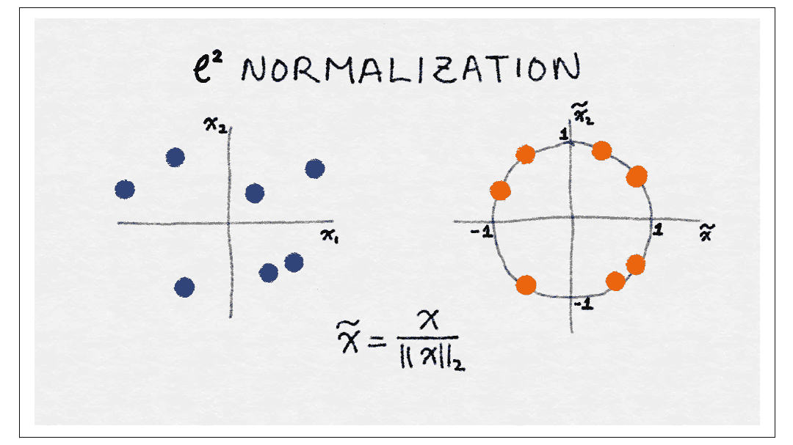
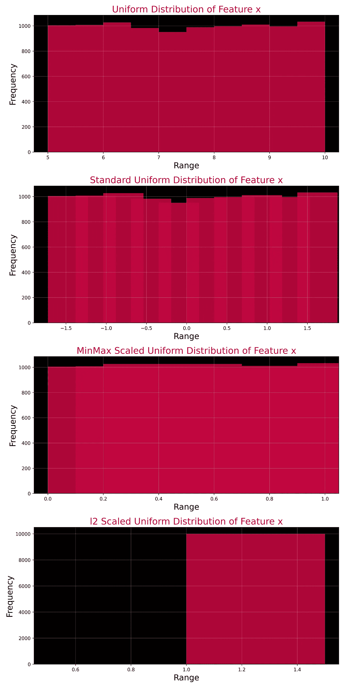
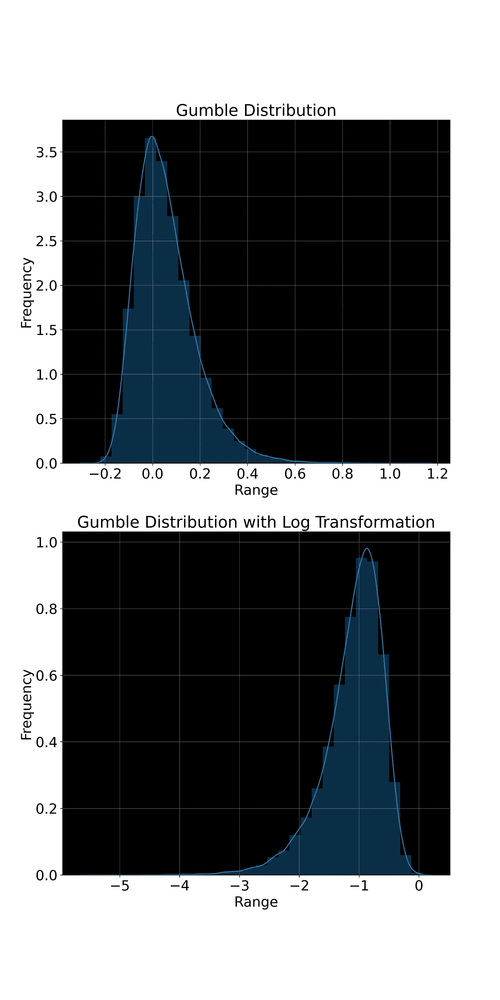
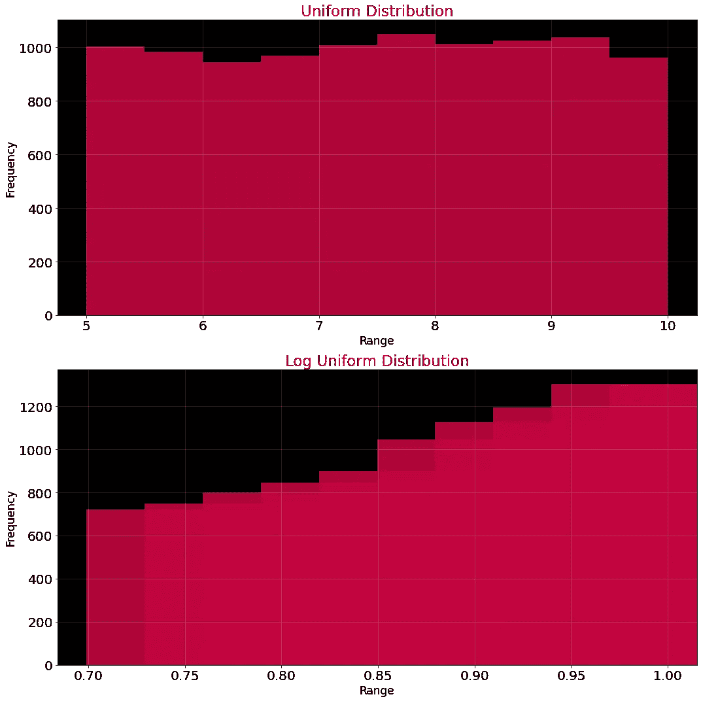
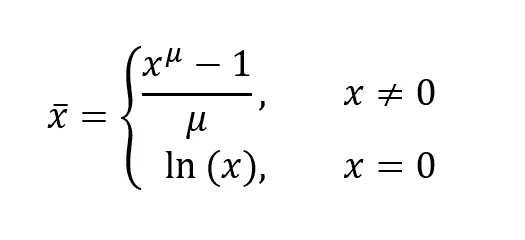
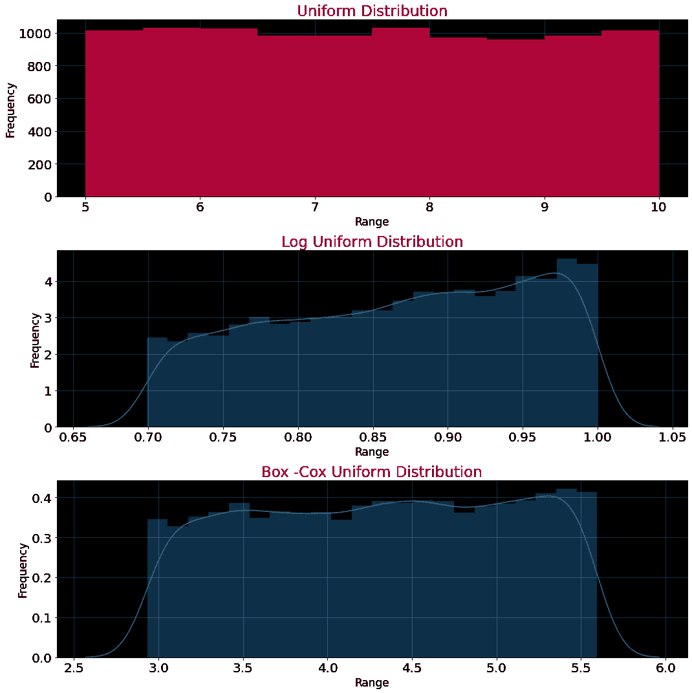

# 特征工程(一):数字特征

> 原文：<https://medium.com/geekculture/feature-engineering-part-1-numerical-features-684ffc44720?source=collection_archive---------13----------------------->

在我们的生活中，我们偶然发现许多数字；在账单中，可能是你的银行账户 XD，时间等。在机器学习中，它们是学习的根本，所有的模型都依赖于它们。特征工程在构建这些特征时发现了它的重要性，以从它们中获取最多的信息，并符合模型假设。如题所示，我们将研究数字特征工程，并将涵盖以下主题:

1.  **特征缩放**
2.  **特征变换**
3.  **特色互动**

# 1.特征缩放

特征缩放或归一化是一种帮助我们重新缩放特征的技术。许多机器学习模型是输入的线性模型，并且对特征的尺度敏感。大型数据框中的计数等要素可能会超出界限，难以累积，从而影响我们的模型性能，例如，在线性回归模型中，每个要素都有一个系数/权重，必须处理如此大范围的数字，因此会影响模型性能。为了解决任何此类情况，我们使用了扩展技术，包括:

a)最小-最大缩放器

b)标准化

c) l2 标准化

## 1.1 最小-最大缩放器

最小-最大缩放器通过使用特征的最小值和最大值，帮助我们将特征缩小到 0 到 1 的范围。

它确实会受到异常值的影响。想象一个数组[2，4，6，8，100]，其中 100 是异常值，因此缩放后的值现在将是[0，0.02，0.04，0.06，1]，如果这些特征不存在异常值[2，4，6，8，10]，那么缩放后的值将更有意义为[0，0.25，0.50，0.75，1]。

## 1.2 标准化

在这种特征缩放技术中，我们使用特征的统计属性，而不是最大值和最小值。我们使用特征的均值(μ)和标准差(sigma)来衡量其值。

缩放后的要素的平均值为 0，方差为 1。这种技术也称为方差缩放，因为使用的是标准差，即方差的平方根。注意，统计类似于正态分布，但总是 ***当且仅当执行标准化的分布是正态分布时，结果分布将是标准正态分布，否则它将是均值为 0、标准差为 1 的特征的原始分布。*** 一种实验性的理解方法可以在[这里找到](https://junkcharts.typepad.com/numbersruleyourworld/2019/11/myth-standardizing-variables-makes-them-normal.html) ***。***

> “如果输入变量包含异常值，标准化可能会变得偏斜或有偏差”，Jason Brownlee，机器学习大师

## 1.3 l2 标准化(缩放)

l2 归一化也在岭回归中用于补偿回归系数，也称为欧几里德范数，将特征除以其中所有观察值的平方和的平方根。也就是说，

l2 范数用于计算坐标空间中任何向量的长度，并且在这种缩放之后，特征向量 Xi 的长度变为 1。下图将进一步阐明这一点。

Figure: 2.17 of the book [Feature Engineering for Machine Learning](https://www.oreilly.com/library/view/feature-engineering-for/9781491953235/)

左边是两个特征 x1 和 x2 的数据空间，这些是缩放前的值，如果我们创建一条从原点到数据点的向量线，您可以看到每个向量都有不同的向量长度，而在右边归一化后，所有向量都有一个单位长度。

注意，上面讨论的所有缩放技术只是将值重新缩放到一个可接受的适当范围。它不会改变或修改特征的分布。当我们的特征的比例彼此相差很大时，缩放就很方便了。Wild Scales 在我们模型的训练中表现出数值的不稳定性，因此降低了模型的性能。

## 1.4 Python 中的实现

我们将使用一个虚拟特征 x，它是由 10k 个观测值生成的随机均匀分布。我们将使用上面学到的所有三种缩放方法，并可视化虚拟特征 x 的变化。我们还将验证它们都没有改变 x 的分布，只是改变了比例。

这些代码可以在 Github 的[机器学习库的 repo 中找到，还有我博客的其他代码。](https://github.com/aamir09/Machine-Learning-)

上面的输出如下:

请注意，每种缩放技术都没有改变 x 的分布，而只是移动了平均值并向外扩展。在下一部分(特征变换)中将不会观察到这种现象，该部分倾向于修改统计数据以及特征的分布。

# 2.特征转换

我们讨论了扩展以及它如何帮助我们。我们现在将注意力转移到特性转换上。什么是特征转换，它如何帮助我们？特征转换是我们修改特征的过程，以便将它们转换成更适合模型的结构，这反过来有助于最大化我们的性能。我们将讨论以下内容:

1.  **日志转换**
2.  **Box-Cox 变换**

## 2.1.对数变换

以 10 为基数的对数函数会将大于 1 的数字映射到小于数字原始范围的实数范围。例如，以 10 为基数的 log(100)将是 2，类似地，其他大数也可以映射到更小的范围，因此我们的模型不必处理大数，这通常会导致性能下降。对数变换是对要素的强大修改，它帮助我们减少要素中的方差，并尝试使分布接近正态分布。它在处理重尾分布(尾部的 pmf 比正态分布大的分布)时很有效，因为它压缩了高端，扩展了低端，形成了更长的头部。这里有一个例子来阐明上述陈述，我们将使用 Numpy 来生成一个 Gumbel 分布，它确实是重尾的，然后我们将在对其应用对数变换后分析该分布。

下端被拉长成一个更大的头部，而长尾被压缩，正如你在上面看到的。将分布拉向高斯分布的对数变换示例如下:

输出是:

请注意，对数转换是如何试图将分布拉向高斯分布的。

## 2.2 Box-Cox 变换

幂变换被称为方差稳定变换，因为它们倾向于消除方差对均值的依赖性。对数变换是其中的一部分，Box-Cox 变换也是如此。它利用对数变换和平方根变换，平方根变换由于其恒定方差的特性而被使用。box-cox 变换的等式是:

其中μ是分布的平均值。μ的值应该在范围(0，1)内，因为只有在这个范围内，x 的值才能收缩，否则它们将膨胀。与对数变换类似的 Box-Cox 变换尝试采用接近高斯的分布，并且比对数变换做得更好。记住它只对正数有效。

同样的一个例子是:

输出是:

这就是我的观点，如果你喜欢，请支持我，订阅我的电子邮件，这样你就不会错过我的任何文章。

# 参考

[1]机器学习的特征工程，A .郑，A .卡萨里，2018 年 4 月，奥赖利。