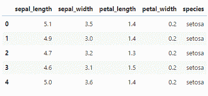
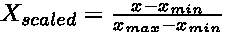
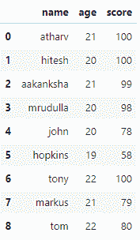
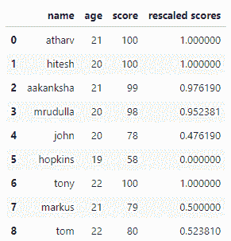
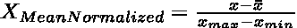
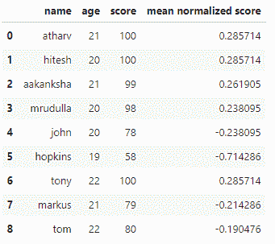
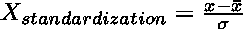
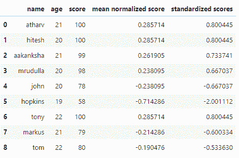
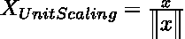
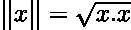

# 特征缩放

> 原文：<https://medium.com/geekculture/feature-scaling-5bb775c5da4c?source=collection_archive---------17----------------------->

了解特征缩放的基础知识，为什么使用它，以及它的方法。


Photo by [Kenny Eliason](https://unsplash.com/@neonbrand?utm_source=medium&utm_medium=referral) on [Unsplash](https://unsplash.com?utm_source=medium&utm_medium=referral)

根据维基百科的一篇文章:

> ***特征缩放*** *是一种用于将数据的自变量或特征的范围归一化的方法。在* [*数据处理*](https://en.wikipedia.org/wiki/Data_processing) *中，也称为数据归一化，一般在* [*数据预处理*](https://en.wikipedia.org/wiki/Data_preprocessing) *步骤中进行。*

那么，什么是特征缩放呢？你看到了“正常化”、“自变量”、“特征”、“数据预处理”、“正常化”这样的词，我们先来了解一下这些词是什么意思……

# 独立变量/特征

特性不过是数据集中的列名，

例如，你有一个虹膜数据集。



在这里你可以看到，列名:['萼片 _ 长度'，'萼片 _ 宽度'，'花瓣 _ 长度'，'花瓣 _ 宽度'，'物种']，只是特征。

我们可以使用这些特征创建各种 ML 模型，我们可以使用这些特征进行探索性数据分析。

# 数据预处理

为了理解数据预处理，考虑一个巨大的数据集，其中有些特征是有用的，有些是可怕的。因此，我们删除无用的数据，并将其他笨拙的数据转换成可用和兼容的形式。这就是数据预处理，将原始数据转化为有用的数据集。

我们将在接下来的文章中了解数据预处理。简而言之，如果单位很大，那么它们将更难计算，需要更多的时间…

现在你知道了为什么需要特性缩放，现在让我们来看看特性缩放的方法。

*   重新缩放(最小-最大归一化)
*   均值归一化
*   标准化(Z 分数标准化)
*   缩放至单位长度

# 重新缩放(最小-最大归一化)

在最小-最大归一化中，数据点根据其最大值和最小值进行重新缩放，因此重新缩放后的值在 0 到 1[0，1]的范围内。这是用列虎钳完成的，一次一列。



x scaled, by author

例如，我们有一些学生的样本数据，让我们手动创建这些数据，因为为什么不呢。

```
cols = ['name','age','score']
names = ['atharv','hitesh','aakanksha','mrudulla','john','hopkins','tony','markus','tom']
ages = [21,20,21,20,20,19,22,21,22]
scores = [100,100,99,98,78,58,100,79,80]
df = pd.DataFrame({
    "name":names,
    "age":ages,
    "score":scores
},columns=cols)
```



现在，让我们找出它们的最大值和最小值，并将它们保存在一个变量中。

```
df_max = df.score.max()
df_min = df.score.min()
```

现在，让我们看看这个公式是如何工作的，

```
for i in df.score:
    print((i-df_min)/(df_max-df_min))
```

> 1.0
> 1.0
> 0.9761904761904762
> 0.95238095809 523
> 0.4761904 7619047

现在，让我们比较一下重新标度的版本和原始版本的分数，

```
rescaled_scores = []
for i in df.score:
    rescaled_scores.append((i-df_min)/(df_max-df_min))
df['rescaled scores'] = rescaled_scores
```



# 均值归一化

这就像最小-最大归一化，但是有平均值。这种方法将数据/序列转换为更注重平均值的重新调整版本，重新调整版本的平均值为零，根据原始数据的平均值进行重新调整。



Mean normalized, by author

让我们用上面使用的相同数据集来尝试一下，

```
for i in df.score:
    print((i-df.score.mean())/(df_max-df_min))
```

> 0.2857142857142857

让我们将其与原始数据进行比较:

```
mean_norm_score = []
for i in df.score:
    mean_norm_score.append((i-df.score.mean())/(df_max-df_min))
df['mean normalized score'] = mean_norm_score
```



在这里，您可以看到原始数据的平均值为 88，tom 的得分(平均标准化得分)比任何其他值都更接近 0。

# 标准化

*   如果我们将 z 分数应用于每个数据点，那么我们可以将每个元素放在相同的范围内，而不会丢失任何数据。
*   为了恢复数据的原始形式，我们总是可以将它反转回来。



Standardization, by the author

其中 x 条是样本数据的平均值，sigma 是样本数据的标准偏差。

为此我们必须使用一个名为" Statistics "的额外库，我们将使用" stdev "方法来查找数据的标准偏差，查找标准偏差是一个非常简单的过程，但是为什么要浪费时间呢？

```
import statistics as stats
stats.stdev(df.score)
```

> 14.99166435056495

让我们找到标准化的值:

```
for i in df.score:
    print((i-df.score.mean())/(stats.stdev(df.score)))
```

> 0.8004448151580841
> 0.800448151580841
> 0.733741080561577
> 0.66703734596507
> -0.66703734596507
> -2.00111203789521【T13

现在让我们将其与原始值进行比较:

```
standardized_scores = []
for i in df.score:
    standardized_scores.append((i-df.score.mean())/(stats.stdev(df.score)))
df['standardized scores'] = standardized_scores
```



Standardized, image by the author

# 缩放至单位长度

如标题所示，我们将数据缩放到单位长度，但不仅仅是单位长度，我们用欧几里得单位长度缩放数据。

但这种方法在数据科学家中并不受欢迎，但对你来说可能是有效的和最优的，我本人从未尝试过这种方法来缩放数据，所以我必须更深入地挖掘这个话题。



Unit scaling, by the author

在哪里，



PS:更多关于单位缩放的信息将会随着我的了解而更新…

不要忘记留下掌声👏😊

联系人:[https://linktr.ee/a.kayyy](https://linktr.ee/a.kayyy)