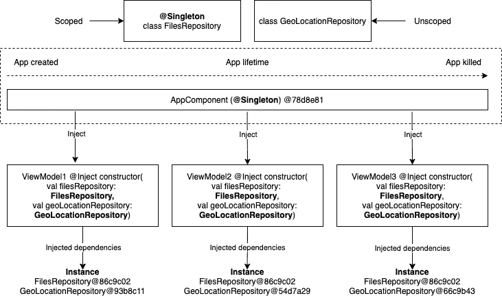
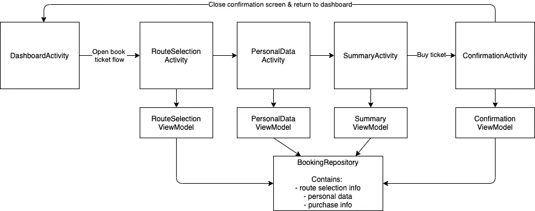
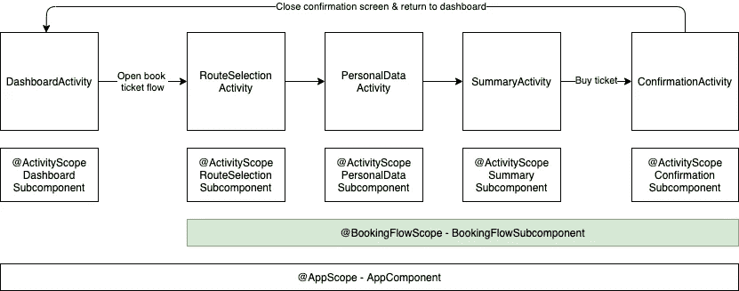
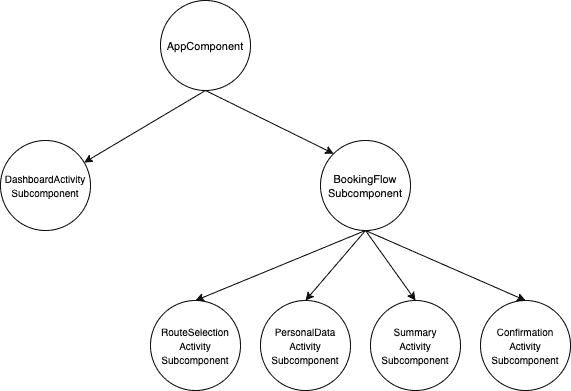

# 带匕首 2 的特征范围

> 原文：<https://medium.com/geekculture/feature-scopes-with-dagger-2-2b7a2ceb1c7d?source=collection_archive---------9----------------------->

## 作用域机制以及我们如何构建任何类型的作用域


Photo by [La-Rel Easter](https://unsplash.com/@lastnameeaster?utm_source=medium&utm_medium=referral) on [Unsplash](https://unsplash.com?utm_source=medium&utm_medium=referral)

App，activity &片段作用域是使用 Dagger 时熟悉的构造，但我们经常发现自己需要的作用域与这些不匹配。在这些情况下，我们需要创建自定义范围。它们的生命周期跨越多个片段和/或活动，并且通常映射到特性的生命周期。这就是为什么我们在本文中将它们称为特性范围。

# 所有范围都是一样的

所有 Dagger 作用域都使用相同的机制，在开始特性作用域之前，我们先来看看熟悉的 app 作用域(通常通过`**AppComponent — @Singleton**`定义)。这让我们对 scope 的主要构造有了很好的了解，并让我们正确理解如何设置&使用它们。首先，让我们修改三个重要的结构:

# **1。范围注释**

范围注释给出了范围的名称，是依赖项和组件之间的粘合剂。在 Android 社区中，*事实上的* **应用范围**注释为`@Singleton`。

Singleton annotation definition

> **让我们打破一个广为流传的神话:“**只有通过用`@Singleton`注释类，它才会使注入的依赖关系在应用程序级别成为单例” **—错误。**

`@Singleton` **是一个常规注释**和*本身*除了标记依赖项和组件之外，它什么也没做。基于这种标签，Dagger 理解了它们之间的关系。它的广泛使用可以归因于它是唯一由 **javax** 库提供的现成的作用域注释，并且在绝大多数 Dagger 示例中使用。因为它背后没有魔法，它可以很好地与任何其他注释交换，我个人更喜欢使用`@AppScope`，我觉得它更有表现力。

# **2。组件&子组件定义**

组件和子组件是负责注入依赖关系的匕首结构。注入应用范围依赖性的组件通常被称为 **AppComponent** ，它的基本实现如下所示:

AppComponent definition

需要注意的一个重要方面是`@Singleton`注释的使用。**app component 的** **实例只能注入有作用域的依赖项——单例(通过@Singleton)或无作用域的——非单例。**这是理解范围的一个关键方面，为了更好地形象化，让我们看看下图:



Scoped and unscoped dependencies

上面的例子遵循了`AppComponent`的典型用法；在应用程序的生命周期中会创建一个`AppComponent@78d8e81`实例，并将其存储在应用程序实例中。这个组件实例负责将限定范围的**文件存储库**和未限定范围的**地理位置存储库**依赖项注入到三个视图模型构造函数中。结果，我们可以看到，限定了作用域的**文件存储库**是作为单例注入的(所有注入的依赖项都具有相同的@86c9c02 引用)，对于未限定作用域的**地理位置存储库**，每次注入都会创建一个新实例。

> 组件/子组件实例可以注入组件/子组件范围的依赖项(单例)或未划分范围的依赖项(非单例)。

# 3.**组件/子组件实例创建的地点&其寿命**

在 app 作用域的情况下，`AppComponent`在 app 类中初始化，只要 app 存在，它就存在。通过在组件实例生命周期的上下文中控制依赖关系为单例或非单例的组件实例生命周期，我们可以根据需要控制依赖关系的生命周期。

Initialise AppComponent in Android application object

> 通过控制组件/子组件的初始化，我们控制了范围。
> 
> 快速回顾一下，范围设置所需的结构是:
> 
> -范围注释
> 
> -组件/子组件定义
> 
> -组件/子组件初始化的位置及其寿命

在下一节中，我们将看看这三个构造如何应用于特性范围。

# 功能范围

为了说明特性范围的设置和使用，我们将使用一个具体的例子。

**UX 要求—** 对于火车票应用程序，我们希望实现一个订票功能。预订流程由四个屏幕组成:路线选择、填写个人数据、购买摘要和确认屏幕。用户可以在流中向后和向前导航，能够看到他填写的数据，并且当用户退出流时，收集的数据被丢弃。`BookingRepository`存储流程中收集的数据，代表计算流程状态的真实来源。



High level class diagram for the booking flow

为了实现具有上述需求的流程，我们需要一个 Dagger 设置，它允许我们在流程开始时注入一个新的`BookingRepository`实例，在流程中注入相同的`BookingRepository`实例，并在流程终止时丢弃`BookingRepository`实例。这些需求需要一个**特征范围**。



Scopes overview

在上面的设置中，`AppComponent`注入应用程序级别的依赖项，`BookingFlowSubcomponent`注入预订流程中的依赖项，`activity subcomponent`注入依赖项，这些依赖项的生命周期与活动的生命周期相关。

这里要考虑的一个重要方面是除了`AppComponent`之外的所有注入器都是作为子组件实现的。子组件可以访问其父组件和祖先组件公开的所有依赖项，直到根组件。

组件图如下所示:



***提示:*** *告诉 Dagger 为具有一定范围的活动创建子组件的一个简单方法是通过* `*@ContributesAndroidInjector*` *和* `*scope*` *注释。*

*下面的代码片段显示了如何创建* `*RouteActivitySubcomponent — @ActivityScope*` *:*

```
@ActivityScope 
@ContributesAndroidInjector(modules = RouteSelectionModule::class)
abstract fun contributeRouteSelectionActivity(): RouteSelectionActivity
```

***注:*** *其他活动的子组件也是以同样的方式创建的。*

# 设置

所有的示波器都遵循相同的机制。我们之前已经看到了`AppComponent **—** @Singleton`中最重要的构造，现在让我们看看它们是如何应用于**功能范围**的。

**1。范围注释** —相同的实现，只是名称不同，`BookingFlowScope`。

BookingFlowScope annotation definition

***作用域依赖*** —要将`BookingRepository`作为 singleton 注入预订流作用域的上下文中，该类需要用`@BookingFlowScope`进行注释。

```
@BookingFlowScope
internal class BookingRepositoryImpl @Inject constructor(
    private val apiInteractor: ApiInteractor,
    private val paymentRepository: PaymentRepository
)
```

*****边注:*** *对于视图模型，活动的视图模型存储负责在配置更改后重新创建活动时提供相同的实例。***

**2。子组件—** 对于功能范围，我们将使用一个子组件来访问其父组件`AppComponent`公开的所有依赖项，并链接提供特定于该范围的依赖项的模块。子组件使用前面步骤中创建的`@BookingFlowScope`,并且能够注入流的所有活动。

BookingFlowSubcomponent definition

**3。子组件实例创建的位置&它的生命周期**

设置子组件时，与`AppComponent`(组件图的根)相比，还有一个额外的步骤。我们需要告诉 Dagger 这个组件是如何与图的其余部分连接的。在我们的例子中，`BookingFlowSubcomponent`是`AppComponent`的孩子。为了表达这种关系，我们在`**AppComponent.kt**`文件中添加以下几行:

```
*/**
 * Get [BookingFlowSubcomponent].
 */* fun bookingFlowSubcomponent(): BookingFlowSubcomponent
```

**附加步骤现在已经完成**，我们可以专注于子组件实例的创建及其生命周期。操作`BookingFlowComponent`实例的逻辑驻留在方法`**getOrCreateBookingFlowSubcomponent**`和`**releaseBookingFlowSubcomponent**.`中的`App`类中

Methods for manipulating the bookingFlowComponent instance

`**getOrCreateBookingComponent**`方法在流的所有屏幕中使用，以获得一个`BookingFlowSubcomponent`实例的句柄。当在第一个屏幕中被调用时，它会创建一个新的`BookingFlowSubcomponent`实例，并将其缓存在`bookingFlowSubcomponent`类变量中。对于在其他屏幕中执行的后续调用，该方法将返回缓存的实例。

`**releaseBookingFlowComponent**`退出预约流程时使用的方法是为了关闭范围。为了关闭范围，子组件被设置为`null`。在下一个垃圾收集周期中，子组件实例和注入的依赖项将被释放。当流程再次启动时，将创建一个新的子组件实例。

# 使用和注射

为了突出`BookingFlowSubcomponent`在活动中的用法，我们来看看`RouteSelectionActivity`(在其他活动中的用法是相同的):

Usage of BookingFlowSubcomponent in an activity

上面的代码中有两行很有意思，**第 4 行和第 13 行**。

在**第 4 行**中，在调用基类的构造函数之前，会发生两件事:

1.  `appInstance.getOrCreateBookingFlowSubcomponent()`返回`BookingFlowComponent`的新实例，因为`RouteSelectionActivity`是流程的第一个屏幕。在其他屏幕中或再次访问`RouteSelectionActivity`时，它将返回相同的实例。
2.  `bookingFlowSubcomponent.inject(this)`为这个活动注入依赖项。在流程中，依赖项的注入总是在同一个`BookingFlowSubcomponent`实例的上下文中完成。

在**行 13** 中，当流程终止时，`BookingFlowSubcomponent`被释放。`BookingFlowSubcomponent`实例将在下一个周期被垃圾收集；对于注入的依赖项也是如此，因为没有人再保留对它们的引用。

就这些了，非常感谢你们的阅读！我希望它对你有所帮助，如果你有任何问题和反馈，请通过评论区告诉我。

保持积极和健康；下次再见！