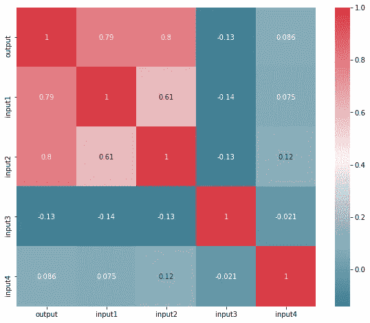
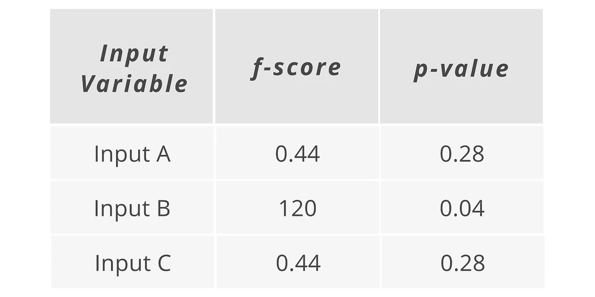
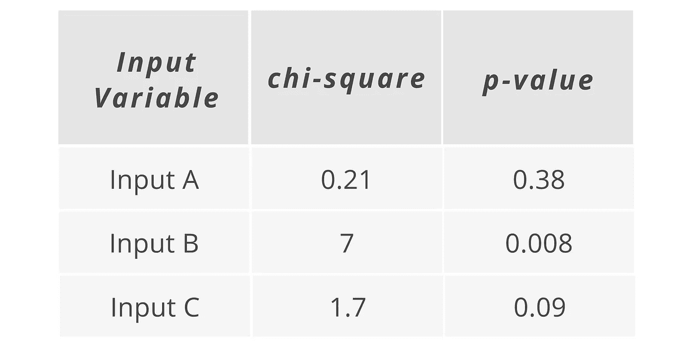

# 机器学习中的特征选择:相关矩阵|单变量测试| RFECV

> 原文：<https://medium.com/geekculture/feature-selection-in-machine-learning-correlation-matrix-univariate-testing-rfecv-1186168fac12?source=collection_archive---------1----------------------->

Photo by [Devon Divine](https://unsplash.com/@lightrisephoto?utm_source=medium&utm_medium=referral) on [Unsplash](https://unsplash.com?utm_source=medium&utm_medium=referral)

# 什么是特征选择

***特征选择*** 是用来选择对你的机器学习任务最重要的输入变量的过程。

在监督学习任务中，你的任务是预测一个输出变量，在某些情况下，你只限于使用几个输入变量，但有时，你将有机会使用一整套潜在的预测器或变量。在这种情况下，在模型中使用所有这些输入变量或预测值通常是有害的。这就是 ***特征选择*** 的用武之地。

# 为什么使用特征选择

1.  提高模型准确性
2.  更低的计算成本
3.  更容易理解和解释

# **进行特征选择的方法**

## **1。相关矩阵**

***相关矩阵*** 是显示不同变量相关系数的简单表格。该矩阵描述了表中所有可能的值对之间的相关性。它是一个强大的工具，可以总结大型数据集，并识别和可视化给定数据中的模式。

相关矩阵由显示变量的行和列组成。表格中的每个单元格都包含相关系数。

***相关矩阵***

***关联模板代码***

## 2.单变量检验

***单变量特征选择*** 或 ***测试*** 应用统计测试来找出输出变量和每个输入变量之间的关系。一次对一个输入变量进行测试。测试取决于您运行的是回归任务还是分类任务。

这些测试的示例输出是显示每个输入变量和输出之间的关系分数的表格。*(*见下图)*

**回归任务**

在回归任务中，可能会为每个变量提供一个 [*f 值*](https://deepai.org/machine-learning-glossary-and-terms/f-score) 和一个 [*p 值*](https://www.youtube.com/watch?v=vemZtEM63GY) ，并让您了解它们在输入和输出变量之间关系的统计显著性。这将有助于您评估您对模型中使用的变量应该有多大的信心。

***单变量测试:回归任务代码模板***

**分类任务**

根据您使用的测试，可能会为每个变量提供一个 [*卡方得分*](https://www.statisticshowto.com/probability-and-statistics/chi-square/) 和一个 [*p 值*](https://www.youtube.com/watch?v=vemZtEM63GY) 。同样，这让你看到了输入变量和输出变量之间关系的统计意义。

在回归或分类任务中，这将为您提供关于哪些变量可能比其他变量更重要的基本信息，并且您还可以为统计测试分数、p 值或两者设置一个阈值，以表明您只希望包括与您希望预测的输出变量有可靠关系的变量。

***单变量测试:分类任务代码模板***

***注:*** 单变量测试唯一的缺点就是它 ***只孤立地考虑变量*** 。它没有考虑到相互影响的变量。

## **3。交叉验证的递归特征消除 *(RFECV)***

***递归特征消除*** 拟合一个模型，该模型从所有输入变量开始，然后迭代地去除那些与输出关系最弱的变量，直到达到期望的特征数量。它实际上符合一个模型，而不像单变量测试那样只是运行统计测试。

> “RFE 很受欢迎，因为它易于配置和使用，并且可以有效地选择训练数据集中与预测目标变量更相关或最相关的那些特征。”

RFECV 中的 ***CV*** 表示 ***交叉验证*** 。它让你更好地理解你的模型中将包含哪些变量。

在交叉验证部分，它将数据分成不同的块，并在每个块上分别迭代训练和验证模型。这只是意味着，每当您评估包含或删除某些变量的不同模型时，算法也会从创建的模型场景中了解每个模型的准确性，并可以确定哪个模型提供了最佳准确性，从而得出要使用的最佳输入变量集。

***递归特征消除与 CV 代码模板***

***参考文献:***

 [## 交叉验证的递归功能消除- scikit-learn 0.24.2 文档

### 递归特征消除示例，自动调整交叉验证所选特征的数量。

scikit-learn.org](https://scikit-learn.org/stable/auto_examples/feature_selection/plot_rfe_with_cross_validation.html)  [## GitHub-ZL 63388/data-preparation-codes:这个库是基本代码模板的集合…

### 这个存储库是用于数据准备的基本代码模板的集合。我分享的所有代码都来自…

github.com](https://github.com/ZL63388/data-preparation-codes)  [## 数据科学无限

### 以正确的方式学习正确的内容，并提供无限的支持和指导，我致力于帮助您成为一名…

data-science-infinity.teachable.com](https://data-science-infinity.teachable.com/courses/data-science-infinity?affcode=716157_jcwmqdhh)