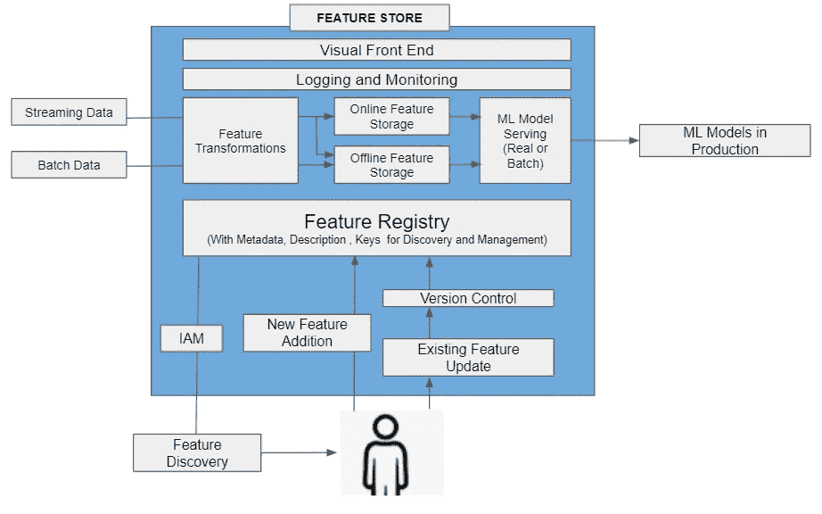

# 数据科学的特征存储:继续向上的旅程

> 原文：<https://medium.com/geekculture/feature-store-for-data-science-quick-summary-91b969fd5ddf?source=collection_archive---------4----------------------->

Photo by [Luke Chesser](https://unsplash.com/@lukechesser?utm_source=medium&utm_medium=referral) on [Unsplash](https://unsplash.com?utm_source=medium&utm_medium=referral)

# **为什么特色店:**

为了让我们理解特性库，我们需要首先理解什么是特性。我们提供给机器学习模型的数据被称为特征。现在，现实世界中产生的数据并不总是包含对未来预测的能力。您需要进行数据聚合、转换、数据连接，以根据您的业务/领域/统计知识创建新功能。我坚信这是数据科学家彼此不同的地方，他们的经验、专业知识和创造力在这里发挥着重要作用。我已经在[写了另一篇同样详细的文章](/swlh/first-principles-thinking-in-feature-engineering-for-machine-learning-801b40bb0e73)。

现在，通过一个简单的例子来解释这一点，假设你为一家自行车制造公司工作，现在你的任务是预测你公司未来的产品周期销售预测。你在你的业务领域有丰富的经验，你知道只要当地有好天气，健康运动，自行车销售就会增加。您必须在模型中包含这些特征。您已经付出了很多努力来集成这些外部付费 API，在每个邮政编码级别计算这些特性，最后，您有了一个很好的工作 ML 模型。

现在，在您的公司中，其他数据科学家需要建立一个 ML 模型，他们需要预测某一天的商店客流量。他们还意识到，天气和健康运动对客流量的增加起着重要作用。现在，他们必须花费类似的计算和存储成本才能将这些功能包含在该模型中。但这是你创造的，你们两个都在同一家公司工作？他们能利用同样的优势吗？数据科学家“A”在创建他/她的特征之前，如何知道其他数据科学家“b 到 z”创建的特征？

现在，我假设你对你的业务有很好的领域/功能知识，能够创造出新的特性。如果你没有领域知识，你已经做了各种迭代，使用广泛的统计概念来得出那些 ML 模型的最显著的特征。让你的同事利用你的专业知识是个好主意吗？毕竟有句话叫“[站在巨人](https://en.wikipedia.org/wiki/Standing_on_the_shoulders_of_giants)的肩膀上”，是有原因的。

对未来商店的需求还有更深入的认识，但我认为上面的例子符合主要需求。为了回答上面的许多问题，我们引入了一个功能库/功能库或任何其他有趣的名字。这是它适合的地方。

# 什么是功能存储:

我不想在这里介绍特征存储的另一个定义，它是一个特征库，允许数据科学家计算、存储、更新、记录、监控、发现和服务各种机器学习特征。要素存储是一个地方，在这里，不同的数据科学家可以协作发现彼此的创造力，并为他们的组织减少开发时间和成本。关于这方面的更多细节，我推荐阅读这些文章( [1](https://towardsdatascience.com/what-are-feature-stores-and-why-are-they-critical-for-scaling-data-science-3f9156f7ab4) 、 [2](https://www.kdnuggets.com/2020/12/feature-store-vs-data-warehouse.html) )。

# 功能存储的重要先决条件:

现在你可能想知道一个伟大的功能商店应该有哪些主要方面。

下图描述了我们应该在功能库中拥有的各种功能。

Data Scientist interacting with Feature Store, Image from Author, Inspired by [Feast](https://feast.dev/)

上面的架构恰当地总结了特征库的各个重要方面。让我们详细讨论特性存储的先决条件:

## 计算、存储、更新、记录、监控、发现和服务

这个部分(*计算、存储、更新、记录、监控、发现和服务*)是一个功能商店最起码的要求。与现有的数据仓库、数据平台等相比，任何缺少这些方面的功能存储都很难证明需要功能存储。

要素存储的第一个重要方面是允许基于数据科学家创建的数据管道计算新要素。那么它不仅应该能够存储那些带有元数据、属性键的特性，还应该允许那些特性的更新/版本控制。

接下来是特性库的另一个重要方面，即同一组织中的其他团队如何搜索这些特性，因此应该有一种通过使用元数据变量来搜索特性的方法。以便其他团队可以轻松地发现并利用这些特性来解决他们的业务问题。现在，为了实现这一点，数据科学团队可以使用适当的元数据(功能描述、主键、详细信息等)注册功能，稍后组织中的其他数据科学家可以使用这些元数据信息进行功能发现。

## 在线、离线功能

特征存储的另一个重要方面是存储和维护在线和离线特征。离线功能可用于服务批量模型或训练 ML 模型。而在线特征可用于实时预测。与离线功能相比，在线功能的延迟限制非常低。因此，功能存储应该能够支持适当的数据库，以满足延迟和存储要求。例如，今年推出的 Databricks 功能商店可以支持 Azure 上的在线和离线功能，存储选择使用 delta lake、Azure MySQL 等。

我们不应该混淆特性存储和数据仓库，两者是有区别的。我推荐阅读[这篇文章](https://www.kdnuggets.com/2020/12/feature-store-vs-data-warehouse.html)以了解关于这个话题的更多细节。简而言之，在典型的数据仓库之上，功能存储需要许多附加组件(如上所述)。但是，我们可以通过利用一些云原生功能(即 DVC、计算、存储、IAM、ML 服务等)来构建我们的功能库。

## 开源、托管

当谈到完全开源的特性库时，选择非常少。 **Feast** 就是其中之一，它是一个很棒的开源特性商店，对于 AWS 和 GCP 来说都是本地可用的。它是由谷歌和 Gojek 联合开发的，在这里阅读。然而，最近，我们看到了它在 Azure 和本地环境中的实现，有关更多细节，我将请求阅读来自 feast 团队的这篇 2021 年 4 月[的文章](https://feast.dev/blog/feast-0-10-announcement/)。在这篇文章中，他们呼吁，他们现在也提供对 Azure 和内部部署的支持。

现在很少有创业公司在开发商业可用的功能商店。[泰克顿](https://www.tecton.ai/)就是其中之一。如果你看到下一部分的图片，优步的米开朗基罗平台，是最初拥有特色商店的平台。泰克顿由米开朗基罗的团队创建。泰克顿也是 feast 特性商店开源库的核心贡献者。

各种云提供商也提供功能存储作为托管服务。它可能易于使用并与相同的云计算、存储和网络资源集成。这可能是各种企业基于其需求的自然选择。例如，谷歌的 vertex AI 正在拥有其[功能商店](https://cloud.google.com/vertex-ai/docs/featurestore/overview)，AWS 在 2020 年增加了一个[功能商店](https://aws.amazon.com/sagemaker/feature-store/)，作为其 SageMaker 平台的一部分。

## 访问控制

这是特征存储的另一个重要方面，关于数据的安全性。它应该提供一个身份和访问控制系统来管理对这些功能的认证访问。这是云原生特性存储得分较高的地方，因为您可以在现有的云 IAM 基础架构中轻松启用这些特性。

# 特色商店之旅:

现在，功能商店是如何发展的，大型科技公司是如何推动功能商店的发展的，我建议参考下面取自[这篇文章](/data-for-ai/feature-store-milestones-cca2bafe6e9c)的图片。

 [## 功能商店里程碑

### 与特色商店相关的最重要的产品开发、投资回合和公告的摘要。

medium.com](/data-for-ai/feature-store-milestones-cca2bafe6e9c) 

你可以从上面的旅程图中潜在地得出各种重要的见解。2020 年后，特色商店的采用率如何提高。这就是我们最近看到云原生选项作为托管服务可用于功能商店的原因。

围绕特色商店的热情现在已经达到了一个阶段，它观察了 2021 年 10 月举行的[世界首届特色商店峰会](https://www.featurestoresummit.com/agenda)。请参阅下面关于议程、演讲者和主题的详细信息。

 [## 特色商店峰会

### 单击“接受所有 cookie ”,即表示您同意在您的设备上存储 cookie 以增强网站导航…

www.featurestoresummit.com](https://www.featurestoresummit.com/agenda) 

如果你想了解更多关于这些科技公司(网飞、优步、Airbnb、Gojek、DoorDash、Lyft、LinkedIn)实现的功能商店的架构、实现和使用细节，那么我建议你去看看下面的 GitHub 链接，它总结了所有这些功能商店的链接。没有什么能比直接听取他们技术团队的意见更好了。

 [## GitHub-eugeneyan/applied-ml:📚公司的论文和技术博客分享他们在数据方面的工作…

### 📚公司的论文和技术博客，分享他们在生产中的数据科学和机器学习方面的工作。— GitHub …

github.com](https://github.com/eugeneyan/applied-ml#feature-stores) 

# **结论:**

在这篇文章中，我想写下我对特色商店的想法，请随时在评论区添加您的想法。