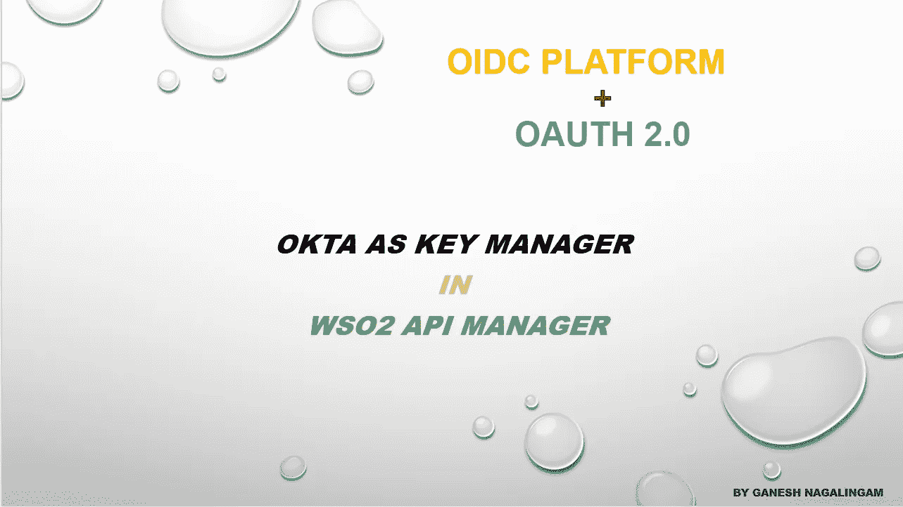
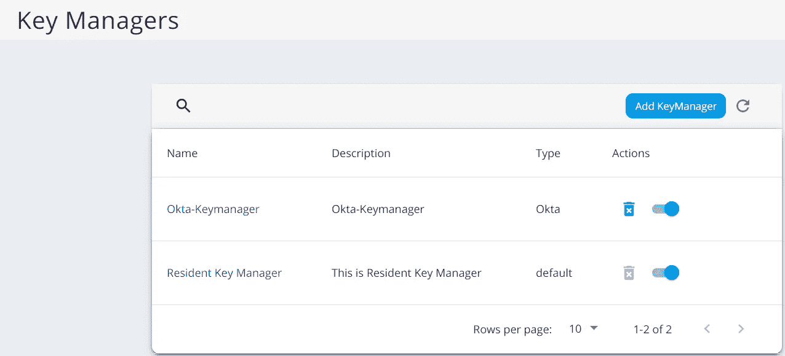
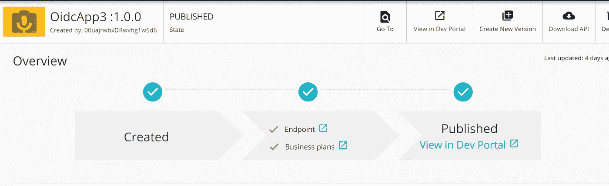
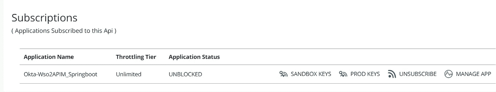
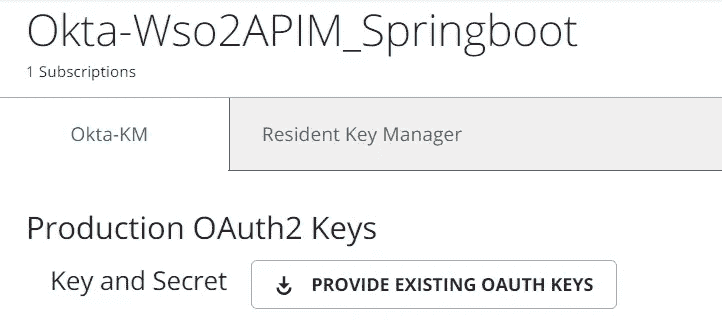
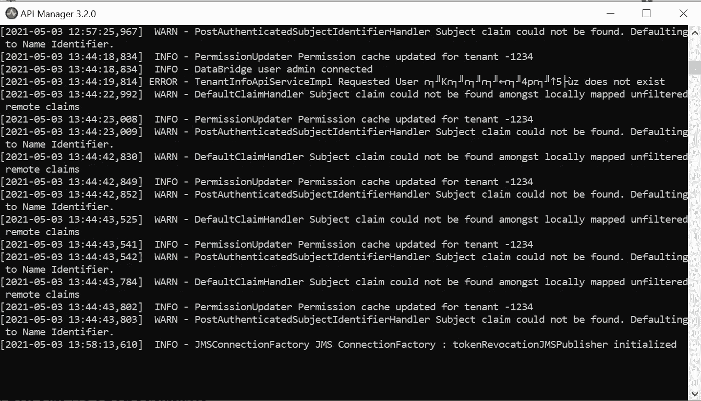
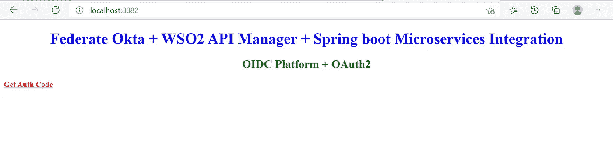
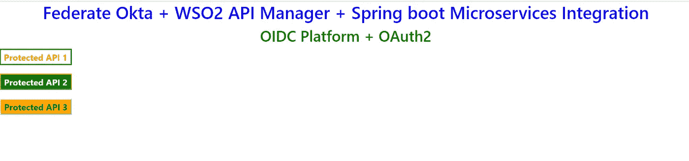

# 联合 OKTA IdP + WSO2 API 管理器作为 Spring boot 微服务集成的网关

> 原文：<https://medium.com/geekculture/federate-okta-idp-wso2-api-manager-as-gateway-to-spring-boot-microservices-integration-ba567567e81?source=collection_archive---------25----------------------->

## 实施 OIDC 平台+ OAuth 2.0 + WSO2 API 管理器

## OKTA 作为 WSO2 API 管理器中的关键管理器

Guide to OIDC Platform + OAuth 2.0 + Gateway Integration to Microservices

# 范围

a.本文解释了联合身份提供者与 WSO2 API 管理器的集成，以及使用 OIDC 2.0 + OAuth 2.0 通过 API 网关访问受保护的微服务。
b .通过 WSO2 API Manager 中的 OKTA Key Manager 配置，从 WSO2 API Gateway 发起访问令牌验证。
c .虚拟服务、资源、端点、生命周期。
d. Id 令牌，访问令牌，X-JWT——断言传播到使用 Spring boot / Spring 框架开发的受保护微服务。
e .开发并测试概念证明。

# 先决条件

a.OKTA 作为身份提供者。一个开发者帐户就足够了。
b. WSO2 API Manager v3.2.0，作为 API 网关。提供免费产品下载。
c .使用 Spring boot / Spring 框架，Java 平台的微服务开发。使用 Maven 进行设计和开发，让任何味道都黯然失色。

# WSO2 API 管理器组件

## a.管理门户

在本文中，它用于配置外部密钥管理器。在这里，我们将 OKTA 配置为密钥管理器。

## b.发布者门户

在本文中，它用于发布受保护的资源、配置虚拟服务、将虚拟服务映射到实际受保护的端点、发布 API。

## c.开发门户

在本文中，它用于创建一个新的客户机应用程序，该应用程序使用 WSO2 API Manager 中配置的 OKTA Key manager 生成动态客户机注册。这将在 OKTA(外部身份提供者)中自动创建一个 OIDC 平台应用程序。WSO2 API 管理器和 OKTA 之间的集成用于在访问受保护的 API 之前验证访问令牌。

# 整合概念

## 管理门户中的配置

a.在本文中，我们通过提供
***/将 OKTA 配置为密钥管理器。众所周知的*** *端点自动从 IdP 导入所需的 URI。
b.* 提供客户端应用的*客户端 id、客户端秘密*和 *API token* ，将客户端从 WSO2 API 管理器*动态注册到* OKTA IdP。
c. *API token* 可以在 OKTA 中创建，用于动态客户端注册。

OKTA, as key manager

## Publisher 门户中的配置

这种集成的目的有助于我们理解以下内容:-
a .创建一个 API 来通过 WSO2 API 管理器公开受保护的资源访问。
b. WSO2 API Manager 充当*网关，将用于将虚拟服务映射到实际端点。
c .这将有利于 ***解耦*** 实际服务端点，因为来自客户端应用程序的调用将指向 WSO2 API 管理器中配置的虚拟服务，该管理器将充当网关。
d .端点将是部署受保护微服务的域。
e . WSO2 API 管理器中的虚拟服务路径将包含映射的 ***上下文根/版本*** 。
f .例如，如果实际端点 API 有一个资源路径 **/secured** ，那么在 WSO2 API 管理器中配置的 ***资源路径*** 将是/ **安全的。**为配置的 ***资源路径*** 调用 API 网关时，该路径将被附加到实际端点。*下面显示一个例子:-**

> ***虚拟服务资源路径***http(s)://<wso2apim.com>:8280/gateway/version****/secured*** *将通过追加****/secured****实际微服务资源端点* *来调用微服务**

*g.在发布者门户中创建 API 并发布它。*

*h.API 应该 ***订阅*** 到 ***客户端应用*** ，以便通过 OAuth 2.0 访问令牌提供对受保护端点的授权访问。客户端应用程序将在 WSO2 开发门户中创建，WSO2 开发门户是 WSO2 API 管理器中的一个组件。*

**

*API created and published*

**

*API subscribed to client application*

## *开发门户中的配置*

*a.在 dev portal 中创建一个客户端应用程序，它将依次调用在 key manager 中配置的动态客户端注册 URI，在 OKTA 中创建一个 OIDC 平台应用程序。这种集成将用于在将访问令牌发送到受保护的资源端点之前验证访问令牌。*

*b.向客户端应用程序订阅 API 后，客户端应用程序可以通过配置的密钥管理器生成访问令牌。新创建的密钥管理器将显示在开发门户中，通过它应该生成访问令牌。在我们的示例中，关键经理是 OKTA。*

**

*OKTA, as Key manager*

# *运行示例*

*a.让我们在**端口 8082** 中运行弹簧启动微服务*

**

*Spring boot microservices — port 8082*

*b.让我们在**端口 9443** 中运行 WSO2 API 管理器*

**

*WSO2 API Manager — port 9443*

*c.打开浏览器，点击超链接 ***/authorize(获取授权码)*** URI 获取 ***授权码授予*** 。这将首先用 OKTA IdP 认证用户，然后将把 ***代码*** 传递给重定向 URI。控制器将读取**代码**并通过 rest 模板调用***/令牌*** 端点将 ***代码*** 换成*。接收到的 ***访问令牌*** 将被发送到 ***网关*** 进行验证，一旦通过 ***密钥管理器*** 验证成功，将通过传递访问令牌来调用受保护端点。将从受保护资源接收对客户端应用程序的响应。**

****

**Get Authorization Code**

****

**Access Protected API resource with access token**

# **结论**

**本文是 IAM 初学者和中级人员学习如何集成不同 IAM 产品及其好处的起点。它分享了对 OIDC 平台+ OAuth 2.0 +密钥管理器、通过 WSO2 API 管理器公开的 Spring boot 微服务端点和联合身份提供者集成的见解。**

## **发布于 2021 年 5 月 3 日**

> *****其他中等文章，*由*加内什*** 撰写**
> 
> **[*探索语法树和补救代码气味使用 JAPA 访客模式*](/geekculture/quest-syntax-tree-and-remedy-code-smell-using-japa-visitor-patterns-f023a89842cf)**
> 
> **[异步 WebSocket 消息中间件和微服务](/nerd-for-tech/asynchronous-websocket-messaging-middleware-and-microservices-1a50a8f14e4b)**
> 
> **[通过 CORS 融合 Angular 和 Spring Cloud 架构](/geekculture/amalgamate-angular-with-spring-cloud-architecture-through-cors-7f13b5fdb98f)**
> 
> **[*多代理洞察 Apache Kafka 集群架构*](/geekculture/multi-broker-insights-into-apache-kafka-cluster-architecture-617b0abfc53e)**
> 
> **[远程队列定义:IBM MQ v9.2](https://ganeshblog.medium.com/remote-queue-definition-ibm-mq-v9-2-c3ec4f568dab?source=user_profile---------5----------------------------)**
> 
> **[Kubernetes Pods&Docker Containers:在 Windows 10 Home 中使用虚拟盒子旋转虚拟机](https://ganeshblog.medium.com/kubernetes-pods-docker-containers-spin-vm-using-virtual-box-in-windows-10-home-d3be783ff087?source=user_profile---------0----------------------------)**
> 
> **[*整合服务提供商(sp)与 OKTA 身份提供商(IdP)*](https://ganesh-nagalingam.medium.com/integrate-service-providers-sps-with-okta-identity-provider-idp-ce64a4e262ae)**
> 
> **[将 IBM 业务流程管理器与混合 MobileFirst 应用程序集成](https://ganeshblog.medium.com/integrate-ibm-business-process-manager-with-hybrid-mobilefirst-application-5aed20841bf3?source=user_profile---------2----------------------------)**
> 
> **[Kerberos v5:使用 Apache directory studio 在 Windows 10 Home 中进行 SSO 认证](https://ganeshblog.medium.com/kerberos-v5-sso-authentication-in-windows-10-home-using-apache-directory-studio-fb0151899185?source=user_profile---------3----------------------------)**
> 
> **[将 IBM WebSphere Service Registry and Repository 与 IBM Process Server 集成](https://ganeshblog.medium.com/integrate-ibm-websphere-service-registry-and-repository-with-ibm-process-server-f97eeb0e2ea?source=user_profile---------6----------------------------)**