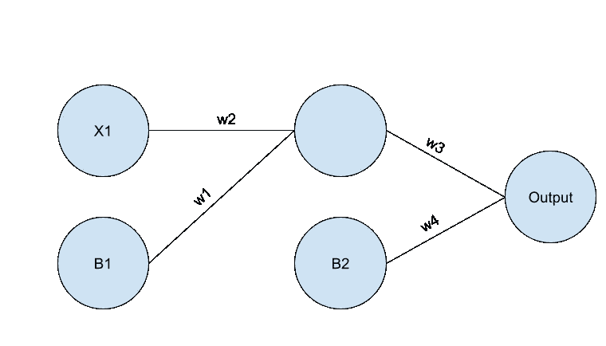

# 前馈实现:PyTorch 深度学习第 4 部分

> 原文：<https://medium.com/geekculture/feed-forward-implemented-deep-learning-with-pytorch-part-4-9761721698c?source=collection_archive---------16----------------------->

## 使用基本 Python 从头开始实现一个简单的神经网络

Photo by [Florian Olivo](https://unsplash.com/@florianolv?utm_source=medium&utm_medium=referral) on [Unsplash](https://unsplash.com?utm_source=medium&utm_medium=referral)

欢迎来到 PyTorch 深度学习第 4 部分！如果你是新手，可以看看前面的部分。前面的部分都在[我的媒体页面](https://jinalshah2002.medium.com)上。作为复习，在上一篇文章中，我介绍了前馈数学。前馈是神经网络的基本概念之一。前馈是一个过程，在这个过程中，你的神经网络接受你的输入，通过你的隐藏层“馈送”它们，并“吐出”一个输出。

在本文中，我将提供一个用 Python 实现前馈的完整实现。本文中的所有代码都可以在我的 [Github 页面](https://github.com/JinalShah2002)的[这个资源库](https://github.com/JinalShah2002/Deep-Learning-with-PyTorch)中找到。我已经尽了最大努力对代码进行了彻底的注释，以便您理解每一步都发生了什么。我强烈建议您获取代码样本并进行实验。毕竟，对于编码，你是边做边学的。事不宜迟，我们开始工作吧！

# 基本设置

在我们直接进入代码之前，确保我们的环境设置正确是非常非常重要的。你用的编辑器真的取决于你。我强烈建议你下载 [Anaconda 平台](https://www.anaconda.com)。这是因为你会自动安装所有的基础数据科学工具如 Jupyter Notebook，sklearn 等。如果您选择不下载 Anaconda，请确保您已经安装了 [NumPy](https://numpy.org) 库。这可以通过键入以下命令来完成:

*   pip 安装数量

公平的警告，在本教程中，我假设你有基本的 Python 知识和关于面向对象编程(OOP)概念的知识。

# 密码

我们将寻求建立的神经网络架构将是一个简单的 3 层神经网络。图 1 提供了对这种神经网络架构的直观理解。

Figure 1: This is the neural network architecture that we will be implementing. X1 represents are the 1, and the only, input. B1 & B2 represent the biases for each layer, and w1,w2,w3, and w4 represent the weights. The image was created by the author.

此外，我将使用的激活函数将是 sigmoid。通常，您可能会使用各种激活函数，比如 ReLU 或 tanh，但是为了简单起见，我使用 sigmoid。

您可能已经注意到，神经网络的架构相对简单。这样做的主要原因是，我想让你对前馈在神经网络中如何工作有一个简单而具体的理解。如果我们实现了一个有很多很多隐藏层的更复杂的架构，我保证你从零开始实现之后，你的脑子会完全炸了。此外，我们将要实现的神经网络很可能在数据集上表现不佳。这有两个原因:

*   神经网络还没有训练好。我将在以后的文章中介绍神经网络的训练方面。
*   这太简单了。使用这种神经网络架构来解决问题是非常罕见的。我知道没有什么是不可能的，但这种情况会非常非常接近。

以下是完整的代码:

Figure 2: the full code of the feed-forward implementation for a neural network

这段代码很多，我们来走一遍。如果您注意图 2 的底部，可以看到我已经实现了 sigmoid 函数。正如我上面提到的，这个函数将作为神经网络的激活函数。如果您不熟悉 sigmoid 激活函数，图 3 提供了它的数学表示。

Figure 3: The Mathematical Representation of the Sigmoid Function. [https://analyticsindiamag.com/beginners-guide-neural-network-math-python/](https://analyticsindiamag.com/beginners-guide-neural-network-math-python/)

此外，图 4 显示了对它的图形化理解。

Figure 4: A graphical representation of the sigmoid function. [https://analyticsindiamag.com/beginners-guide-neural-network-math-python/](https://analyticsindiamag.com/beginners-guide-neural-network-math-python/)

如图 4 所示，sigmoid 函数以压缩 0 & 1 之间的值而自豪。如果你熟悉经典的机器学习，你可能会认为这是逻辑回归。

关于 sigmoid 函数说得够多了，让我们把注意力转向 forward 函数，这是这段代码的核心。在 forward 函数中，你可以看到我是如何通过隐藏层和输出层输入 X 的。换句话说，我正在执行神经网络的前馈阶段。正如我们在以前的文章中讨论的，前馈本质上是许多矩阵乘法。这在代码中显而易见。如你所见，我首先将偏置和输入矩阵连接成一个矩阵。然后，我通过[矩阵乘法](https://www.khanacademy.org/math/precalculus/x9e81a4f98389efdf:matrices/x9e81a4f98389efdf:multiplying-matrices-by-matrices/a/multiplying-matrices)将这个矩阵乘以权重。我对隐藏层和输出层重复这些步骤。这两层之间唯一的区别是，我将 sigmoid 激活函数应用于隐藏层的输出。为了简单起见，我没有将 sigmoid 函数应用于输出层；但是，有时您可能希望对输出图层应用激活函数。例如，您可能想要获取概率作为输出，因此您可能想要在输出图层上应用[soft max 激活](https://en.wikipedia.org/wiki/Softmax_function)函数。

我要指出的最后一点是构造函数(__init__ function)中的权重和偏差声明。如您所见，我将权重设置为随机数。这里要指出的重要一点是，无论何时你建立一个神经网络，你将总是从随机权重开始。这是因为，例如，如果我们将每个权重设置为 0，那么反向传播可能在更新权重等方面存在问题。为了不陷入这种混乱，我们随机设置权重。此外，您可能还注意到，我将偏差设置为等于 1。**通常，神经网络中的偏差设置为 1。**

# 为什么要使用框架？

我想通过讨论当我们可以从头开始实现神经网络时，我们为什么要使用深度学习框架来结束这篇文章。老实说，这个问题有一个非常简单的答案:从头开始实现一个非常深的神经网络(比如 100+个隐藏层)对我们来说工作量太大了。此外，深层神经网络背后的数学可能会让你的大脑真的爆炸。像 PyTorch 和 Tensorflow 这样的框架为我们做了所有繁重的工作。它们使得建立神经网络变得非常简单和容易。我们所要做的就是定义我们的架构、损失函数等等。为什么我们要“重新发明轮子”？

Photo by [Aaron Burden](https://unsplash.com/@aaronburden?utm_source=medium&utm_medium=referral) on [Unsplash](https://unsplash.com?utm_source=medium&utm_medium=referral)

# 关闭

如果你读到了这篇文章的结尾，我感谢你。作为读者，你的支持真的激励我去创造更多有意义的内容。我希望您从零开始学到了一两件关于实现前馈的事情。一如既往，如果你有任何问题，请在下面的评论中留下。如果你有任何反馈，也请在下面的评论中或者在这篇文章的私人评论中告诉我。如果你有兴趣接触，请随时通过 [LinkedIn](https://www.linkedin.com/in/jinalshah2002/) 与我联系。下次见！享受深度学习！