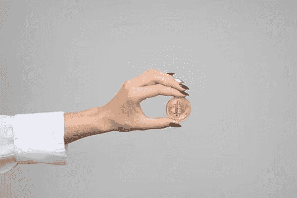

# 女性名人鼓励女性参与加密

> 原文：<https://medium.com/geekculture/female-celebrities-encourage-women-involvement-in-crypto-da9a42f14ea8?source=collection_archive---------20----------------------->

Image credit: [Piqsels](https://www.piqsels.com/en/public-domain-photo-jzeub)

主要的女性名人聚集在一起，鼓励更多的女性参与加密和 NFTs。包括瑞茜·威瑟斯彭、米拉·库妮丝、格温妮丝·帕特洛和帕丽斯·希尔顿在内的明星认为女性应该在塑造互联网的未来中发挥更大的作用。他们希望确保女性不会错过有利可图的投资机会，或者沉迷于将从根本上重塑我们思考、工作和互动方式的新技术。

帕特洛女士在一次由面向女性的加密货币社交社区 [BFF](https://mybff.com/) 主办的活动中评论道:“我们看到很多这样的兄弟聚在一起，赚了很多钱。”。

这些女性名人共同传达了女性赋权的信息。“我们也应该在这个领域占有一席之地，”帕特洛女士断言。

## **BFF:女性加密货币社区**

布里特·莫林和杰米·施密特创办了 BFF。莫林女士是数字媒体公司 Brit + Co .的首席执行官，施密特女士是一位企业家，她创立了美容品牌施密特的 Naturals。

除了米拉·库妮丝和格温妮丝·帕特洛的支持，其他支持 BFF 社区的主要女性包括:

*   《出租跑道》的创始人兼首席执行官 Jenn Hyman
*   兰迪·扎克伯格，女商人，马克·扎克伯格的妹妹
*   Shiza Shahid，社会企业家，马拉拉基金前首席执行官
*   希拉·马塞洛，Care.com 的创始人兼首席执行官
*   Julia Hartz，Eventbrite 的创始人兼首席执行官
*   丽贝卡·明科夫，时装设计师

BFF 计划在未来开发和销售自己的 NFT。在线社区是免费加入的。它提供了一个平台来学习和联系其他对这个领域感兴趣的女性。

BFF 品牌团队成员 Jessica Hische 表示:“对 crypto/Web3 的一大批评是，它由‘加密兄弟’主导，他们不一定以批判的眼光看待这个新领域，也不一定优先考虑平等访问或可持续发展。”“但这就是我加入 BFF 的原因，BFF 是一个新的开放社区，希望将更多的女性和非二进制人群带入这个领域。”

Photo by [LinkedIn Sales Solutions](https://unsplash.com/@linkedinsalesnavigator?utm_source=unsplash&utm_medium=referral&utm_content=creditCopyText) on [Unsplash](https://unsplash.com/s/photos/women-executives?utm_source=unsplash&utm_medium=referral&utm_content=creditCopyText)

## **妇女投资参与差距**

Web 3.0 空间正在快速增长。据估计，到 2026 年，这将是一个 10 万亿美元的市场。然而，男性占 Web 3.0 应用程序参与者的 80%以上。

虽然数据显示，女性投资者的表现优于男性，但总体而言，女性在投资参与方面落后于男性。数据显示，在密码交易所的用户中，女性不到三分之一。

这意味着许多有钱投资的女性反而在观望。由女性名人带头发起的倡议旨在增强女性的投资信心。

## **名人促销**

推动女性更多参与 crypto 的名人一直小心翼翼地不把他们的信息框定为投资建议。相反，他们告诉女性去研究潜在的投资并进入这个领域。

使用社交媒体认可加密投资的名人可能会与证券交易委员会(SEC)陷入法律纠纷。美国证券交易委员会的执法部门已经对一些名人发出警告并处以罚款，因为他们在付费社交媒体上的代言听起来好得令人难以置信。声明内容仅供参考，不构成投资建议的法律免责声明有助于避免未来的法律问题。

“我们有责任……一旦你学会了分享知识，欢迎人们，”威瑟斯彭女士说。

库尼斯女士也有同感。“这仅仅是为了鼓励女性去冒一点风险，去探索，去接受教育，去尝试，去参与，”她说。“如果你不喜欢，那很酷。”

美国说唱歌手种马梅根(Megan the Stallion)在社交媒体上发布了一个名为“[辣妹用比特币](https://www.youtube.com/watch?v=5AN5veSPfY4)”的视频。作为 CashApp 的发言人，种马梅根鼓励她的粉丝们自学加密货币。

## **帕丽斯·希尔顿和 NFTs**

社交名媛帕丽斯·希尔顿(Paris Hilton)对自己的秘密投资和推出自己的 NFT 系列直言不讳。她从 2016 年开始投资比特币和以太。最近，希尔顿加入了 NFT 平台 Origin Protocol，担任战略顾问。

希尔顿和其他名人正在努力增加 NFT 女性艺术家和投资者的数量。根据 ArtTactic 的一份报告，女性艺术家创作的 NFT 艺术品不到 20%。女性发起了一个名为[女性世界](https://worldofwomen.art/)的项目，以庆祝 NFT 空间的包容性。瑞茜·威瑟斯彭、珊达·瑞姆斯和伊娃·朗格利亚过去都曾宣传过《女性世界》。自 2021 年 7 月首次亮相以来，妇女世界项目已创造了超过 4000 万美元的收入。像这样的社区支持倡议的成功证明了名人在促进整个 Web 3.0 世界的多样性方面可以产生积极的影响。