# 发酵印度罗布斯塔咖啡果

> 原文：<https://medium.com/geekculture/fermenting-indian-robusta-coffee-cherries-dbfb7acb0a17?source=collection_archive---------8----------------------->

## 咖啡数据科学

## 作者:Ashish Rao 和 Robert McKeon

当我进入专业[罗布斯塔](/geekculture/we-dont-talk-about-robusta-fa5d14c8e505)，[阿希什](https://instagram.com/skia_coffee_?igshid=YmMyMTA2M2Y=)伸出手。他曾致力于利用发酵来改善他农场的罗布斯塔酒。他提出给我寄一份青豆样品。

这咖啡和我以前喝过的很不一样。它有罗布斯塔咖啡的口感，没有强烈的苦味，咖啡有点甜。所以我问他是怎么发酵樱桃的。他分享了一些他如何着手发酵罗布斯塔的图表，并允许我发表它们。

首先，你必须收获。我喜欢所有的图片，这就是为什么我没有删除任何步骤。

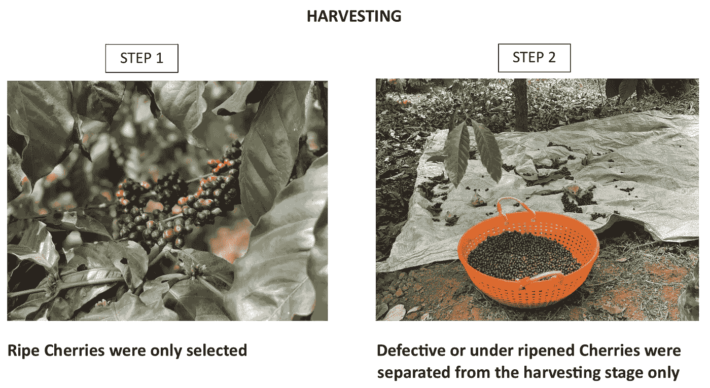

All images uses with permission

然后你取出所有的碎片。

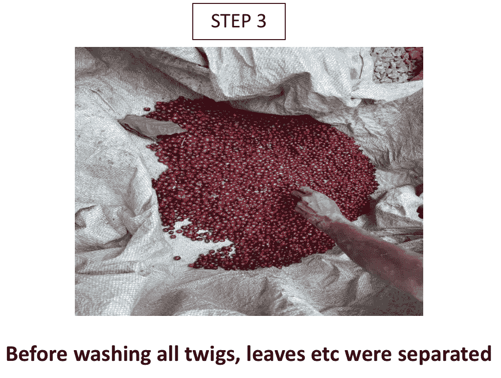

接下来是洗衣服。漂浮的咖啡果通常不够成熟，所以你想把它们去掉。

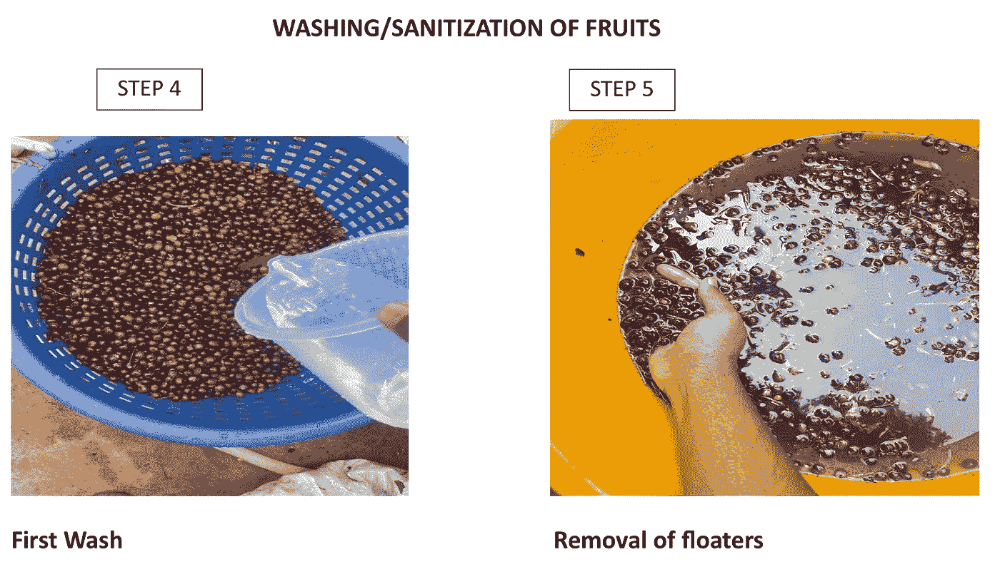

再次清洗和分类，然后漂洗以杀死任何细菌。

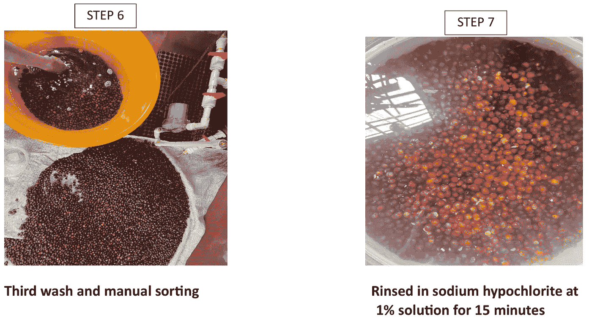

阿希什尝试了两种发酵方式:乳酸发酵和酒精发酵。

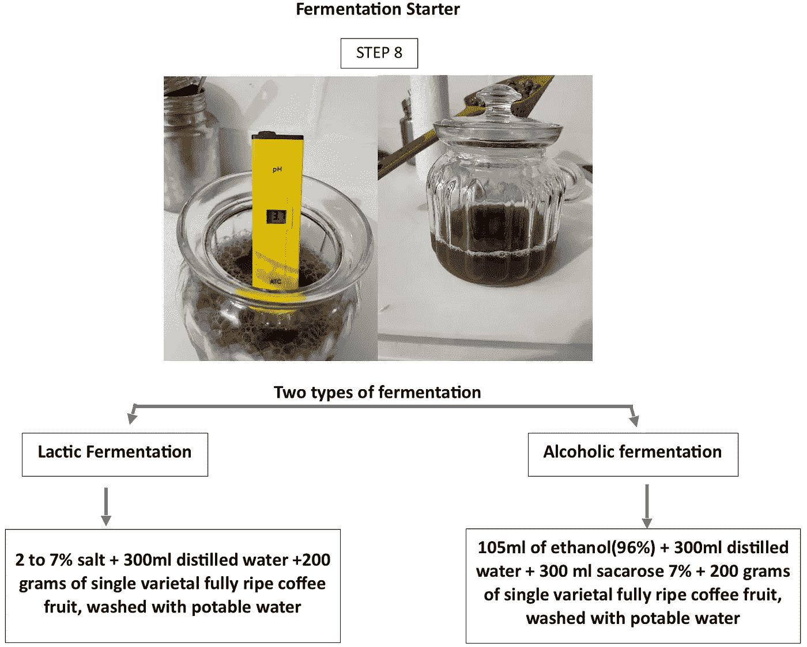

这种发酵剂用来制造发酵液。尝试了两种解决方案。

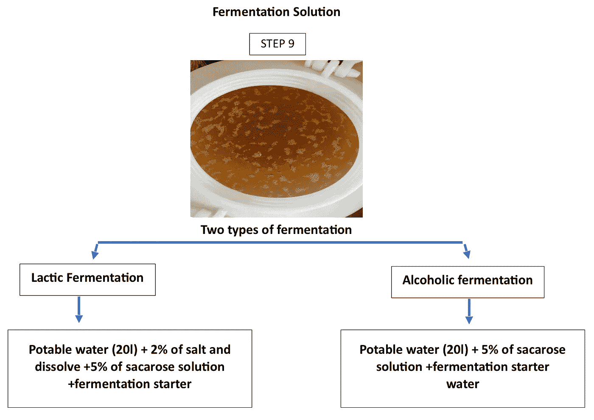

含有樱桃的溶液被放入一个带有几个输出监视器的罐中，以确定发酵何时完成。

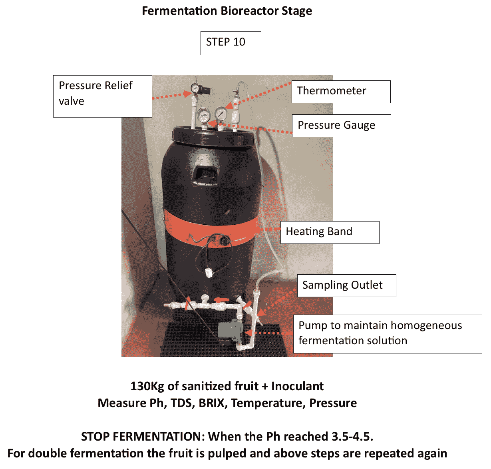

这一次是在 Ph 值为 4.8 时停止的，所以略高，但发酵已经进行了一段时间。

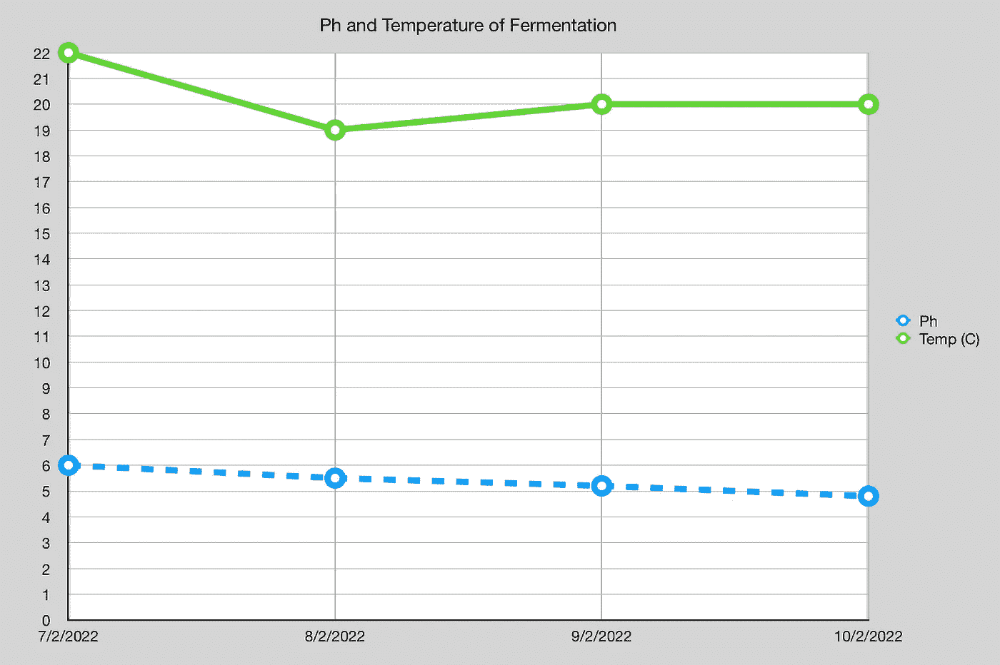

之后，在酿造之前只需要几个简单的步骤。

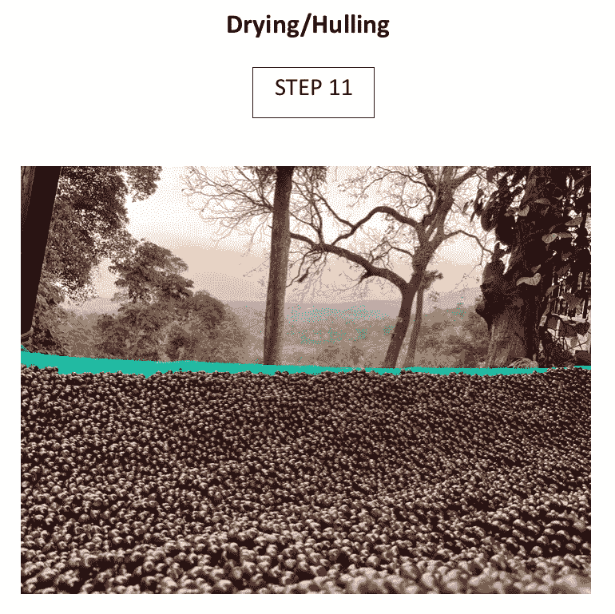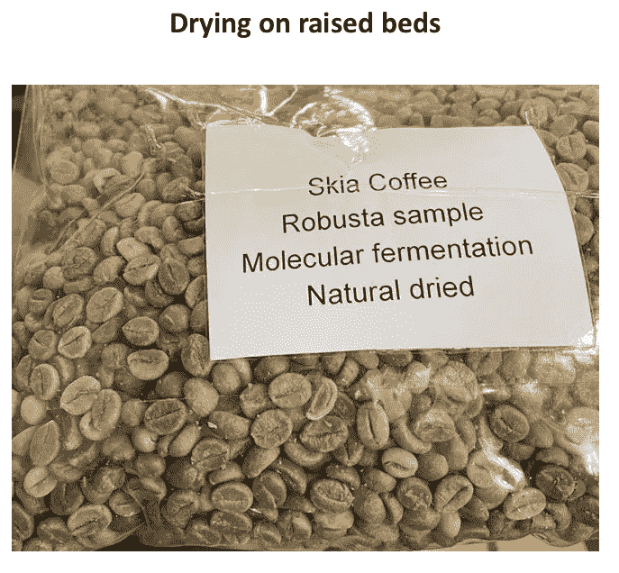

我把一个样品烤到中等程度，这是一种非常好的咖啡。它尝起来像更温和的阿拉比卡咖啡，口感像罗布斯塔咖啡。

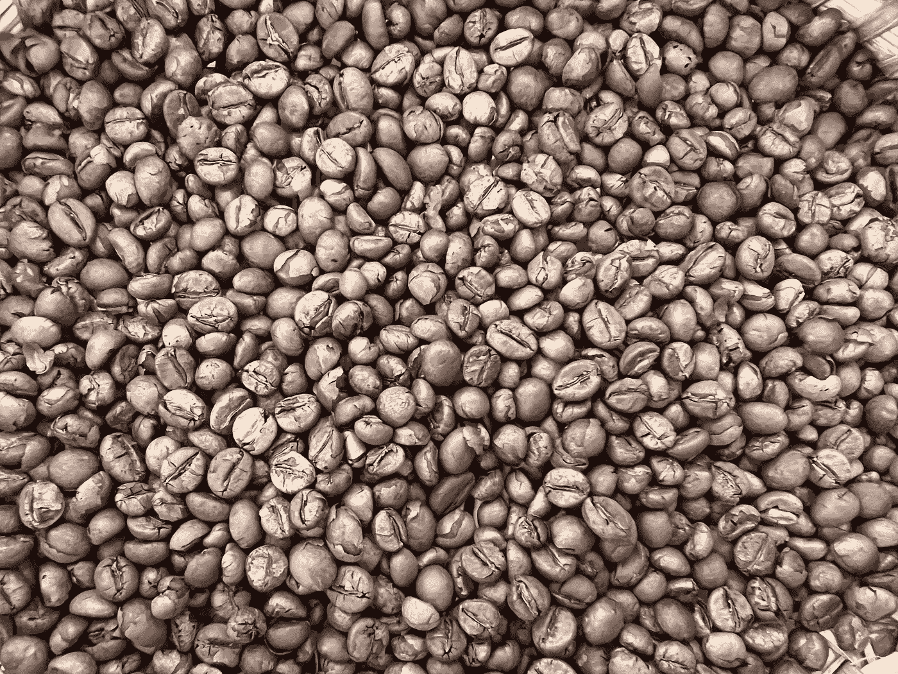

发酵产生了一些有趣的阿拉比卡咖啡，但我更感兴趣的是它对罗布斯塔咖啡的影响，因为我渴望罗布斯塔咖啡的口感。我也很好奇这样的技术是否可以用来改良较低等级的罗布斯塔。

如果你愿意，可以在[推特](https://mobile.twitter.com/espressofun?source=post_page---------------------------)、 [YouTube](https://m.youtube.com/channel/UClgcmAtBMTmVVGANjtntXTw?source=post_page---------------------------) 和 [Instagram](https://www.instagram.com/espressofun/) 上关注我，我会在那里发布不同机器上的浓缩咖啡照片和浓缩咖啡相关的视频。你也可以在 [LinkedIn](https://www.linkedin.com/in/dr-robert-mckeon-aloe-01581595) 上找到我。也可以在[中](https://towardsdatascience.com/@rmckeon/follow)关注我，在[订阅](https://rmckeon.medium.com/subscribe)。

# [我的进一步阅读](https://rmckeon.medium.com/story-collection-splash-page-e15025710347):

[我的未来之书](https://www.kickstarter.com/projects/espressofun/engineering-better-espresso-data-driven-coffee)

[我的链接](https://rmckeon.medium.com/my-links-5de9eb69c26b?source=your_stories_page----------------------------------------)

[浓缩咖啡系列文章](https://rmckeon.medium.com/a-collection-of-espresso-articles-de8a3abf9917?postPublishedType=repub)

[工作和学校故事集](https://rmckeon.medium.com/a-collection-of-work-and-school-stories-6b7ca5a58318?source=your_stories_page-------------------------------------)