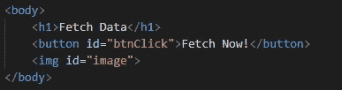
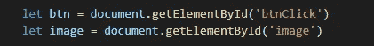
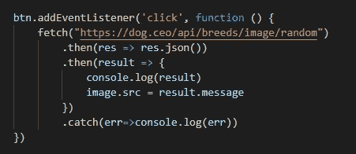

# 在 Javascript 中从 API 获取图像数据

> 原文：<https://medium.com/geekculture/fetch-image-data-from-api-in-javascript-9a7f5f3048ab?source=collection_archive---------0----------------------->

Photo by [Max Duzij](https://unsplash.com/@max_duz?utm_source=medium&utm_medium=referral) on [Unsplash](https://unsplash.com?utm_source=medium&utm_medium=referral)

在这篇文章中，我们将学习如何从第三方 API 获取数据，并在 HTML 页面上显示结果。这一次，我们将获取的数据是来自 [*狗 API*](https://dog.ceo/dog-api/) 的图像，这非常不可思议。事不宜迟，让我们开始吧！

# 第一步

定义 HTML。我们所需要的只是一个按钮和 *img* 标签来放置结果。这是怎么做的。

Define the HTML

很简单，没有什么特别的。不要忘记给*按钮*和 *img* 标签一个 *id* ，这样我们以后就可以在 javascript 中访问它。

# 第二步

现在我们将进入 javascript，在这里我们定义了两个变量，并通过引用它们的 *id 将其分配给按钮和图像标签。这里是它的样子。*

Define the variable in javascript

# 第三步

接下来是主要部分，我们将从 API 获取数据，并使用我们收到的数据在 HTML 中显示它。

首先我们给按钮事件监听器，然后在里面我们获取数据，之后你可以选择 *console.log* 它首先查看你从 API 收到的所有数据，然后我们给图像变量分配一个引用我们刚刚收到的数据的源。别忘了加上*。如果出现问题，将*错误处理程序捕捉到托管。

就是这样！这就是在 javascript 中从第三方 API 获取数据的方式。希望这篇文章对你有帮助，祝你有美好的一天！🙌

*支持我，如果你的文章像这样:*

