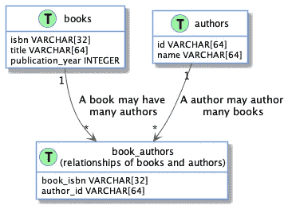
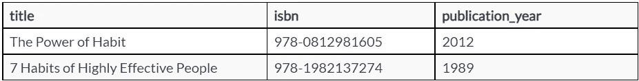
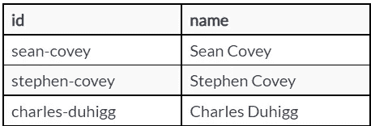
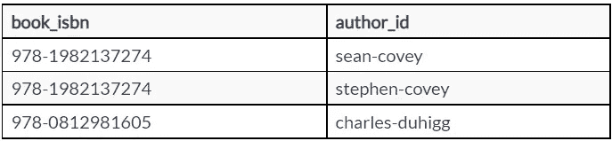
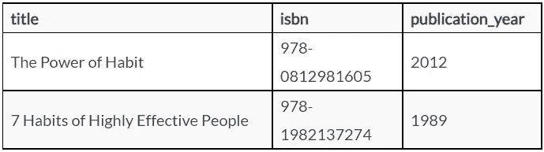
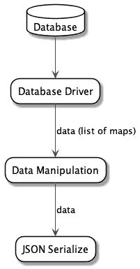

# 从数据库获取数据

> 原文：<https://medium.com/geekculture/fetching-data-from-the-database-647b519e6336?source=collection_archive---------6----------------------->

## 文章

*出自* [*面向数据的编程*](https://www.manning.com/books/data-oriented-programming?utm_source=medium&utm_medium=organic&utm_campaign=book_sharvit2_data_1_29_21) *作者耶霍纳坦·沙尔维特*

*本文探讨了面向数据的编程如何处理从数据库中检索数据。*

在[manning.com](https://www.manning.com/?utm_source=medium&utm_medium=organic&utm_campaign=book_sharvit2_data_1_29_21)结账时，在折扣代码框中输入 **fccsharvit2** 即可享受 35%的折扣。

你和乔去你办公室附近的公园散步。你坐在一个美丽的湖边的长椅上，凝视着天空中的云。沉思了几分钟后，乔打破沉默，问你:“你看到了什么？”你告诉他，这朵云看起来像一匹马，这朵云看起来像一辆汽车。当你回到办公室，你问乔关于云的解释，他嘴角带着神秘的微笑告诉你:“云就是云”。

运行在服务器端的应用程序通常将数据存储在数据库中。在 DO 中，我们表示从数据库中检索到的数据，就像我们在应用程序中表示任何其他数据一样:使用**通用数据集合**。

到目前为止，你已经向我展示了面向数据的编程如何表示应用程序内存中的数据。那么来自外部的数据呢？

**乔**:你说的*外*是什么意思？

你:来自数据库的数据。

乔:我会把这个问题返回给你:你认为在 DOP 中我们如何表示来自数据库的数据？

**你**:作为**通用数据集合**，我猜。

乔:没错！在面向数据的编程中，我们总是用通用的数据集合来表示数据。

这是否意味着我们可以像在第 1 部分中操作内存数据一样灵活地操作数据库中的数据？

**乔**:肯定。

**在面向数据的编程中，我们用通用数据集合来表示数据库中的数据，并用通用函数来操作它。**

你能给我演示一下，当目录数据存储在 SQL 数据库中时，如何检索图书搜索结果吗？

乔:一会儿我给你看。首先，告诉我您将如何设计存储目录数据的表？

**YOU** :你指的是包含每个列的主键和可空性信息的精确表模式吗？

乔:不需要。我只需要你给我一个表格、表格列以及表格间关系的大概概述。



Figure 1\. The database model for books and authors

你:我会有一个包含三列的`books`表:`title`、`isbn`和`publication_year`。和一个有两列的`authors`表:用于`id`和`name`。



Table 1\. The `books` table filled with two books



Table 2\. The `authors` table filled with three authors

**乔**:那书和作者之间的联系呢？

你:让我想想:一本书可以由多个作者写，一个作者可以写多本书。因此，我需要一个连接作者和书籍的**多对多** `book_authors`表，有两列:`book_isbn`和`author_id`。



Table 3\. The `book_authors` table with rows connecting books with their authors

**乔**:先从最简单的情况说起。我们将编写代码来搜索与书名匹配的书籍，并返回书籍的基本信息:书名、isbn 和出版年份。

你:那本书的作者呢？

乔:我们会在这一章的后面处理这个问题，因为这个问题有点复杂。你能写一个 SQL 查询来检索标题中包含*习惯*的书吗？

你:当然。

对你来说很容易。清单 1 显示了您编写的 SQL 查询。

**清单 1。检索书名包含** `**habit**`的书籍的 SQL 查询

```
SELECT
   title,
   isbn,
   publication_year
   FROM
       books
  WHERE title LIKE '%habit%';
```

结果显示在表 4 中。



Table 4\. Results of the SQL query that retrieves books whose title contain `habit`

JOE :你如何描述表 4 中显示的数据收集结果？

**你**:我会说这是一个**地图列表**。

**从 NoSQL 数据库访问数据的方式与从关系数据库访问数据的方式相似。**

**乔**:对。你能把搜索结果写成地图列表吗？

**你**:听起来不太复杂。清单 2 给出了地图列表。

**清单 2。作为地图列表的搜索结果**

```
[
   {
     "title": "7 Habits of Highly Effective People",
     "isbn": "978-1982137274",
     "publication_year": 1989
   },
   {
     "title": "The Power of Habit",
     "isbn": "978-0812981605",
     "publication_year": 2012
   }
 ]
```

乔:你能写搜索结果的 JSON 模式吗？

你:如果你允许我看一下你前几天好心给我的 JSON 模式备忘单，应该不会太难。

**乔**:当然。礼物的目的是让接受礼物的人使用。

几分钟后，在第 1 部分的 JSON schema cheatsheet 的帮助下，您为搜索结果准备了一个 JSON 模式

**清单 3。JSON 模式备忘单**

```
{
   "type": "array",
   "items": {
     "type": "object",
     "properties": {
       "myNumber": {"type": "number"},
       "myString": {"type": "string"},
       "myEnum": {"enum": ["myVal", "yourVal"]},
       "myBool": {"type": "boolean"}
     },
     "required": ["myNumber", "myString"],
     "additionalProperties": false
   }
 }
```

**清单 4。数据库搜索结果的 JSON 模式**

```
var dbSearchResultSchema = {
   "type": "array",
   "items": {
     "type": "object",
     "required": ["title", "isbn", "publication_year"],
     "properties": {
       "title": {"type": "string"},
       "isbn": {"type": "string"},
       "publication_year": {"type": "integer"}
     }
   }
 };
```

**乔**:优秀。现在，我将向您展示如何实现`searchBooks`,它从数据库获取数据并返回一个 JSON 字符串和结果。有趣的是，我们将只使用从 DB 层到 JSON 序列化的通用数据集合。

**你**:会和我们在第三章写的`searchBooks`的实现类似吗？

**乔**:绝对的。唯一的区别是，在第 3 章中，系统的状态存储在本地。我们用类似`_.filter()`的功能查询了一下。现在，我们使用 SQL 查询来查询存储在数据库中的状态。但是在数据**表示**和**操作**方面，是完全一样的，如图 2 所示。数据操作步骤通过操作**数据集合**的**通用函数**实现。随着本章中的例子变得更加详细，您将会看到能够用通用函数操作数据集合的好处。



Figure 2\. Data flow for serving a request that fetches data from the database

你:听起来很有趣…

我们的大部分代码都是关于操作数据集合的通用函数。

JOE:它的核心是通过一个返回地图列表的驱动程序与数据库通信的能力。在 JavaScript 中，您可以使用类似 node-postgres([https://node-postgres.com](https://node-postgres.com/))的 SQL 驱动程序。

**你**:还有用 Java？

JOE :在 Java 中，除了清单 5 中的小实用函数之外，您还可以使用 JDBC，它将 JDBC 结果集转换成一系列地图。

**清单 5。将 JDBC 结果集转换成哈希映射列表**

```
List<Map<String, Object>> convertJDBCResultSetToListOfMaps(ResultSet rs) {
     List<Map<String, Object>> listOfMaps = new ArrayList<Map<String, Object>>();
     ResultSetMetaData meta = rs.getMetaData();
     while (rs.next()) {
         Map map = new HashMap();
         for (int i = 1; i <= meta.getColumnCount(); i++) {
             String key = meta.getColumnLabel(i);
             Object value = rs.getObject(i);
             map.put(key, value);
         }
         listOfMaps.add(map);
     }
     return listOfMaps;
 }
```

将一个 **JDBC 结果集**转换成一个**散列表**非常简单。

我认为将一个 JDBC 结果集转换成一个散列映射列表要复杂得多。

乔:这很简单，因为从某种意义上说，JDBC 是面向数据的！

**你**:那字段类型呢？

**JOE** :当我们将一个 JDBC 结果集转换成一个地图列表时，每个值都被认为是一个`Object`。

你:这很烦人，因为这意味着为了访问这个值，我们需要将它转换成它的类型。

**JOE** :是也不是，看看我们的图书搜索用例。我们传递所有的值，而没有真正查看它们的类型。只有当我们在 JSON 中序列化结果时，具体的值类型才是重要的。这是由 JSON 序列化库处理的。叫做*后期绑定*。

对于后期绑定，我们尽可能晚地关心数据类型。

你:这是否意味着在我的应用程序中，我可以操作数据而不用处理具体的类型？

在面向数据的编程中，灵活性增加了，因为系统的许多部分可以自由地操纵数据，而不用处理具体的类型。

乔:没错。稍后您将看到后期绑定的作用。这是面向数据编程的最大好处之一！

你:有意思……

JOE:在我向你展示从数据库中检索搜索结果的代码之前，最后一件事:为了使它更容易阅读，我将编写 JavaScript 代码，就好像 JavaScript 是以同步方式处理 I/O 一样。

**你**什么意思？

JOE:在 JavaScript 中，向数据库发送查询这样的 I/O 操作是异步完成的。在现实生活中，这意味着要么使用回调函数，要么使用`async`和`await`关键字。

你:哦耶。这是因为 JavaScript 是单线程的。

本章的 JavaScript 代码片段被写成好像 JavaScript 在以同步的方式处理 I/O。在现实生活中，我们需要在 I/O 调用中使用`async`和`await`。

**乔**:确实。所以我要说的是，在与数据库通信的代码中，我将编写代码，就像 JavaScript 以同步方式处理 I/O 一样。代码如清单 6 所示。

**清单 6。在数据库中搜索书籍并在 JSON 中返回结果**

```
var dbClient; ❶
 var ajv = new Ajv({allErrors: true}); ❷

 var title = "habit";
 var matchingBooksQuery = `SELECT title, isbn
                           FROM books
                           WHERE title LIKE '%$1%'`;❸
 var books = dbClient.query(matchingBooksQuery, [title]); ❹
 if(!ajv.validate(dbSearchResultSchema, books)) {
   var errors = ajv.errorsText(ajv.errors);
   throw "Internal error: Unexpected result from the database: " + errors;
 }

 JSON.stringify(books);
```

❶ `dbClient` **持有 DB 连接。**

用**中的** `allErrors: true`初始化❷ **Ajv(一个 JSON 模式验证库)，以便捕捉所有的数据验证错误(详见第 5 章)**

❸ **我们使用参数化的 SQL 查询，因为它在安全性方面更安全**

❹ **我们将参数作为一个值列表(在我们的例子中是一个单值列表)传递给 SQL 查询**

**你**:在 JavaScript 这样的动态类型语言中，我理解`dbClient.query()`返回的映射列表中值的类型是在运行时确定的。但是在像 Java 这样的静态类型语言中它是如何工作的:在`books`中数据字段的类型是什么？

**JOE** :清单 5 中的函数`convertJDBCResultSetToListOfMaps()`返回一个`Map<String, Object>`的列表。但是像 gson([https://github.com/google/gson](https://github.com/google/gson))这样的 JSON 序列化库知道如何在运行时检测 map 中值的具体类型，并根据它们的类型序列化值。

**你**:你说*根据类型*序列化一个值是什么意思？

例如，字段`publication_year`的值是一个数字，因此它没有用引号括起来。然而，字段`title`的值是一个字符串，因此用引号括起来。

你好！现在，我明白你说的*晚绑定*是什么意思了。

**乔**爽！现在，让我向您展示我们如何在数据库中存储数据。让我们从头开始:解析客户机请求。您通常如何接收客户端请求的参数？

**你**:看情况。这些参数可以作为 GET 请求中的 URL 查询参数或 POST 请求正文中的 JSON 有效负载发送。

JOE:假设我们在一个 web 请求中收到一个 JSON 负载。你能给我一个高级搜索请求的 JSON 有效负载的例子吗？

你:它将包含书名应该匹配的文本。

JOE :关于从开放图书馆图书 API 中检索字段的细节呢？

**你**:它们不会作为 JSON 有效载荷的一部分传递，因为它们对所有搜索请求都是一样的。

**乔**:我可以想象一个场景，你希望客户决定检索哪些字段。例如，移动客户端更喜欢只检索最重要的字段，以节省网络带宽。

**你**:嗯，这样的话，我会有两个不同的搜索终端:一个用于手机，一个用于桌面。

**JOE** :如果客户希望根据应用程序屏幕显示不同的信息，该怎么办？例如，在扩展搜索结果屏幕中，我们显示所有字段，而在基本搜索结果屏幕中，我们仅显示最重要的字段。现在，您有 4 种不同的使用情形:桌面扩展、桌面基本、移动扩展和移动基本。您会创建 4 个不同的端点吗？

**你**:好的。您说服了我:让我们有一个单一的搜索端点，让客户端决定检索哪些字段。

乔:你能给我展示一个搜索请求的 JSON 负载的例子吗？

**你**:当然。它在清单 7 中。

**清单 7。搜索请求有效负载示例，其中客户端决定为每个搜索结果检索哪些字段**

```
{
   "title": "habit",
   "fields": ["title", "weight", "number_of_pages"]
 }
```

**乔**:太棒了！第一步是将 JSON 字符串解析成数据结构。

**你**:让我猜猜:这将是一个**通用数据结构**。

乔:当然了！那样的话，我们就有地图了。通常，JSON 解析是由 web 服务器框架处理的，但是在这里我将向您展示如何手动完成。

你:你所说的 web 服务器框架是什么意思？

node.js 中的 express，Java 中的 Spring，Python 中的 Django，Ruby on Rails，C#中的 ASP.net。

**你**:哦。我明白了。那么，如何将 JSON 字符串手动解析成映射呢？

JOE :在 JavaScript 中，我们使用清单 8 中的`JSON.parse()`，在 Java 中，我们使用由 Google 维护的第三方库，如清单 9 中的 gson([https://github.com/google/gson](https://github.com/google/gson))。

**清单 8。在 JavaScript 中解析 JSON 字符串**

```
var jsonString = "{\"title\":\"habit\",\"fields\":[\"title\",\"weight\",\"number_of_pages\"]}";
 JSON.parse(jsonString);
```

**清单 9。用 gson 解析 Java 中的 JSON 字符串**

```
var jsonString = "{\"title\":\"habit\",\"fields\":[\"title\",\"weight\",\"number_of_pages\"]}";
 gson.fromJson(jsonString, Map.class);
```

JOE:你能为搜索请求的有效负载编写 JSON 模式吗？

你:当然。它在清单 10 中。

**清单 10。搜索请求的 JSON 模式**

```
var searchBooksRequestSchema = {
   "type": "object",
   "properties": {
     "title": {"type": "string"},
     "fields": {
       "type": "array",
       "items": {
         "type": [
           "title",
           "full_title",
           "subtitle",
           "publisher",
           "publish_date",
           "weight",
           "physical_dimensions",
           "number_of_pages",
           "subjects",
           "publishers",
           "genre"
         ]
       }
     }
   },
   "required": ["title", "fields"]
 };
```

**乔**:好看！您将`fields`数组中的元素标记为*枚举*，而不是*字符串*。您从哪里获得允许值的列表？

你:南希给了我她想向用户公开的字段列表。它在清单 11 中。

**清单 11。OpenLibrary Books API 的重要字段**

```
- title
 - full_title
 - subtitle
 - publisher
 - publish_date
 - weight
 - physical_dimensions
 - number_of_pages
 - subjects
 - publishers
 - genre
```

**将服务器响应表示为地图**

**JOE** :开放图书馆图书 API 是什么样子的？

非常简单:你用图书 ISBN 创建一个 GET 请求，然后它返回一个 JSON 字符串，其中包含关于这本书的扩展信息。

**乔**:你的客户有没有要求对 API 返回的字段进行特殊处理？

你:她只想保留某些领域。清单 11 中的那些。

**乔**:就这样？

你:是的。在清单 12 中，您可以看到 OpenLibrary Books API 为“高效人士的 7 个习惯”返回的 JSON 字符串，只保留了必要的字段。

清单 12。OpenLibrary Books API 对“高效人士的 7 个习惯”的响应

```
var dataFromOpenLib = {
   "title":"7 Habits of Highly Effective People : Revised and Updated",
   "subtitle":"Powerful Lessons in Personal Change",
   "number_of_pages":432,
   "full_title":"7 Habits of Highly Effective People : Revised and Updated Powerful Lessons in Personal Change",
   "publish_date":"2020",
   "publishers":["Simon & Schuster, Incorporated"]
 };
```

另外，我们只需要保留出现在客户端请求中的字段。

乔:你知道如何实现双字段过滤吗？

你:是啊。我将把来自 API 的 JSON 字符串解析成一个哈希映射，就像我们解析一个客户端请求一样，然后我将使用`_.pick()`两次来只保留必需的字段。

乔:我觉得这是个很棒的计划。你能编码它吗，包括验证 Open Books API 返回的数据？

你:当然！让我首先为 Open Books API 响应编写 JSON 模式。

您需要用第 1 部分中关于模式组合的材料来刷新您的记忆，以便表达这样一个事实，即`isbn_10`或`isbn_13`是强制性的。产生的模式如清单 13 所示。

**清单 13。开卷 API 响应的 JSON 模式**

```
var basicBookInfoSchema = {
   "type": "object",
   "required": ["title"],
   "properties": {
     "title": {"type": "string"},
     "publishers": {
       "type": "array",
       "items": {"type": "string"}
     },
     "number_of_pages": {"type": "integer"},
     "weight": {"type": "string"},
     "physical_format": {"type": "string"},
     "subjects": {
       "type": "array",
       "items": {"type": "string"}
     },
     "isbn_13": {
       "type": "array",
       "items": {"type": "string"}
     },
     "isbn_10": {
       "type": "array",
       "items": {"type": "string"}
     },
     "publish_date": {"type": "string"},
     "physical_dimensions": {"type": "string"}
   }
 };

 var mandatoryIsbn13 = {
   "type": "object",
   "required": ["isbn_13"]
 };

 var mandatoryIsbn10 = {
   "type": "object",
   "required": ["isbn_10"]
 };

 var bookInfoSchema = {
   "allOf": [
     basicBookInfoSchema,
     {
       "anyOf": [mandatoryIsbn13, mandatoryIsbn10]
     }
   ]
 };
```

**YOU** :现在，假设我有一个`fetchResponseBody()`函数，它发送一个请求并以字符串形式检索响应的主体，代码如清单 14 所示。

**清单 14。从 OpenLibrary 检索图书信息**

```
var ajv = new Ajv({allErrors: true});
 class OpenLibraryDataSource {
   static rawBookInfo(isbn) {
     var url = `https://openlibrary.org/isbn/${isbn}.json`;
     var jsonString = fetchResponseBody(url); ❶
     return JSON.parse(jsonString);
   }

   static bookInfo(isbn, requestedFields) {
     var relevantFields = ["title", "full_title",
                           "subtitle", "publisher",
                           "publish_date", "weight",
                           "physical_dimensions", "genre",
                           "subjects", "number_of_pages"];
     var rawInfo = rawBookInfo(isbn);
     if(!ajv.validate(bookInfoSchema, rawInfo)) {
       var errors = ajv.errorsText(ajv.errors);
       throw "Internal error: Unexpected result from Open Books API: " + errors;
     }
     var relevantInfo = _.pick(_.pick(rawInfo, relevantFields), requestedFields);
     return  _.set(relevantInfo, "isbn", isbn);
   }
 }
```

❶ **在响应体中获取 JSON**

本章的 JavaScript 代码片段被写成好像 JavaScript 在以同步的方式处理 I/O。在现实生活中，我们需要在 I/O 调用中使用`async`和`await`。

**乔**:为什么在`bookInfo`返回的地图中增加了`isbn`字段？

这将允许我把两个来源的关于同一本书的信息结合起来。

乔:我喜欢！

本文到此为止。如果你想了解更多，可以在曼宁的 liveBook 平台[上查看这本书，这里](https://livebook.manning.com/book/data-oriented-programming?origin=product-look-inside&utm_source=medium&utm_medium=organic&utm_campaign=book_sharvit2_data_1_29_21)。