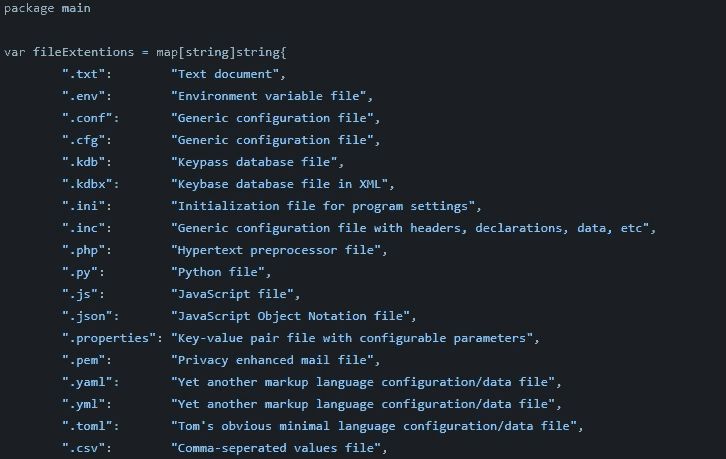

# ffind:在渗透测试中快速找到感兴趣的文件

> 原文：<https://medium.com/geekculture/ffind-quickly-find-interesting-files-during-a-penetration-test-4189e545e81b?source=collection_archive---------17----------------------->

## 配置文件、数据库文件、源代码等

H ello，🌎！在渗透测试过程中，您可能会发现自己手动寻找感兴趣的文件，如配置文件、数据库文件、源代码文件等。嗯，我已经写了一个简单的工具，使寻找这些类型的文件更快。`ffind`是一个…