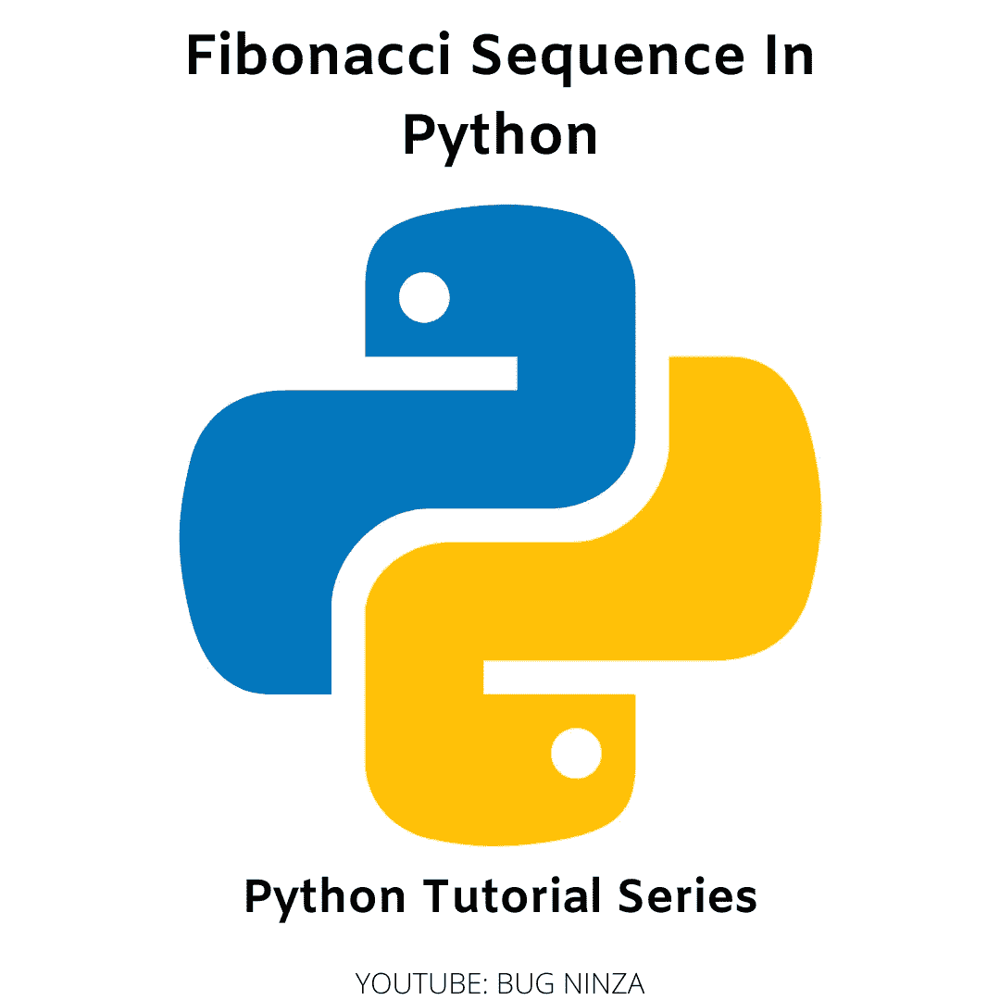

# Python 中的斐波那契数列

> 原文：<https://medium.com/geekculture/fibonacci-sequence-in-python-e772808c71e6?source=collection_archive---------4----------------------->

## 求解斐波那契数列的迭代方法和递归方法



Python Tutorial Series

Python 爱好者们你们好！

在本 [Python 教程系列](https://ninza7.medium.com/list/python-tutorial-d0976d26559b)的上一节中，我们谈到了在 Python 中解决一个问题的 [*递归方法，并用一些例子来理解它们。在本文中，我们将更进一步。我们将在 Python 编程语言中处理斐波那契数列。这是编程界一个非常著名的问题。如果你是一个绝对的初学者，那么没关系。我们将从非常初级的水平来理解斐波那契数列。如果你正在阅读这个*](https://ninza7.medium.com/recursive-approach-to-solve-a-problem-in-python-c130828064fe) *[Python 教程系列](https://ninza7.medium.com/list/python-tutorial-d0976d26559b)，那么你会很容易理解。*

# 斐波那契数列

斐波那契数列是一个整数序列。序列中的第一个和第二个数字是 0 和 1。序列中的下一项计算为前两项之和。它看起来像这样:

```
0,1,1,2,3,5,8,13,21,...
```

## 求斐波那契数列第 n 项的迭代法

```
def fibonacci(n):
    assert n>0
    secondLast = 0
    Last = 1
    if n == 1:
        print(secondLast)
    elif n == 2:
        print(Last)
    else:
        for i in range(3, n+1):
            result = secondLast + Last
            secondLast = Last
            Last = result
        print(result)

fibonacci(8)
fibonacci(7)
fibonacci(4)
```

代码的输出是:

```
13
8
2
```

在函数 Fibonacci 中，我们将 *n* 作为参数。这个 n 应该大于 0。我们都知道斐波那契数列的最后一项是前面两项之和。记住这一点，我们分配两个变量， *secondLast* 和 *Last。*斐波那契数列从 0 开始，然后是 1，依此类推。所以我们在上面代码中使用的 if-elif-else 控制结构中使用了这个逻辑。对于序列的前两个数字，我们有 0 和 1。接下来，从 3 到 n+1，else 条件将处理我们的输入。假设，我们想知道斐波那契数列的第八项。for 循环将迭代 3 到 9 次(不包括 9 次)。变量结果是*倒数第二个*和*最后一个*变量值的总和。接下来，*最后一个*变量的值被分配给*第二个最后一个*变量。接下来，*结果*的值存储在*最后一个*变量中。并且在成功迭代 for 循环之后。我们将打印*结果*。

## 求斐波那契数列第 n 项的递归方法

```
def fibonacci(n):
    assert n>0
    if n == 1:
        return 0
    elif n == 2:
        return 1
    else:
        return fibonacci(n-1) + fibonacci(n-2)print(fibonacci(8))
print(fibonacci(7))
print(fibonacci(4))
```

上述代码的输出与前面代码的输出相同:

```
13
8
2
```

在这个斐波那契函数中，我们把 n 作为一个参数。n 应该大于 0。如果 n 的输入值是 1 和 2，那么代码的输出分别是 0 和 1。现在在 *else 条件*中，我们只是返回函数本身与不同参数值的和。通过假设 n 的值来理解这一点。假设 n 的值是 4。然后，else 条件返回 fibonacci(3)和 fibonacci(2)的总和。同样，fibonacci(3)的值分为两部分:fibonacci(2)和函数(1)。fibonacci(1)的值是 1。这样，整个问题分解成一个更简单的问题，然后自己计算。运行完代码后。您将获得相同的输出。递归方法最好的部分是，与迭代方法相比，我们使用了更少的代码行来解决相同的问题。

本文到此为止。如果我错过了什么，请在评论区告诉我。

如果这篇文章听起来对你有帮助，那么一定要跟着鼓掌。分享给你的极客社区。

感谢阅读。

[*用 Python 递归解题*](https://ninza7.medium.com/recursive-approach-to-solve-a-problem-in-python-c130828064fe)

[*Python 中的字典介绍*](https://python.plainenglish.io/dictionary-in-python-baa5b05067f8)

[*Python 初学者元组入门*](https://ninza7.medium.com/an-introduction-to-tuples-in-python-for-beginners-5b4a02957e50)

[*关于 Python 中列表的更多信息*](https://ninza7.medium.com/more-about-lists-in-python-18c34b350518)

[*Python 列表*](https://ninza7.medium.com/list-in-python-e1e554585926)

[*Python 字符串上的内置函数*](https://python.plainenglish.io/built-in-functions-on-python-strings-1269f06c51fb)

[*Python 字符串*](https://python.plainenglish.io/python-strings-53394b90c883)

[*Break、Continue、Pass 语句示例*](https://python.plainenglish.io/python-break-continue-and-pass-statements-with-examples-a856f8b07692)

[*Python while 循环示例*](https://python.plainenglish.io/understanding-while-loop-in-python-with-examples-40c518acee88)

[*Python for 循环举例*](https://python.plainenglish.io/for-loop-in-python-programming-language-with-examples-ca869431f09d)

[*Python If-Elif-Else 条件语句示例*](https://python.plainenglish.io/python-if-elif-else-conditional-statement-with-example-6c55606e3420)

[*如何在 Python 中使用 If 和 If-Else 语句*](https://python.plainenglish.io/python-if-else-conditional-statement-a3142520ee1d)

[*如何编写和调用 Python 函数*](https://python.plainenglish.io/how-to-write-a-python-function-and-call-it-da2553cd354)

[*Python 中的内置函数*](https://python.plainenglish.io/all-about-python-built-in-functions-e424d7142870)

[*Python 编程语言入门*](https://python.plainenglish.io/get-started-with-python-programming-language-2b6b9e7d3e7e)

你好，我叫 Rohit Kumar Thakur。我对自由职业持开放态度。我构建 React 本地项目，目前正在开发 Python Django。请随时通过([freelance.rohit7@gmail.com](mailto:freelance.rohit7@gmail.com))联系我。