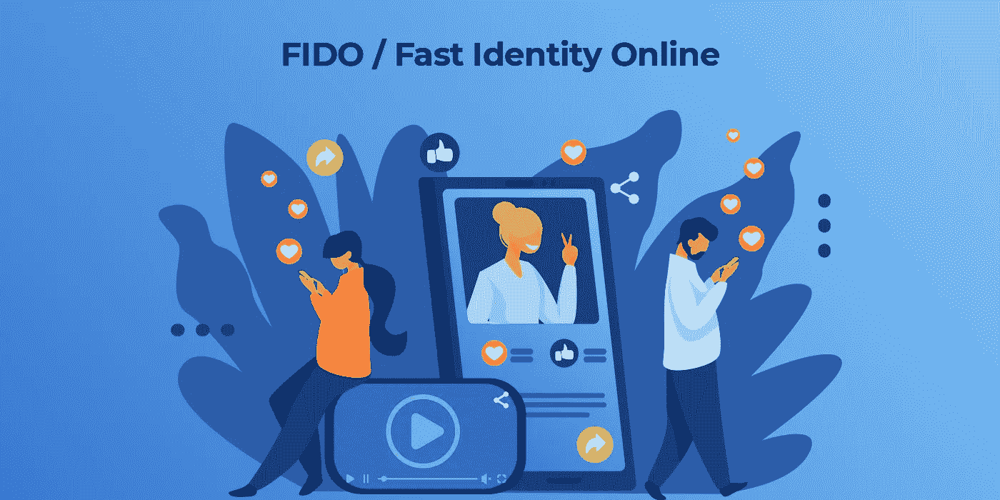
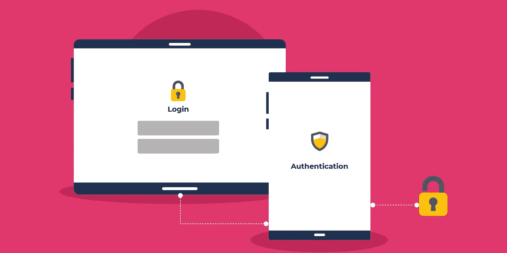
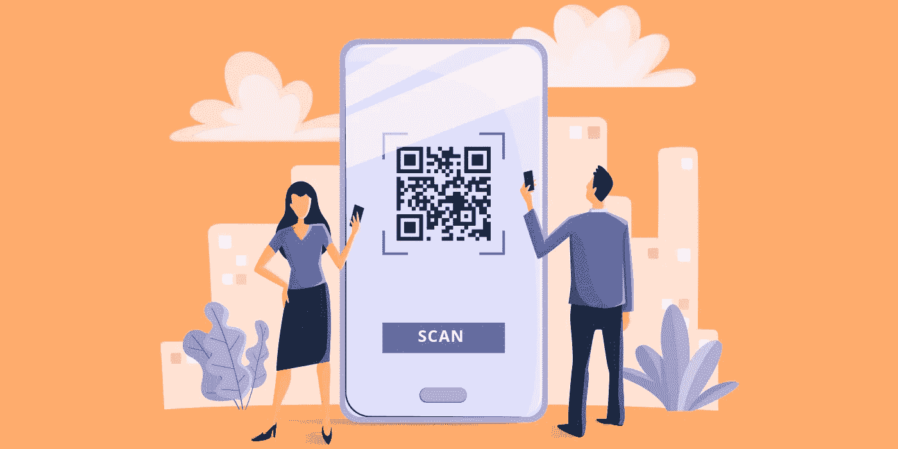

# FIDO /快速在线身份认证

> 原文：<https://medium.com/geekculture/fido-fast-identity-online-caf6f64b6f26?source=collection_archive---------40----------------------->

花点时间想想你有多少个在线账户。无论是社交媒体账户、新闻网站、博客还是企业账户，都没有关系。答案是很多。这对任何人来说都很平常。而且可以肯定地说，几乎所有这些账户都有密码保护。因此，任何用户在任何时候都要处理大量的密码和与之相关的复杂问题。比如在创作的时候；特定字符组合，满足最小长度限制，特定字符属性，如区分大小写，最大长度限制，特殊字符，复杂性，定期更改(90 天等)等等。

## **问题**

密码的维护和创建非常复杂。但就安全数据访问而言，它们是最好的防线。因为它很容易设置，所以当涉及到安全性时，它会产生一种自满的感觉。设置一次密码就完事了，对吧？但事实是密码需要保持一致。具有良好和强大的特性。密码也容易受到各种各样的攻击。暴力、网络钓鱼、凭据填充等。一次又一次的调查显示，在安全方面的密码使用情况令人沮丧。考虑一下这个

> [https://services . Google . com/FH/files/blogs/Google _ security _ infograph . pdf](https://services.google.com/fh/files/blogs/google_security_infographic.pdf)

**根据谷歌**进行的在线调查

> 52%的人对许多(但不是所有)帐户重复使用同一个密码
> 
> 只有 13%的人对所有账户使用不同的密码
> 
> 高达 35%的人对他们所有的账户重复使用相同的密码

> [https://digital guardian . com/blog/uncovering-password-habits-is-users-password-security-habits-improving-infograph #:~:text = In % 20 fact % 2C % 20a % 20 dash lane % 20 analysis，to % 20a % 20 single % 20 email % 20 address](https://digitalguardian.com/blog/uncovering-password-habits-are-users-password-security-habits-improving-infographic#:~:text=In%20fact%2C%20a%20Dashlane%20analysis,to%20a%20single%20email%20address)。

**digital guardian 进行的一项详细调查显示**

> 只有大约 31.3%的受访者更改过一次到两次密码
> 
> 只有大约五分之一(22.4%)的人每年更换密码超过五次
> 
> 几乎一半的受访者(49.3%)表示他们会重复使用密码

> [https://dataprot.net/statistics/password-statistics/](https://dataprot.net/statistics/password-statistics/)

**在 Data prot 进行的一项调查中，**

> 53%的人依靠记忆来管理密码。
> 
> 51%的人在工作和个人账户上使用相同的密码。
> 
> 57%已经在网络钓鱼攻击中被骗的人仍然没有更改他们的密码。

密码大多处于 ***【静止数据】*** 状态。存储或处于静止状态的数据或密码不像通过网络传输的数据那样易受攻击。但是处于静止状态的数据通常更为关键。

密码和计算本身一样古老。MITs 兼容的分时系统建于 1961 年，以第一个密码为特色。计算已经从笨重的巨型设备发展到灵活的移动设备。很遗憾，密码保持不变。此外，在拥有大量设备的现代数字时代，维护和管理许多帐户和密码是一个难题。那么，为什么世界还没有从密码中走出来呢？

## **双因素认证**

在很大程度上，2FA 或双因素认证使帐户更安全。通过为用户的帐户提供另一个安全级别，可以降低风险。2FA 可与密码结合使用

> 用户知道的东西—密码、PIN、滑动手势等
> 
> 用户拥有的东西—移动设备、兼容的安全密钥等
> 
> 用户是什么——生物识别

2FA 让账户安全。但是 2FA 从用户角度来说是一个不好的体验。使用 2FA 进行身份验证花费的时间更多。在某些情况下，如兼容设备的丢失、损坏，甚至更成问题。最终，2FA 是密码之上的一个*安全级别。所以密码问题一直都在。即使有了 2FA，它也没有消失*

## ***FIDO 联盟***

*问题很简单，如何摆脱密码，取而代之的是一个更安全的系统。如何改变一个永恒的登录方式，即使用密码。这正是 [FIDO 或快速身份在线](https://fidoalliance.org/)寻求实现的目标。FIDO 身份验证旨在取代仅使用密码的登录。*

## ***创世纪***

*[FIDO 联盟](https://fidoalliance.org/)由行业领袖创立。 ***PayPal、联想、Nok Nok Labs、Validity Sensors、英飞凌、Agnitio 等*** 。后来，谷歌、贝宝和三星等其他科技巨头也向 FIDO 联盟提供了支持。从而提高其可信度。FIDO 的核心是使用 PKI(公钥基础设施)这种健壮的、经过验证的技术。公钥/私钥是在注册时生成的。公钥驻留在服务器中，私钥永远不会离开用户。用公钥加密的数据只能用私钥解密*

## ***无密码多因子:FIDO 版本一***

**

*2014 年发布的第一个 FIDO 标准有两个主要组成部分。通用认证框架(UAF)和通用第二因子(U2F)。*

*UAF 是通过多因素安全手段进行认证的骨干。UAF 使应用程序或服务能够呈现不同的登录机制。如 ***指纹扫描、人脸扫描、语音识别、PIN 码等*同时注册。与通常的 id/密码流程不同，用户遵循他们在注册时选择的身份验证。***

*顾名思义，U2F 处理与基于 USB 的物理安全密钥相关的标准，如 NFC 和蓝牙。这些设备充当身份验证的次要因素，或者构成双因素身份验证的基础。2AF 是一种常见的身份认证技术。与此类似，FIDO 也有一个二级因素认证标准，即 U2F*

*换句话说，UAF + U2F 提供了比密码更高级别的认证和安全性，但是没有密码的麻烦*

## *FIDO 2 版本*

*FIDO 2 于 2018 年推出，是版本一的更新升级版。FIDO 2 联合万维网联盟( **W3C** )推出了 Web 认证( **WebAuthn** )。FIDO 2 将 UAF 和 U2F 的功能扩展到第三方应用和服务。基于 FIDO 的身份验证在受支持的浏览器和平台上可用。凭借 Web 认证组件、标准和 [web 应用](https://www.codecrafttech.com/web-app-development-usa.html)编程接口(API)。在撰写本文时，几乎所有主流浏览器都支持 WebAuth，如 Chrome、Firefox、Edge 和 Safari*

## ***结论***

*FIDO alliance 或特别是 WebAuthn 对所有人都是双赢的，因为替换密码有切实的好处。WebAuth 提供了良好的体验，加上基于 PKI 的无密码基础设施所提供的安全性。服务提供商也不必担心维护、开发和更新复杂的安全认证解决方案的复杂性。*

*[来源](https://www.codecrafttech.com/resources/blogs/fido-fast-identity-online.html) : FIDO / Fast 身份在线*