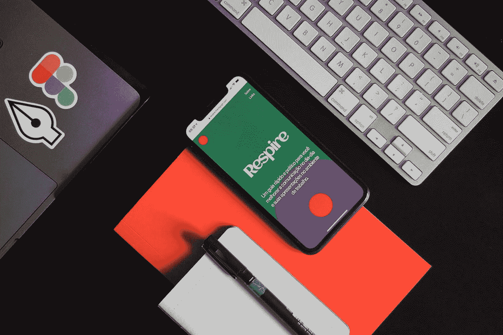

# Figma:创造响应式设计的最佳方式

> 原文：<https://medium.com/geekculture/figma-the-best-way-to-create-responsive-design-952b77657df2?source=collection_archive---------8----------------------->

## 使用 Figma 的响应式设计功能随时随地设计您的网站！

Photo by [Mario Gogh](https://unsplash.com/@mariogogh?utm_source=medium&utm_medium=referral) on [Unsplash](https://unsplash.com?utm_source=medium&utm_medium=referral)

响应式设计是 web 设计的一种形式，使用户能够在多种设备上体验一致的高性能，包括桌面浏览器和移动设备。而是为你的内容和用户做出正确的选择。有了响应式设计，您…