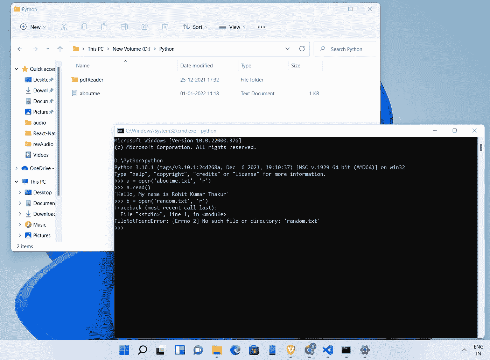
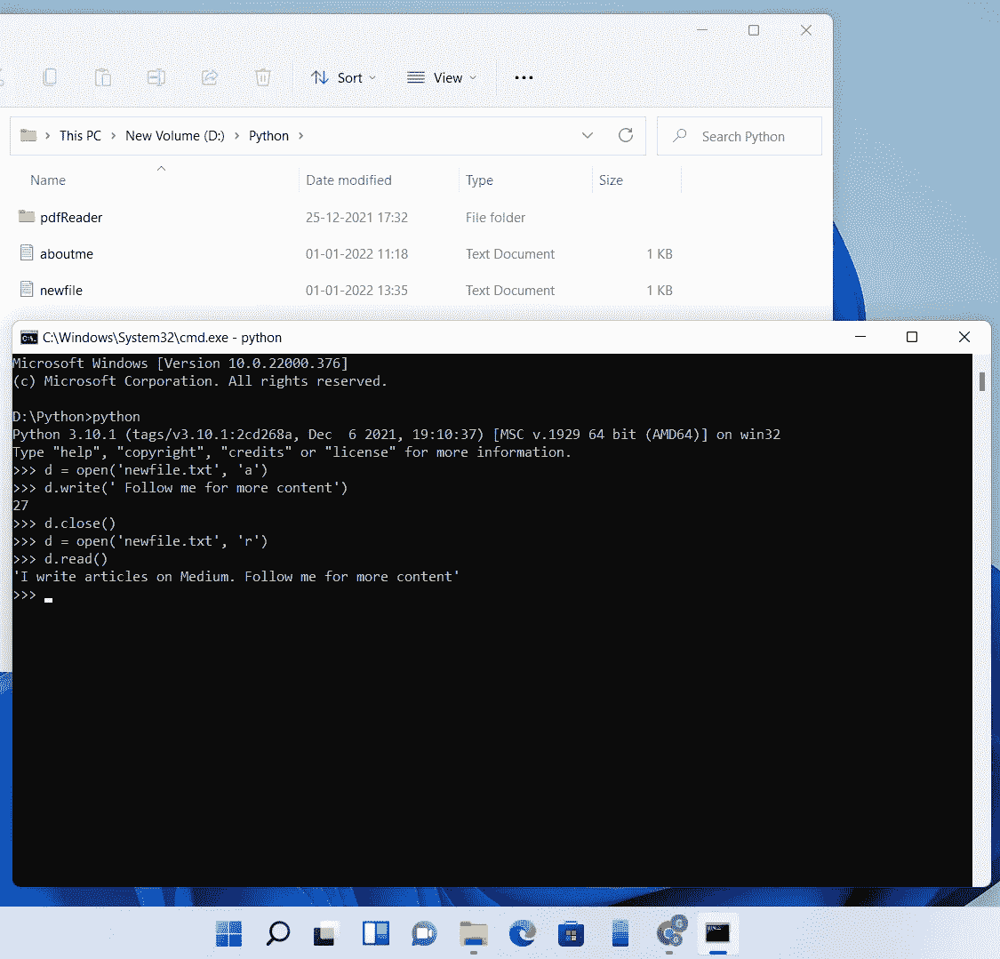

# Python 中的文件处理

> 原文：<https://medium.com/geekculture/file-handling-in-python-2b71dd153d2d?source=collection_archive---------4----------------------->

## 如何读取、写入和追加 Python 文件？


File Handling: Python Tutorial Series

你好，学习者..！！

在这个 [Python 教程系列](https://ninza7.medium.com/list/python-tutorial-d0976d26559b)的最后一节，我们谈到了[如何使用 Python 解决汉诺塔问题](https://faun.pub/problem-of-tower-of-hanoi-in-python-d43b1b89a4d7)。在本文中，我们将处理 Python 文件。

首先，让我们理解为什么我们需要 Python 中的文件处理。因为我们目前开发的程序以互动的方式从用户那里获取数据。这些数据只在程序的生命周期内保留在内存中。但是如果我们想永久保存数据呢？例如，我们为登录系统开发了一个 Python 程序。用户交互输入用户名和密码。但是在这里，我们必须将这些数据永久存储在一个文件中。Python 提供了一个标准输入文件和一个标准输出文件来处理临时数据。标准输入文件从键盘读取，标准输出文件显示在屏幕上。除此之外，我们还可以创建一个 Python 文件并永久存储数据。那么，让我们来看看如何处理这些问题。

# 文件处理

文件提供了一种程序与外界交流的方式。文件只不过是由感兴趣的数据组成的字节流。我们对文件执行三种操作，即读、写和追加。但在此之前，我们需要打开文件。Python 为此提供了一个内置的库 open()。语法如下所示:

```
a = open(file_name, access_mode)
```

open()函数将 fila 的名称作为第一个参数。第二个参数指示访问文件的模式。

*   **读作**

```
a = open(file_name, 'r')
```

read (r)用于读取现有文件。如果指定的文件不存在，那么它将显示一个错误。例如，我在一个目录中创建了一个文件“aboutme.txt”。如果我读取这个文件，那么它会给出一个有效的输出。但是如果我试图读取不存在的文件，那么它会显示一个错误:



Read a file in Python

*   **写**

```
a = open('filename', 'w')
```

当要访问文件以在其中写入数据时，使用写模式。在这里，如果指定的文件不存在，那么 Python 将创建一个新文件。但是，当以写模式打开文件时，如果该文件已经存在，则该文件将被覆盖。例如:

```
>>> c = open('newfile.txt', 'w') #it will create a new file in the             directory
>>> c.write("I write articles on Medium.")
```


write a file in python

当您运行第一个命令时，Python 将创建一个新文件( *newfile.txt* )，因为它不存在。在文件中写入内容后，您必须关闭文件以将文件保存在目录中。关闭后，您将无法读取该文件。您必须编写命令来读取文件。

*   **追加**

```
a = open('filename', 'a')
```

顾名思义，追加模式允许我们通过在指定文件的末尾追加内容来写入文件。就像写模式一样，如果指定的文件不存在，它将创建一个新文件。



Append a file in Python

现在，假设我们希望复制一个文本文件的内容，比方说，在另一个文件 TWO.txt 中复制 ONE.txt。为此，我们以读取模式打开文件 ONE.txt，以写入模式打开文件 TWO.txt 的输出(尚未创建)，从文件 ONE.txt 中读取数据，并将其写入文件 TWO.txt。

```
>>> a = open('ONE.txt', 'r')
>>> b = open('TWO.txt', 'w')>>> data = a.read()
>>> b.write(data)
>>> a.close()
>>> b.close()
```

请注意，如果应用程序要求以读写模式打开文件，则可以在打开文件时使用“r+”模式。

本文到此为止。如果我错过了什么，请在评论区告诉我。

如果这篇文章听起来对你有帮助，那么一定要跟着鼓掌。分享给你的极客社区。

感谢阅读。

# 更多 Python 主题可供阅读

[*巨蟒中的汉诺塔问题*](https://faun.pub/problem-of-tower-of-hanoi-in-python-d43b1b89a4d7)

[*在 Python 中不使用 len 函数求字符串的长度*](https://python.plainenglish.io/find-the-length-of-string-without-using-len-function-in-python-e9621e1fa0c8)

[*Python 中的斐波那契数列*](/geekculture/fibonacci-sequence-in-python-e772808c71e6)

[*用 Python 递归解题*](https://ninza7.medium.com/recursive-approach-to-solve-a-problem-in-python-c130828064fe)

[*Python 中的字典介绍*](https://python.plainenglish.io/dictionary-in-python-baa5b05067f8)

[*Python 初学者元组入门*](https://ninza7.medium.com/an-introduction-to-tuples-in-python-for-beginners-5b4a02957e50)

[*更多关于 Python 中的列表*](https://ninza7.medium.com/more-about-lists-in-python-18c34b350518)

[*Python 列表*](https://ninza7.medium.com/list-in-python-e1e554585926)

[*Python 字符串上的内置函数*](https://python.plainenglish.io/built-in-functions-on-python-strings-1269f06c51fb)

[*Python 字符串*](https://python.plainenglish.io/python-strings-53394b90c883)

[*Break、Continue、Pass 语句示例*](https://python.plainenglish.io/python-break-continue-and-pass-statements-with-examples-a856f8b07692)

[*Python while 循环示例*](https://python.plainenglish.io/understanding-while-loop-in-python-with-examples-40c518acee88)

[*Python for 循环举例*](https://python.plainenglish.io/for-loop-in-python-programming-language-with-examples-ca869431f09d)

[*Python If-Elif-Else 条件语句示例*](https://python.plainenglish.io/python-if-elif-else-conditional-statement-with-example-6c55606e3420)

[*如何在 Python 中使用 If 和 If-Else 语句*](https://python.plainenglish.io/python-if-else-conditional-statement-a3142520ee1d)

[*如何编写和调用 Python 函数*](https://python.plainenglish.io/how-to-write-a-python-function-and-call-it-da2553cd354)

[*Python 中的内置函数*](https://python.plainenglish.io/all-about-python-built-in-functions-e424d7142870)

[*Python 编程语言入门*](https://python.plainenglish.io/get-started-with-python-programming-language-2b6b9e7d3e7e)

你好，我是 Rohit Kumar Thakur。我对 ***自由职业*** *持开放态度。我构建了* ***React 本地项目*** *并且我目前正在开发****Python Django****。随时联系我(*[***【freelance.rohit7@gmail.com***](mailto:freelance.rohit7@gmail.com)*)。*