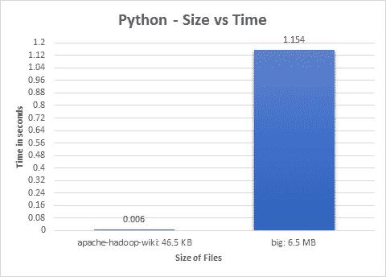
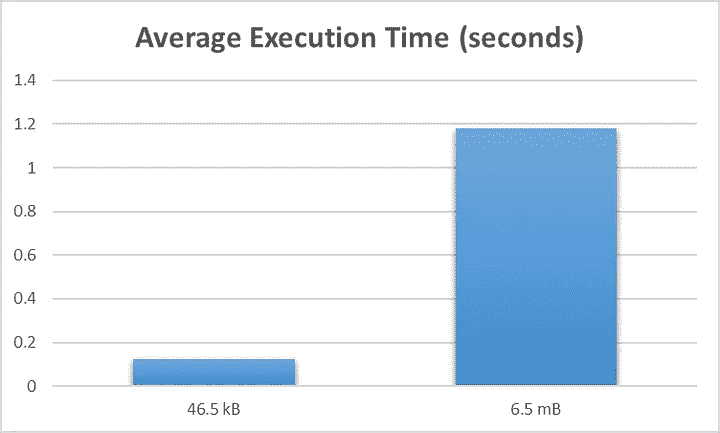
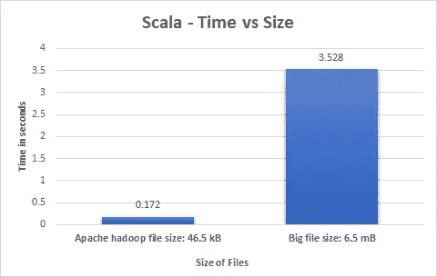
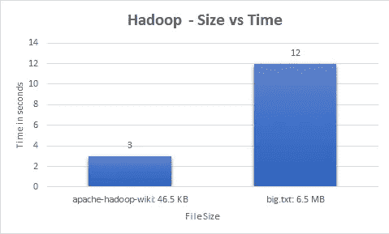
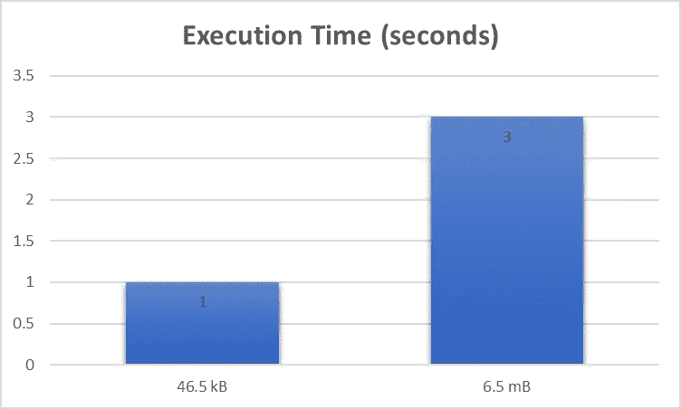
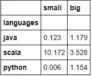
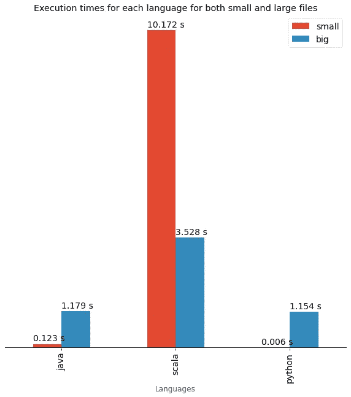
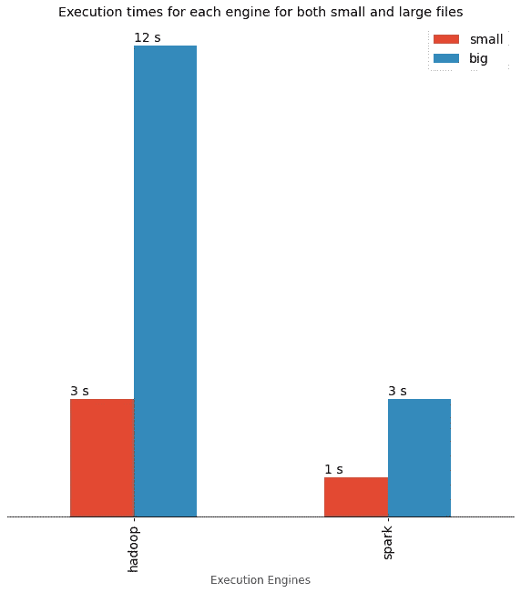

# 大数据系统中的文件处理:哪个更快？哪个更好？

> 原文：<https://medium.com/geekculture/file-processing-a-comparative-analytics-study-e21b4693b70c?source=collection_archive---------3----------------------->

## 比较分析研究基准流行的编程语言和执行引擎。


Photo by [PAUL SMITH](https://unsplash.com/@sumo?utm_source=medium&utm_medium=referral) on [Unsplash](https://unsplash.com?utm_source=medium&utm_medium=referral)

# 介绍

你有没有想过哪些编程语言和执行引擎在处理文件时是最快的还是最慢的？您是否陷入了困境，不知道应该使用哪种编程语言来有效地解决您的业务问题？不用再看了，这就是你的答案。

我们看看流行的语言，如 ***Python、Java、*** 和 ***Scala*** 和执行引擎，如 ***Hadoop*** 和 ***Spark*** ，看看它们在处理文件和基准测试方面表现如何。

# 方法学

我们探索并进行数据分析&比较在各种编程语言和执行引擎中计算输入文本文件字数所需的执行时间，输入文本文件的大小从极小到极大不等。

我们编写示例字数统计程序来处理这些文件并执行它们。然后，我们计算单独处理文件所需的时间，并收集结果。此外，我们收集我们的样本发现和观察结果，并进行比较。从单个分析中得到的所有发现都被收集并组合在一个 [**Google Colab**](https://github.com/Thomas-George-T/File-Processing-Comparative-Analytics/blob/master/Data-Analysis.ipynb) 笔记本中，然后我们使用 *matplotlib* 绘制图表，并根据我们的发现得出结论。


Photo by [Wesley Tingey](https://unsplash.com/@wesleyphotography?utm_source=medium&utm_medium=referral) on [Unsplash](https://unsplash.com?utm_source=medium&utm_medium=referral)

## 文件

对于这个实验，我们需要两种文件。一个仅输入文本的大文件和一个小文本文件，同时记住它们应该是适当的大小，以便它们不会扭曲我们正在进行的性能测试。

考虑到这些限制，我们正在运行一个数据科学实验*(各种各样的)。*我们挑选了一些相关的东西，对于大型文本文件，我们选择了 [big.txt](https://norvig.com/big.txt) ，如果你不熟悉的话，这是来自《美丽数据》一书*(sega ran 和 Hammerbacher，2009)* 来自《自然语言语料库数据》一章*他们在那里谈到运行拼写纠正。多么贴切！*

*对于这个小文件，我们使用从 Apache Hadoop Wikipedia 页面中收集的数据，这是我们在实验中进行基准测试的另一个执行引擎。*

# *数据分析*

*说得够多了，让我们开始看看编程语言和执行引擎，以及如何对它们进行基准测试。*

## *编程语言*

*我们采用的方法是用各自的语言编写字数统计程序，并解析我们选择的大小文件。因为我们对 Python、Scala 和 Python 重复了相同的步骤，所以我们以 Python 为例进行演示:*

## *计算机编程语言*

*我们用 Python 开始我们的程序，第一步是读取文件。我们使用这个小文本文件作为例子:*

```
*# Reading filefile=open("../Input-Files/apache-hadoop-wiki.txt","r",encoding="utf-8")*
```

*现在对于我们实际的字数统计，我们使用内置的结构*字典*:*

```
*# Initializing Dictionary
dict = {}# counting number of times each word comes up in list of words (in dictionary)for word in file.read().split():
    dict[word] = dict.get(word, 0) + 1file.close()*
```

*我们写下刚刚计算的结果:*

```
*#write the file
fw = open("small-result-python.txt","w",encoding="utf-8")
fw.write(str(dict))
fw.close()*
```

*我们计算字数结果的一小段:*

```
*{'Apache': 79, 'Hadoop': 201, 'From': 3, 'Wikipedia,': 1, 'the': 211, 'free': 1, 'encyclopedia': 1, 'Jump': 2, 'to': 122 }*
```

*现在，为了对我们的程序进行基准测试，我们导入了*时间*包，并在适当的时候插入了钩子。*

*所以我们的完整程序看起来是这样的:*

```
*import timestart = time.time()# Reading filefile=open("../Input-Files/apache-hadoop-wiki.txt","r",encoding="utf-8")# Initializing Dictionary
dict = {}# counting number of times each word comes up in list of words (in dictionary)
for word in file.read().split():
     dict[word] = dict.get(word, 0) + 1file.close()#write the file
fw = open("small-result-python.txt","w",encoding="utf-8")
fw.write(str(dict))
fw.close()end = time.time() print("Execution time :", end - start)*
```

*类似地，我们收集小文件和大文件的结果，并分别为所有语言绘制图表:*

******

*(Left) Bar chart depicting processing times for Python | (Middle) Bar chart depicting processing times for Java | (Right) Bar chart depicting processing times for Scala | Images by Author.*

## *执行引擎*

*我们认为 Hadoop 和 Spark 是我们的执行引擎。我们将在实验中使用独立模式/集群。*

*我们重复对编程语言采取的相同步骤，结果如下所示:*

****

*(left) Graph depicting processing time taken by Hadoop | (right) Graph depicting processing time taken by Spark | Images by Author*

# *比较分析*

*现在我们有了编程语言和执行引擎的所有单独结果。让我们比较一下，得出有用的见解。*

*我们使用 Google Colab 来绘制 python 中的基准图:*

*我们首先导入所需的库:*熊猫*和 *matlplotlib**

```
***import** **pandas** **as** **pd**
**import** **matplotlib** **as** **mpl**
**import** **matplotlib.pyplot** **as** **plt**
mpl.style.use('ggplot')*
```

*准备我们的语言数据集*

```
**# initialize list of languages* 
data_lan = [['java', 0.123, 1.179 ], ['scala', 10.172, 3.528]] 

*# Create the pandas DataFrame* 
df_languages = pd.DataFrame(data_lan, columns = ['languages', 'small','big']) 

*# print dataframe.* 
df_languages*
```

*因为这是一个不断发展的实验，将来我们可以用更多的语言和执行引擎进行基准测试，所以我们使用这种方法:*

```
**# Appending Data, Use this method in the future when trying to add more languages*df_languages = df_languages.append({'languages':'python','small':0.006, 'big':1.154}, ignore_index=**True**)
df_languages*# Set the languages as index for our x axis*
df_languages.set_index('languages', inplace=**True**)
df_languages*
```

*准备绘图的结果数据:*

**

*Dataset with clear X & Y axis demarcations | Image by Author*

*绘制我们的数据:*

```
*ax = df_languages.plot(kind='bar',
                      figsize = (10,10)
                      )plt.xlabel('Languages')
plt.title('Execution times for each language for both small and large files')ax.set_facecolor('white')
ax.tick_params(axis='x', colors='black', labelsize=14)
ax.axhline(0, color='black')
ax.legend(facecolor='white',fontsize=14)
ax.tick_params(top=**False**, left=**False**, right=**False**, labelleft=**False**)**for** p **in** ax.patches:   *#display the percentages above the bars*
    width, height = p.get_width(), p.get_height()
    x, y = p.get_xy() 
    ax.annotate('**{}** s'.format(height), (x, y + height + 0.1),fontsize=14)plt.show()*
```

# *结论*

****

*(left) Graph comparing & benchmarking the file processing time for Programming languages | (right) Graph comparing & benchmarking the file processing time for Execution Engines | Images by Author*

*对于编程语言，我们观察到 **Python** 对于小文件和大文件的执行时间最少，而 **Scala** 的执行时间最长。有趣的是， *Scala* 处理小文件比处理大文件多花了 7 秒。*

*对于执行引擎，我们观察到 **Spark 引擎**具有最少的执行时间，而 **Hadoop 的 Mapreduce 引擎**具有最高的执行时间。这符合 Spark 比 Hadoop 快 100 倍的说法。*

*我希望这个实验能对你的下一个项目应该使用哪种编程语言或执行方式有所启发。总的来说，每种编程语言和执行引擎都有各自的优缺点，但是通过这次实验，我们现在知道了哪种语言和执行引擎具有最好的性能基准。*

*这个项目正在成长，如果你想用更多的编程语言和执行引擎为它做出贡献，请在 [GitHub](https://github.com/Thomas-George-T/File-Processing-Comparative-Analytics) 上这样做。感谢您的阅读。*

# *参考*

1.  *[自然语言语料库数据:美丽数据](https://norvig.com/ngrams/)*
2.  *[阿帕奇 Hadoop 维基百科](https://en.wikipedia.org/wiki/Apache_Hadoop)*