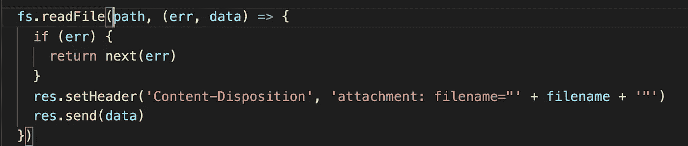

# 使用 Multer 在 Node.js 中上传和下载文件

> 原文：<https://medium.com/geekculture/file-upload-and-download-in-node-js-c524a8050c8f?source=collection_archive---------2----------------------->

在您的应用程序中上传或下载文件不是您很少使用的东西。因此，了解如何在客户端上传文件以及如何在服务器端处理和存储文件是非常重要的。此外，在获取存储在服务器上的文件时，必须意识到不同的可能性，例如下载的文件应该在浏览器标签之一中打开，还是应该作为附件下载并单独打开。

## 客户端的文件上传:

为了解释客户端的文件上传，下面以 Vue.js 的代码片段为例。在表单元素内部， **enctype=** `**"multipart/form-data"**` 表示通过表单提交的不仅仅是文本，还有文件。如果只想在表单中提交文本，应该使用 **enctype=** `**"**[**x-www-urlencoded**](http://www.w3.org/TR/html5/forms.html#application/x-www-form-urlencoded-encoding-algorithm)**"**`，因为这样会更有效。

Vue.js snippet for uploading a file

input 元素有一种类型的`**"file"**`,它表示这个 input 元素不接受文本输入，而是在单击 input 元素对应的输入框时打开一个文件浏览器。当您从资源管理器中选择一个文件并点击**打开**时，那么 **@change** 钩子将被触发并调用附带的函数和语句。这里，附加函数 filesChange 有两个参数，元素的名称和文件列表。**对于上述输入元素的情况，输入元素的名称**将是`**"photo"**`，因为它已经作为 name= `**"photo"**`在输入元素中传递。**文件列表**代表一个数组，其中包含用户在文件浏览器中选择的所有文件。

现在来看方法 **filesChange，**我们创建一个名为 **FormData** 的 JS 对象。FormData 是复制表单的可迭代对象。可以看做是数组的数组。每一个数组都代表想要发送给服务器的元素。每个数组都有一个名字和一个值。一个可选参数是 fileName。这些都是由**添加的。append(名称，值，【文件名】)**方法生成 formData。Name 表示输入元素的名称，value 表示字符串或 BLOB(二进制大型对象), fileName 是在服务器上接收输入元素的文件名。

Send the selected files to the backend server in a post request

现在，下一个任务是将上传的文件发布到服务器，在那里它将被适当地处理。我们使用 axios，它是一个 http 客户端，可以用来发送 http 请求。这里，我们使用 **axios.post(url，formData)** 方法，因为我们添加了一些东西，即 HTTP 动词 post。我们需要一个后端服务器运行，以便我们从客户端发送的文件在服务器上得到正确处理。

**后端的文件处理:** 我们在服务器端使用了 Express server。在后端阶段，必须用适当的控制器功能来映射路线。在我们的例子中，路径是'/upload '。我们将触及一个名为 **multer** 的 node.js 库。我们使用 multer 来提取输入的文件。Multer 是一个中间件，从 HTTP 请求中提取上传的文件

用户可以通过以下方式安装 multer

> npm 安装乘数—保存

现在我们可以将 multer 导入到我们的 routes 文件中

const multer = require(' multer ')
app . use(multer()。单人('照片'))

这里，app 是 **express** 对象的一个实例。**。single(name)** 指定我们只希望为一个特定的输入元素名上传一个文件，对于我们的例子来说是“photos”。现在，一旦应用了 **multer** 中间件，我们就可以使用 **req.file** 来访问该文件。req.file 包含

**字段名:**输入上传文件的元素名称
**原始名称:**文件的原始名称。服务器用来存储文件的名称可以不同于原始名称
**编码:**用于编码的位数
**mimetype:** 此
**缓冲区是哪种类型的文件:**文件作为流发送到服务器，缓冲区包含该流。

如果我们在 multer 中使用 **dest** param，缓冲流可以转换成二进制数据

app . use(multer({ dest:' destination folder ' })。单人('照片'))

后端项目根目录下的 destinationFolder 将是作为缓冲流发送的文件作为二进制对象存储的地方。在这种情况下，我们不会在 req.file 中看到**缓冲区**键

为了获得更多关于如何存储传入文件的选项，我们可以使用**。磁盘存储**方法

**destination** 是一个以 http req 变量、文件和一个 cb (callback)为参数的函数。回调又将 error(如果有，如果没有 error 则为 null)作为第一个参数，将 destination folder 作为存储文件的位置。类似地，filename 函数也将 http req 变量、file 和一个 cb(回调)作为参数。这个回调再次将 error(如果有，如果没有错误则为 null)作为第一个参数，将我们用来存储文件的名称作为第二个参数。这里，我们在文件的原始名称后面附加了时间戳，以防止重复上传同一文件时出现冲突。
以同样的方式，我们可以添加一个文件过滤器，不允许上传不匹配特定 mimetype 的文件。在这个例子中，我们只允许 png、jpg 和 jpeg 类型的图像。

既然我们已经将文件存储在服务器文件系统中，下一件事就是通过另一个 http 请求从前端下载文件

要下载这个文件，我们需要使用一个内置的 JS 库，名为“fs”或文件系统。它允许我们对文件系统进行操作。要在特定的路径下载文件，我们只需要把下面的代码放到正确的控制器中。

const fs =要求(`'fs'`)

我们设置了“内容-处置”头。“附件”意味着文件不会在浏览器中打开，但会在打开之前先下载。
变量**文件名**包含下载新文件的文件名。这是可行的。

但是这里我们是通过 **readFile 一次读取整个文件。**对于较大的文件，下载文件需要很长时间。更糟糕的是，有时服务器上的内存可能会因为许多传入的请求而溢出，因为它必须读取内存中的所有数据。因此，要改善它，我们必须使用文件流

在上面这段代码中，我们首先创建了一个文件读取流，因为我们想从一个特定的路径读取数据。param **path** 以字符串的形式包含了要下载的文件的相对地址。同样，我们将“Content-Disposition”头设置为“attachment ”,这样文件就可以作为附件下载，其名称与变量 filename 相同。 **pipe** 方法获取一个读流，并将其内容放入一个写流。在这里，http res 是一个写流，因此我们将可读文件流的全部数据写入 http response res。现在尝试运行代码，将打开一个文件资源管理器，您可以指定要存储文件的文件夹。完成后，文件将被下载，并出现在浏览器的底部，如下所示。

**总结**

博客到此为止。我们学习了从前端上传文件。在后端，我们通过一个叫做 multer 的中间件来处理文件上传，这个中间件可以自动提取文件并按照我们的指定存储它们。它可以为我们过滤某些文件类型。我们还学习了如何通过创建读取文件流并使用管道将该流写入 HTTP 响应来下载文件。作为参考，可以参考下面 git 库中的我的代码

 [## abhirath 14/上传-下载

### 使用 multer 上传和下载文件这个文件夹有两个目录:客户端和服务器。客户端目录包含…

github.com](https://github.com/abhirath14/Upload-Download)