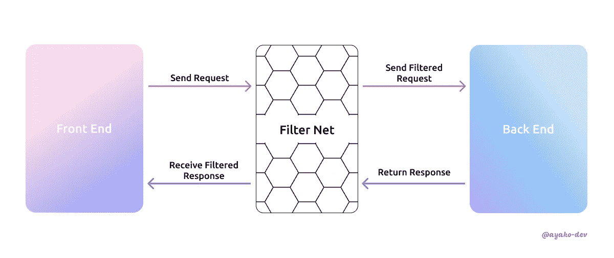
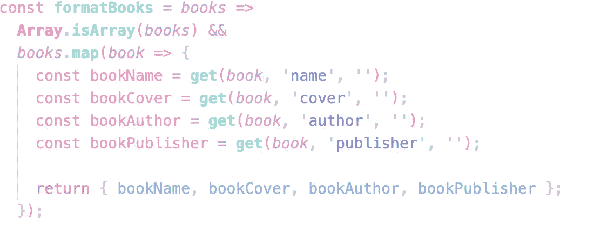

# 前端项目中的过滤器架构

> 原文：<https://medium.com/geekculture/filter-architecture-in-your-front-end-project-7e4d3d7ee957?source=collection_archive---------11----------------------->


Photo by [Ambitious Creative Co. — Rick Barrett](https://unsplash.com/@weareambitious?utm_source=unsplash&utm_medium=referral&utm_content=creditCopyText) on [Unsplash](https://unsplash.com/s/photos/net?utm_source=unsplash&utm_medium=referral&utm_content=creditCopyText)

当您从事一个中型到大型的项目时，您可能需要处理许多 API 请求和响应。您向后端服务器发送请求体，服务器返回响应。这是一种非常常见的获取数据的方式。


Normal Fetching Process

在此过程中，有时您会注意到返回的响应可能包含不必要的数据，并且数据格式与您的前端项目标准不兼容或不一致。例如，不匹配的参数键、不同的命名约定、不同的对象格式等。而所有这些“未经过滤”的数据将成为一个无意的罪魁祸首，创造错误，增加你的技术债务。

在这种情况下，通常您会花时间不断调试和修复它，直到您的组件正确显示响应。但是，你想过为什么吗？为什么所有这些 bug 都会发生？为什么你一直在处理这件事？

如果您在前端项目中已经有了一套代码标准，就意味着您有了一个遵循指南。您可以防止 API 响应弄乱您的代码。


Aigues-Mortes city walls, France

好吧，想象你是这片土地的主人，你在城市的门口设置了一个检查站。你需要知道谁在穿过这个城市，他们只有在特定的权利和许可下才能进来。



Filtered Fetching Process

所以，这里来了**滤波器架构**。它作为一个**中间网络**，停留在请求&获取 API 响应的进程之间。基本上，您将修改您的请求和响应主体，也可以在数据获取过程中将其称为 ***有效负载、*** 。

当服务器返回响应数据时，您将根据您的要求过滤原始 API 数据。之后，将格式化的数据存储到 Redux 或项目上的任何其他状态管理位置。

> ***提醒一下，保存前过滤一下。***

例如，您使用`camelCase`作为前端负载的键，但是后端接收`snack_case`作为键。然后，在这种情况下，您将通过重命名键来格式化您的有效负载，以便符合后端要求。您可以考虑创建一个全局函数来执行这种逻辑变化。反之亦然，这同样适用于返回的 API 响应。您可以转换响应中的键名，使其与您的前端标准相匹配。因此，您的前端代码将始终保持其标准，以获得更好的可维护性，更容易调试&更少的错误。

除此之外，当您收到 API 返回的响应时，您还可以过滤掉不必要的数据。例如，您有一个由多个卡片组成的部分，这些卡片在您的页面中显示图书信息。每张卡片只显示书的名字、封面、作者和出版商。但是，API 会返回冗余信息，如服务 bean、作者注释、出版商注释等。所有这些不需要的信息都可以过滤掉，并在传递给你的卡组件之前重新格式化。

## 过滤技巧


让我们以图书信息*(上面提到的)*为演示案例。下面是使用`map()`重命名键并删除 book 数组中不需要的数据的示例:



Visual Studio Code | [Fluffy Theme](https://marketplace.visualstudio.com/items?itemName=AyakoSky.fluffy-theme)

在上面的例子中，您可以看到我只获取了卡组件所需的数据。然后，我使用`get()`从原始数组中检索值。下面是`get()`的工作原理:

```
get(object, 'your object path, can be nested one', 'fallback value')
```

如果 API 数据在上面的任何键中传回空值，它将使用我默认分配的回退值。我在这里分配了一个空字符串。您可以根据需要指定任何默认的回退值。如果你明智地使用，这种方法有助于减少错误。更多信息可以阅读 [Lodash](https://lodash.com/docs/4.17.15#get) 的官方文档。


感谢阅读！如果你觉得这篇文章有帮助，请给我一些掌声！编码快乐&干杯！