# 按上的 PermissionID 筛选 Swagger 上的一些方法。Net 6.0

> 原文：<https://medium.com/geekculture/filtering-some-methods-on-swagger-by-permissionid-on-net-6-0-ea6b4b2b6f55?source=collection_archive---------1----------------------->


今天我们将讨论如何过滤狂妄自大。如下所示，我们的 swagger 文档是公开的，每个人都可以看到。但是，如果我们不希望一些方法被一些客户用于安全或业务决策，该怎么办呢？

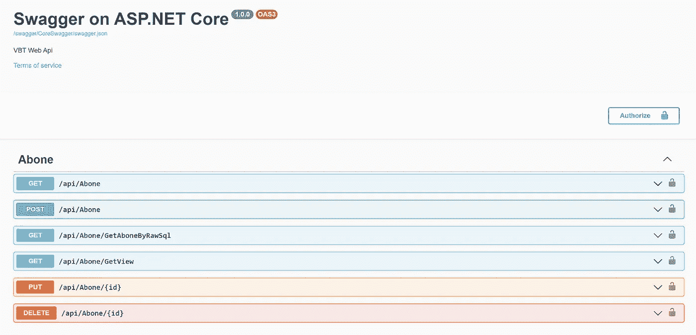

> Swashbuckle。application . swaggerdocsconfig . document filter()

Swagger 方法可以被过滤，通过使用“ ***【文档过滤器】*** ”。**的关键是 *swaggerDoc。路径*** ”。Swagger 通过路径识别方法。我们称之为路由。在下面，我们看到“GetAllUsersByTable()”方法的路由。所以 swagger 知道这个方法为"**/user/getallusersbytable/{ tablename }**"

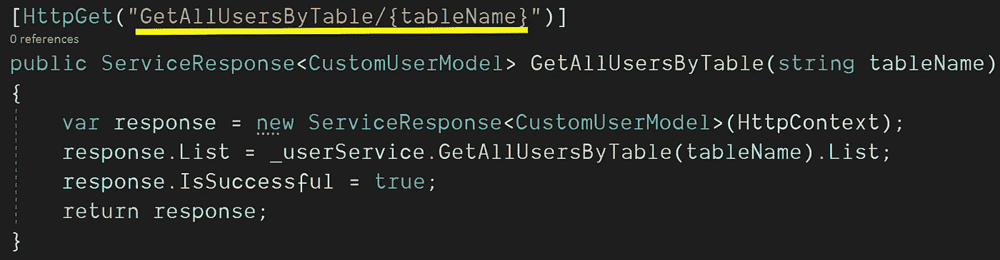

如果我们想对一些用户隐藏这个方法，我们必须对 swagger 说不要通过它的路径带来这个方法。

```
swaggerDoc.Paths.Remove("**/user/getallusersbytable/{tablename}**")
```

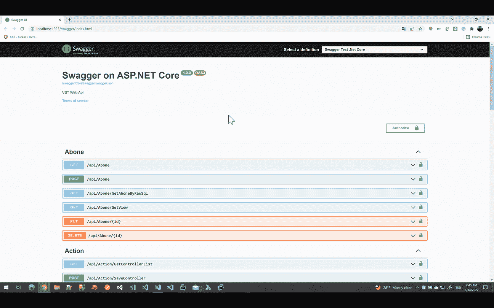

Swagger Filter By UrlID

# 通过 Swagger 文档(键)方法的路径填充 SQL 表:

首先，我们需要收集所有这些 swagger 文档键，并在 SQL 表中使用 uniqueID。如下创建 Swagger_Service 表。

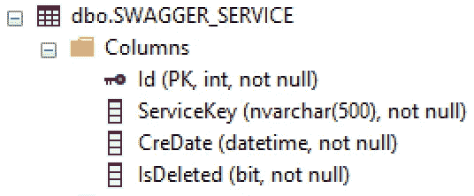

```
CREATE TABLE [dbo].[SWAGGER_SERVICE](
[Id] [int] IDENTITY(1,1) NOT NULL,
[ServiceKey] [nvarchar](500) NOT NULL,
[CreDate] [datetime] NOT NULL,
[IsDeleted] [bit] NOT NULL,
CONSTRAINT [PK_SwaggerService] PRIMARY KEY CLUSTERED
(
   [Id] ASC
)WITH (PAD_INDEX = OFF, STATISTICS_NORECOMPUTE = OFF, IGNORE_DUP_KEY = OFF, ALLOW_ROW_LOCKS = ON, ALLOW_PAGE_LOCKS = ON) ON [PRIMARY]
) ON [PRIMARY]
GOALTER TABLE [dbo].[SWAGGER_SERVICE] ADD  CONSTRAINT [DF_SwaggerService_CreDate]  DEFAULT (getdate()) FOR [CreDate]
GOALTER TABLE [dbo].[SWAGGER_SERVICE] ADD  CONSTRAINT [DF_SwaggerService_IsDeleted]  DEFAULT ((0)) FOR [IsDeleted]
GO
```

是时候自动填充这个 Swagger_Service 表了。

D 我们将创建一个空的文档过滤器，如下所示。它继承了“***IDocumentFilter***”接口，实现了“ ***Apply()*** ”方法。

**infra structure/customswaggerfilter . cs/Apply()(1):**

```
public class CustomSwaggerFilter : IDocumentFilter
{
     public void Apply(OpenApiDocument swaggerDoc,  DocumentFilterContext context)
{
   //DO YOUR FILTERS
}
```

我们必须将这个文件过滤器添加到 Swagger 中的"***【startup . cs】***"上的"***【AddSwaggerGen()***"方法中以保证安全。为了格外小心，我更喜欢在“***【UseSwaggerUI()***”方法上移除 swagger 文档末尾的所有方法方案，如下所示:

**Startup.cs:**

```
services.AddSwaggerGen(c =>
{
   c.DocumentFilter<CustomSwaggerFilter>();//For Swagger CustomFilter
.
.
}app.UseSwagger()
.UseSwaggerUI(c =>
{
   c.DefaultModelsExpandDepth(-1);//Remove Schema on Swagger UI
   .
   .
});
```

**infra structure/customswaggerfilter . cs/Apply()(2):**

我们创建了 Swagger_Service 表，它保存了所有方法的路径。我们创建了文档过滤器。现在是将所有数据一次性填充到 MsSqlDB 的时候了:)这个代码块必须只工作一次

*   首先，我们从=> " ***swaggerDoc 中获取所有方法的路径。路径***
*   我们将实体 DBContext 用于 DB 工具。我们通过使用" *GetVbtContext()* "方法得到了 DBContext，我将在下一章展示它。
*   我们得到了所有的键，删除了“/api/”标签，并将所有的字符转换成小写以获得更可读的数据。
*   SwaggerService 是我们的实体模型。我们把它装满了，还有所有的钥匙。
*   add range(swagger list)= > If(swagger list。Count > 3)那么所有数据都将被批量插入到 DB 中，如果长度小于 3，每个数据都将被逐个插入。Net 6.0 EntityFramework。

**infra structure/customswaggerfilter . cs/Apply()(2):**

```
public void Apply(OpenApiDocument swaggerDoc, DocumentFilterContext context)
{
   //WORK ONCE! INSERT DB.SwaggerService
   using (var dbContext = GetVbtContext("DefaultConnection"))
   {
      var swaggerList = (from keyPath in swaggerDoc.Paths
                        select new SwaggerService
                        {
                            ServiceKey = keyPath.Key.Replace("/api/", "").ToLower()
   }).ToList(); dbContext.SwaggerService.AddRange(swaggerList);
      dbContext.SaveChanges();
   }
}
//--------------------------------------------------
```

**基础设施/customswaggerfilter . cs/GetVbtContext():**

这就是我们如何使用 MsSqlDB 操作创建实体 VbtContext 的方法。

```
public VbtContext GetVbtContext(string connection)
{
   string connectionString = new ConfigurationBuilder().AddJsonFile("appsettings.json").Build().GetConnectionString(connection); var optionsBuilder = new DbContextOptionsBuilder<DashboardContext>(); optionsBuilder.UseSqlServer(connectionString);
   return new VbtContext(optionsBuilder.Options);
}
```

在我们将所有键插入 SWAGGER_SERVICE 表之后，它们看起来如下。这些键都是我们在方法顶部声明的 WebService 路径。

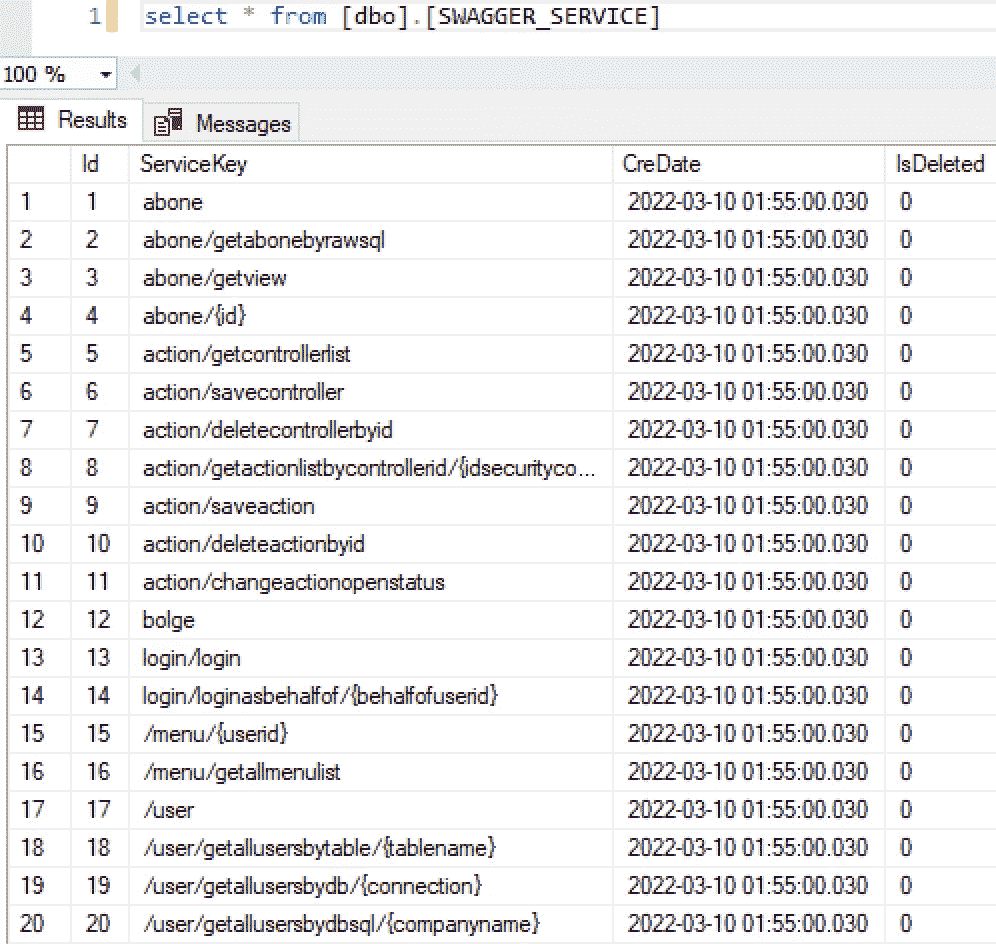

SWAGGER_SERVICE TABLE

C为用户允许的路径创建虚拟数据

现在是时候创建虚拟数据了，谁能看到一些方法，谁不能。

创建" **User_Swagger"** 表格如下:

*   “UrlId”是每个用户的唯一 Id。我们也可以使用“IdUser”。但是为了安全起见，我更喜欢每个用户至少 6 位数的唯一号码。我们将使用它，为每个用户过滤大摇大摆的路径。
*   “IdUser”是用户的唯一 ID。它与[数据库用户]表相关。
*   “IdSwagger”与“[SWAGGER_SERVICE]”表相关。

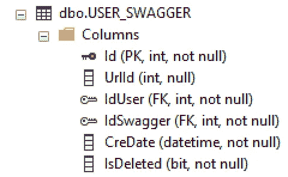

```
CREATE TABLE [dbo].[USER_SWAGGER]([Id] [int] IDENTITY(1,1) NOT NULL,
[UrlId] [int] NULL,
[IdUser] [int] NOT NULL,
[IdSwagger] [int] NOT NULL,
[CreDate] [datetime] NOT NULL,
[IsDeleted] [bit] NOT NULL,CONSTRAINT [PK_USER_SWAGGER] PRIMARY KEY CLUSTERED
(
  [Id] ASC
)WITH (PAD_INDEX = OFF, STATISTICS_NORECOMPUTE = OFF, IGNORE_DUP_KEY = OFF, ALLOW_ROW_LOCKS = ON, ALLOW_PAGE_LOCKS = ON) ON [PRIMARY]
) ON [PRIMARY]GO
ALTER TABLE [dbo].[USER_SWAGGER] ADD  CONSTRAINT [DF_USER_SWAGGER_CreDate]  DEFAULT (getdate()) FOR [CreDate]GO
ALTER TABLE [dbo].[USER_SWAGGER] ADD  CONSTRAINT [DF_USER_SWAGGER_IsDeleted]  DEFAULT ((0)) FOR [IsDeleted]GO
ALTER TABLE [dbo].[USER_SWAGGER]  WITH CHECK ADD  CONSTRAINT [FK_USER_SWAGGER_DB_USER] FOREIGN KEY([IdUser]) REFERENCES [dbo].[DB_USER] ([IdUser])GO
ALTER TABLE [dbo].[USER_SWAGGER] CHECK CONSTRAINT [FK_USER_SWAGGER_DB_USER]GO
ALTER TABLE [dbo].[USER_SWAGGER]  WITH CHECK ADD  CONSTRAINT [FK_USER_SWAGGER_SWAGGER_SERVICE] FOREIGN KEY([IdSwagger]) REFERENCES [dbo].[SWAGGER_SERVICE] ([Id])GO
ALTER TABLE [dbo].[USER_SWAGGER] CHECK CONSTRAINT [FK_USER_SWAGGER_SWAGGER_SERVICE]GO
```

现在是用虚拟数据填充“**User _ Swagger”**表的时候了

**SqlServer(Row SQL):** 我们将执行这些查询来创建 3 个用户权限的虚拟数据，如下所示。

```
INSERT INTO USER_SWAGGER (UrlId,IdUser,IdSwagger)
SELECT LEFT(CAST(RAND()*1000000000+999999 AS INT),6) as UrlId,
U.Id as IdUser,
SS.Id as IdSwagger
from [dbo].[SWAGGER_SERVICE] AS SS,Users as U
WHERE SS.Id%2=0 and U.Id=1INSERT INTO USER_SWAGGER (UrlId,IdUser,IdSwagger)
SELECT LEFT(CAST(RAND()*1000000000+999999 AS INT),6) as UrlId,
U.Id as IdUser,
SS.Id as IdSwagger
from [dbo].[SWAGGER_SERVICE] AS SS,Users as U
WHERE SS.Id%3=0 and U.Id=2INSERT INTO USER_SWAGGER (UrlId,IdUser,IdSwagger)
SELECT LEFT(CAST(RAND()*1000000000+999999 AS INT),6) as UrlId,
U.Id as IdUser,
SS.Id as IdSwagger
from [dbo].[SWAGGER_SERVICE] AS SS,Users as U
WHERE SS.Id%10=0 and U.Id=3
```

在我们将所有数据插入 USER_SWAGGER 表之后，它们看起来如下。

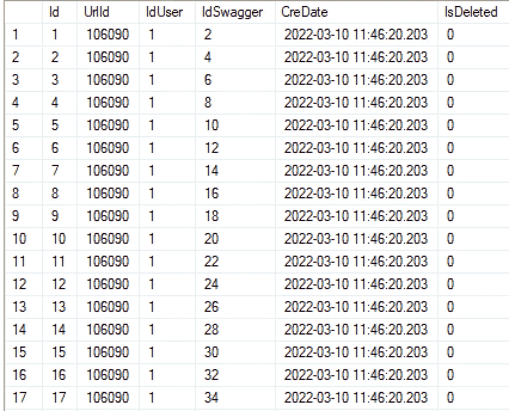

USER_SWAGGER TABLE

F过滤招摇文件:

**Startup.cs:** 首先，我们必须允许从 Startup.cs 上的项目的任何地方访问 HttpContext，如下所示。

```
services.AddHttpContextAccessor();
```

**customswaggerfilter . cs:**

现在我们从 URL 中获取参数“ ***Id*** ”，过滤掉霸气。

*   我们将通过使用 HttpContextAccessor 来获取当前的 HttpContect。我们将使用它来获取 URL 路径。

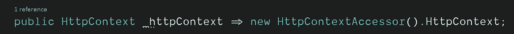

*   我们将通过使用“ ***_httpContext*** ”来获取 Url。并使用“***PareQueryString()***”方法解析 URL 中的 ID。最后，我们将检查“ **id** ”是否为空。

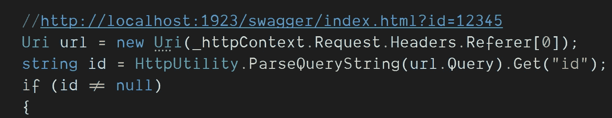

*   我们将使用 Entity 6.0 进行数据库操作。于是我们就用“**使用{}** 创建了“***”db context***”。我们将使用唯一的 Url 参数 Id 从“ ***UserSawagger*** ”表中获取所有用户可访问方法的路径。这是唯一的 6 位数[用户 _ 招摇] UrlId。我们将它设置为 swaggerKeys 变量。

**不:**不要忘记使用"**asnottracking()**"方法来提高实体性能，当只读取数据时。

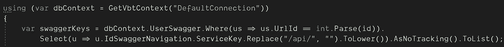

*   我们将从项目中排除所有不包含在用户允许的路径中的方法路径。长话短说，我们将获得这个用户的禁止路径。并且我们将从" ***swaggerDoc 中移除这些被排除的路径。路径*** “通过使用 ***【移除()*** ”的方法。最后，该用户将看不到一些不允许他或她访问的路径。

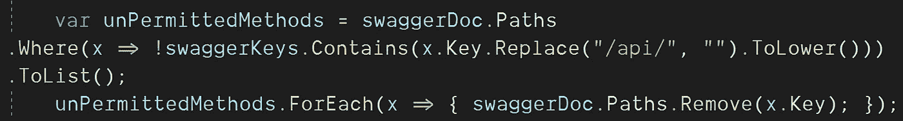

**CustomSwaggerFilter.cs:**

```
public class CustomSwaggerFilter : IDocumentFilter
{
   public HttpContext _httpContext => new HttpContextAccessor().HttpContext; public void Apply(OpenApiDocument swaggerDoc, DocumentFilterContext context)
   {
      //http://localhost:1923/swagger/index.html?id=12345 Uri url = new Uri(_httpContext.Request.Headers.Referer[0]);
      string id = HttpUtility.ParseQueryString(url.Query).Get("id");
      if (id != null)
      {
         using (var dbContext = GetVbtContext("DefaultConnection"))
         {
            var swaggerKeys = dbContext.UserSwagger.Where(us => us.UrlId == int.Parse(id)).Select(u => u.IdSwaggerNavigation.ServiceKey.Replace("/api/", "").ToLower()).AsNoTracking().ToList();

            var unPermittedMethods = swaggerDoc.Paths.Where(x => !swaggerKeys.Contains(x.Key.Replace("/api/", "").ToLower())).ToList(); unPermittedMethods.ForEach(x => { swaggerDoc.Paths.Remove(x.Key); });
         }
      }
   }
}
```

**结论:**

Swagger 是一份公开文件。但是在某些情况下，我们可能希望为特定的角色或用户隐藏一些路由。其中一件重要的事情是，保持对“USER_SWAGGER”表的更新。在工作过程中，可以删除或更新控制器。在开发期间，可以添加新的控制器。所以也许用微服务或者日常作业自动更新“USER_SWAGGER”表更好。

出于安全原因，如果加密 UrlID 并在读取时解密，可能会更安全。因为一个可读的 6 位数容易记忆。

我希望这篇文章能帮助您理解如何在 swagger 文档中过滤方法。下一篇文章再见。再见。

*“如果你读到现在，首先感谢你的耐心和支持。欢迎大家来我的博客*[](http://www.borakasmer.com/)****了解更多！”****

****来源:****

*   **[**https://github.com/mattfrear/Swashbuckle.AspNetCore.Filters**](https://github.com/mattfrear/Swashbuckle.AspNetCore.Filters)**
*   **[**https://stack overflow . com/questions/62858580/net-core-3-1-remove-schema-on-swagger-ui**](https://stackoverflow.com/questions/62858580/net-core-3-1-remove-schema-on-swagger-ui)**
*   **[**https://stack overflow . com/questions/29701573/how-to-omit-methods-from-swagger-documentation-on-webapi-using-swash buckle**](https://stackoverflow.com/questions/29701573/how-to-omit-methods-from-swagger-documentation-on-webapi-using-swashbuckle)**
*   **[**https://corespider . com/blog/how-to-show-only-specific-APIs-on-swagger-in-ASP-net-core/**](https://corespider.com/blog/how-to-show-only-specific-apis-on-swagger-in-asp-net-core/)**