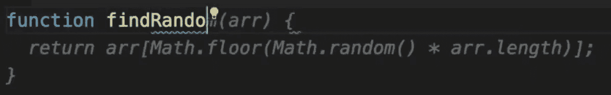
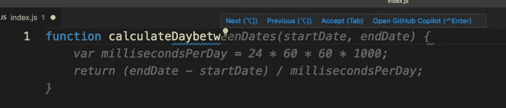

# 最后，Github 副驾驶向所有人开放

> 原文：<https://medium.com/geekculture/finally-github-co-pilot-is-open-to-all-6804df457a95?source=collection_archive---------4----------------------->

我相信你们大多数人都知道 Github 副驾驶是什么。万一你没有，下面是解释。

" *GitHub Copilot 是一个 AI pair 程序员，可以帮助你更快地编写代码，并且工作量更少。它从注释和代码中提取上下文，即时提示单独的行和整个功能。GitHub Copilot 由 Codex 提供支持，Codex 是 OpenAI 创建的一种生成式预训练语言模型。它作为 Visual Studio 代码、Visual Studio、Neovim 和集成开发环境(ide)的 JetBrains 套件的扩展提供。*

简单来说，这是你最喜欢的编辑器的自动建议扩展，通过自动建议可以帮助你更快更有效地编写代码。

如果你不知道如何安装 Github 副驾驶和使用它，你可以看看我的这个视频。我也将在本文中解释这一点。


以下是将 Github co-pilot 添加到 Visual Studio 代码的说明，其他编辑器的说明也保持不变。

1.  您需要一个 Github 帐户，如果您还没有，请通过访问此[链接](https://github.com/signup)创建一个。
2.  如果你已经有一个帐户，然后登录 Github.com，在右上角你会看到一个卡上写着 Github Copilot。如下图所示。


3.你可以点击它或者直接访问这个[链接](https://copilot.github.com/)，点击开始免费试用。是的，Github 副驾驶不是免费的。在写这篇文章的时候，每月花费 10 美元，每年花费 100 美元。提供必要的详细信息，完成付款步骤。

4.现在转到 Visual Studio Code，点击 Extensions，搜索 Github co-pilot 并安装。

5.在右下角安装后，会出现一个弹出窗口，要求你登录 Github。请确保您已经注销了所有其他 Github 帐户，并且只登录了您在上述步骤中链接了您的付款信息的那个 Github 帐户。

6.验证完成后，您的 Github 帐户和 VSCode 就链接起来了。现在可以开始测试 Github 副驾驶了。

> **开始使用 Github 副驾驶主要有两种方式。**

1.**开始输入功能名称，Github 副驾驶将开始自动为您提示其余内容。**

例如:



2.**在评论中添加你想要实现的内容，Github co-pilot 会自动提示下面的代码。**

例如:

```
// Determine whether the sentiment of text is positive// Use a web service
```

> 对于每一个你期望从 Github Co-Pilot 得到的解决方案，它都有很多可能的解决方案。



例如:要计算日期之间的天数，有多种方法，您可以通过点击 cmd/ctrl 并点击

1.  当你点击**打开 Github cop-Pilot:** 它将打开所有可能的可用建议，你可以选择一个符合你标准的解决方案。一些解决方案可能具有更好的空间复杂度，一些可能具有更好的时间复杂度，一些可能两者都有。您可以根据自己的需求选择解决方案。
2.  同样可以通过点击下一个和上一个，新的代码片段不断出现在点击这些。
3.  单击接受将接受当前解决方案。

你可以使用 Github Co-Pilot 做很多高级编码，访问官方文档了解一切。

[](https://docs.github.com/en/copilot) [## GitHub Copilot - GitHub 文档

### 您可以在编码时使用 GitHub Copilot 从 AI pair 程序员那里获得自动完成风格的建议。

docs.github.com](https://docs.github.com/en/copilot) 

阅读愉快，下篇见。

如果你正在准备前端开发者面试，请观看我的以下系列:

如果你正在为 MAANG 前端角色做准备，那么看下面我的视频系列: