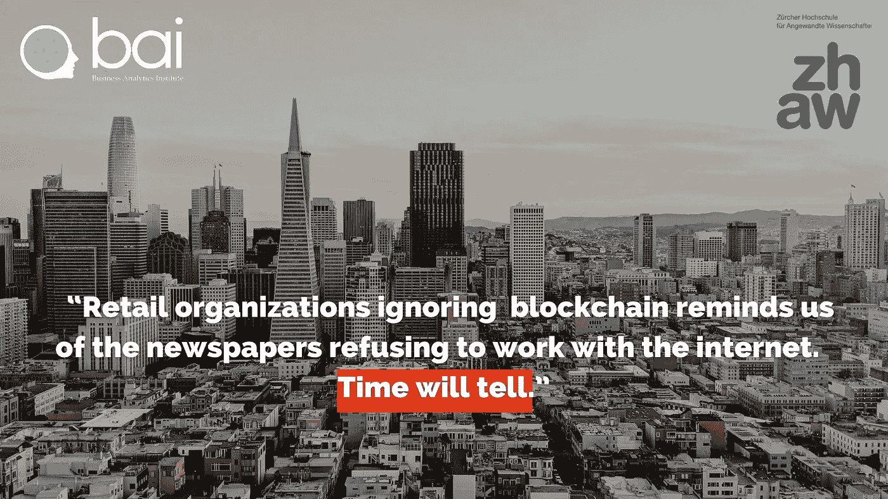

# 金融作为一种产品

> 原文：<https://medium.com/geekculture/finance-as-a-product-341cd35ebf21?source=collection_archive---------37----------------------->

DeFi 的唯一限制是组织的想象力

在接下来的文章中，我们认为，金融最好不要被视为一个有待改进的过程，而是一个强大的增长引擎。对于零售组织及其金融合作伙伴来说，DeFi(分散金融)可以提供一种创新的利润来源，以及一种与您的客户和企业互动的有效方式…