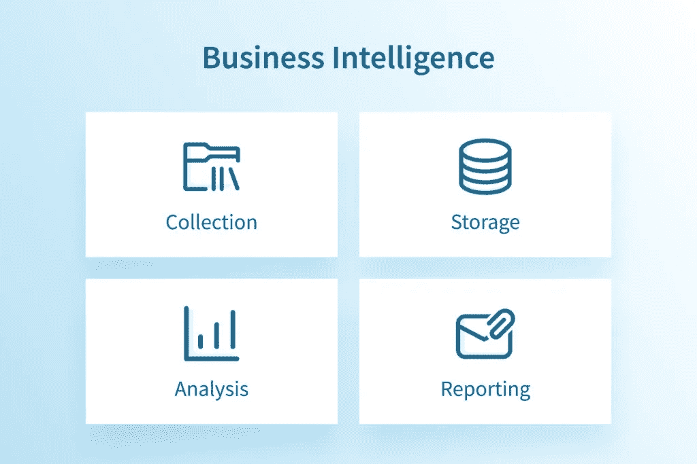
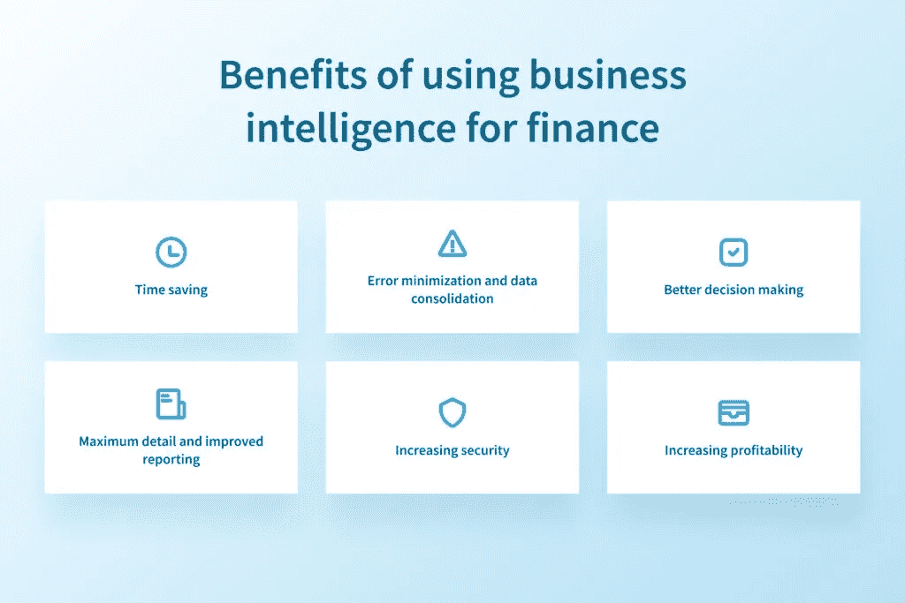
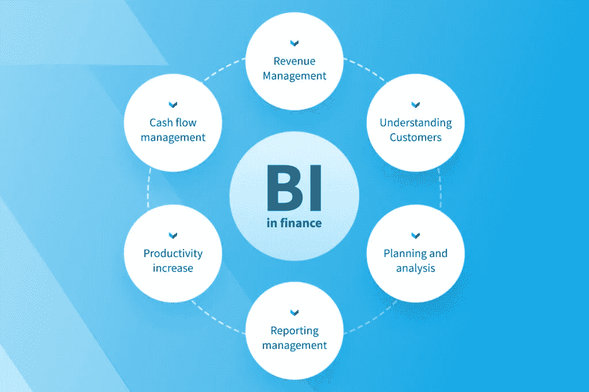

# 金融商业智能:利益和银行流程— NIX United

> 原文：<https://medium.com/geekculture/financial-business-intelligence-benefits-and-banking-processes-nix-united-898a6e566174?source=collection_archive---------19----------------------->

对于许多首席财务官来说，控制利润计划的执行，寻找融资来源，合并报告，预算和分析公司的业绩是主要的日常任务。为了了解事情的进展，他们使用各种来源收集信息——在大公司，他们分析数百个指标。数据是金融服务部门的核心，业务环境产生的数据比以往任何时候都多。万亿字节的数据来自电子表格、发票、日记条目和你能想到的任何东西。这种细节很重要:它允许你收集大数据，通过进一步的结构化和分析，有助于发现不明显但重要的模式，以做出相关、平衡和合理的决策。

首席财务官需要能够对所有类型的数据进行深入分析，以充分利用这些数据，但这需要花费半生的时间。这就是金融商业智能的作用。随着[商业智能解决方案](https://nix-united.com/services/business-intelligence-services-bi/)的推出，贵公司将获得:

*   从不同来源收集、构建和存储数据
*   大数据分析
*   形成报告，使您能够监控大量重要的指标，发现其中的偏差，并按计划调整计划
*   基于数据分析的业务决策和预测建模

因此，将商业智能用于金融服务对于释放机构、其产品和服务的全部潜力以及帮助做出准确和正确的决策是必要的。在今天的文章中，我们来看看商业智能在金融服务中的作用。

# 什么是商业智能？

先说理论。商业智能(BI)是一种业务分析技术，允许您计算关键绩效指标并可视化其动态，以优化数据驱动的决策。为了准确及时地解决问题，BI 系统需要高质量的数据。在业务活动过程中收到的所有财务记录都是重要的数据来源，因此，使用 BI for finance 的功能，您可以了解企业的情况，并使用它来更新财务指标、优化供应链，以及在从营销到并购的所有事情上做出更明智的决策。

商业智能经常与商业分析混淆，但是要小心——这是两个完全不同的概念。商业智能就是在正确的时间以正确的方式向正确的人提供正确的信息。例如，首席财务官可以查看上个月的收入，并在此基础上制定下个月的计划。商业分析更加智能化，因为它被用来帮助进行预测(展望未来成为可能)。也就是说，使用 BA，财务总监将能够理解为什么这些过程会以某些方式影响收入，并能够建立模型来预测其未来的变化。

BI 系统的工作原理如下:

*   数据收集——从公司信息系统(如 CRM、ERP 等)自动下载数据
*   数据保留——收集的数据数量众多且通常很大。它们需要存放在某个地方，以便在需要的时候容易找到
*   分析-BI 工具需要能够从仓库中提取数据来执行这些不同类型的分析。它们显示关键绩效指标(KPI ),并允许您实时监控其动态变化
*   报告——如果我们所有的数据和分析没有传递给能够据此做出决策的人，那么这些数据和分析都是无用的。商务智能应该以一种人们可以快速理解和使用的方式来传达数据和想法

# 将商业智能用于金融的好处

与时俱进并在金融服务中使用商业智能的财务主管可以实现报告自动化，并减少财务部门活动中的手动和常规工作量。他们控制着公司的所有流程，从事战略规划和业务发展，是 CEO 和所有者的左右手。他们的助手是一个 BI 系统，可以收集、分析来自所有 IT 系统的不同数据，并将其集成到可理解的报告中。

我们已经提到了在金融服务中使用商业智能的积极方面。现在，让我们再深入一点，仔细看看企业将如何从金融商业智能的实施中受益。

# 更好的决策

世界各地的企业正在证明在工作中使用 BI 系统的价值，并通过数据驱动的[决策](https://nix-united.com/blog/examples-of-business-intelligence-systems-for-improving-decision-making/)增加收入。在 BI 工具的帮助下，您可以轻松跟踪公司的财务活动，评估公司的市场和信用风险，以及潜在选择的策略如何影响收到的利润。面向金融服务的商业智能提高了数据分析的效率，从而提高了做出具有重要战略意义的决策的及时性和准确性。

让我们看看什么时候商业智能是一个有价值的盟友。例如，银行业受到严格的监管框架的约束，这就要求在决策过程中保持特别的警惕性和透明度。这是由于管理许多领域的大量数据:客户、指标、银行数据、市场状况等。有了面向银行的 BI，数据处理工具的可靠性和准确性将不再有疑问，不会出现错误，从而确保某些决策的正确做出。

# 节约时间

机械的数据收集和报告占据了分析师和金融家的大部分工作日。一个好的 BI 系统有助于节省数据收集、输入、分析、控制和使用的时间。借助 BI，企业可以从大量杂乱无章的信息中快速提取所需的数据。得益于即时访问，财务专家可以做出更好的业务决策，而借助 BI for finance 的自动化报告，您可以设置一种算法来处理不同类型的数据，然后自动使用它无数次。

# 误差最小化和数据整合

由于大量的 IT 系统和它们之间的不良集成，大型企业经理看不到全局。会计、客户关系管理、发票、工资单，当然还有各种其他的 Excel 表格可以让你积累大量的数据，但是却无法对其进行分析并将其转化为决策工具。组织和组合来自多个来源的大量数据并不容易。你能想象手工处理所有这些数据吗？不仅不可避免地会犯错误(由于人的因素)，而且一旦你完成了，到那时，输出很可能就过时了。

BI 系统解决了这个问题，并且像时钟一样工作。面向金融的商业智能使您不仅可以同步数据以进行决策，还可以最大限度地减少人为错误。因此，它允许你回顾过去或提前计划，并分析在不同的情况下事情会如何发展。

# 最详细和改进的报告

尽管[报告过程](https://nix-united.com/blog/business-intelligence-reporting-benefits-and-best-practices/)复杂而漫长，但在 Excel 中，我们获得的数据最多可达第二级细节。要深入研究任何指标，您需要重新上传数据并整合报告，这是一个无休止的复杂过程。金融商业智能如何解决这个问题？你将能够钻研交易和任何主要文件。BI 允许所有员工同时查看和分析所有系统中的数据，当然，还可以创建详细易懂的报告，让授权人员快速履行职责。

# 增强安全性

随着技术的进步，资金猎人已经迅速接受了虚拟空间，因此公司需要采取措施，帮助他们从不断增长的数据集中建立对基于事实的信息的信心，并尽可能降低风险。金融领域的欺诈活动有多种形式，从非法使用个人信息到窃取银行数据。此外，外部人员和您公司的员工都可能成为欺诈的实施者。金融服务行业的商业智能可确保尽快检测到风险并尽快解决。

例如，随着银行业变得越来越一体化，欺诈是要消除的事情的清单上的第一位。以及在银行业务中使用 BI-即搜索可疑交易、跟踪员工活动、扫描过期银行交易等。-可以尽快发现问题并降低风险。

# 提高盈利能力

在金融领域使用 BI 可以让您识别结构化和非结构化数据的模式和趋势。这有助于收集大量信息，对其进行处理，找到关系，并调整战术和决策策略。公司可以通过分析活动中的流程和活动来降低持续成本，并充分利用可用资源和经验。

借助面向金融的商业智能，您可以获得关于老客户和盈利客户的准确而及时的信息，为他们提供新产品和服务，并增加销售额和利润。此外，专为处理、可视化和分析大量数据而设计的分析服务和 BI 系统将通过提供新客户的平均销售额、吸引成本等信息来帮助您吸引新客户。

# 金融服务中的商业智能如何工作

# 现金流管理

使用商业智能时，公司内部的财务监管要容易得多，因为所有费用都会被自动跟踪，而且几乎是实时的。因此，如果出现资金短缺或超支的情况，查明问题的根源和解决办法不会花很长时间。财务方面的商业智能也有助于规划高成本的浪费或采购，因为财务总监可以准确地确定要分配的金额以及偿还该金额的时间。

# 收入管理

即使在计划销售的阶段，基于数据集，BI for finance 也可以进行详细的分析，揭示潜在的危险，让您了解最终结果是否符合业务计划，以及如果实施，预计的销售收入有多准确。商业智能不仅提供深度粒度，而且速度非常快，考虑到执行事务的紧迫性，这是一个关键因素。商业智能不仅有助于评估未来的交易，而且有助于根据对竞争对手的市场、折扣、拒绝购买的次数等的分析来形成产品价格。，并通过分析某些产品的盈利能力、回报、对收入的贡献等来制定战略。

如果一家公司正处于困难时期，BI 可以帮助首席财务官整理互不相关且互不相干的数据集，基于这些数据集，很难(有时甚至不可能)完全诊断出不令人满意的结果的原因。

# 了解客户

在财务流程中使用来自商业智能的数据有助于公司跟踪和分析客户数据，以确定购买习惯和模式。通过充分了解客户的需求和愿望，您可以优化服务以增加当前销售额，并确保对整个公司的长期忠诚度。预测数据分析还可以揭示新的市场和机会，以扩大您的客户群。

拥有客户盈利能力信息的银行机构可以找到更具成本效益的方式与客户互动。例如，可以说服从银行提取现金来支付账单的客户使用网上银行。

# 规划和分析

众所周知，光积累数据是不够的:必须分析数据、管理数据并让数据发挥作用——这是现代公司面临的最重大挑战。财务商业智能为及时、准确和自动分析各种财务数据奠定了基础，从而最大限度地提高了规划效率。金融服务中商业智能的能力远远不止预测一个季度的销售额和收益。BI 有助于理解几乎所有可能影响公司底线的变量:账单和收入、定价政策的影响、库存水平、销售、客户服务成本等等。

# 报告管理

一份糟糕的报告比没有报告更糟糕。因此，收到准确、写得好的财务报告是极其重要的。财务中的商业智能从公司的费用管理工作流中提取所有必要的数据，并确保您以图形和图表的形式收到准确的、经过分析的、结构良好的报告。因此，财务部门可以快速识别错误，纠正错误，并根据事实而不是假设做出决策。

# 生产率提高

在商业中，决策和发现故障的每一次延迟都要花费大量的金钱。面向财务的商业智能可以识别您的企业面临的具体问题，以便您可以尽快做出有针对性的改进。在 BI 的帮助下，所有员工都可以实时监控必要的生产过程，并且通过设置警报，他们可以立即收到问题通知。这可以防止生产停工，从而大大降低生产率。

# 最后的想法

BI 可以成为任何 CFO 最好的朋友，为公司提供一个自动化系统，用于分析历史、当前和预测业务运营。企业的财务需要持续的关注和控制。财务 BI 的实施是实现企业财务结果主动管理的必要步骤。NIX United 为金融服务系统的公司提供强大的商业智能，帮助测量大数据，并根据您的发现和分析创建有用的预测。释放您的业务、产品和服务的全部潜力，并根据 BI 收集的数据做出准确和正确的财务决策。

*原载于 2022 年 9 月 14 日*[*【https://nix-united.com】*](https://nix-united.com/blog/business-intelligence-in-finance-all-you-need-to-know/)*。*