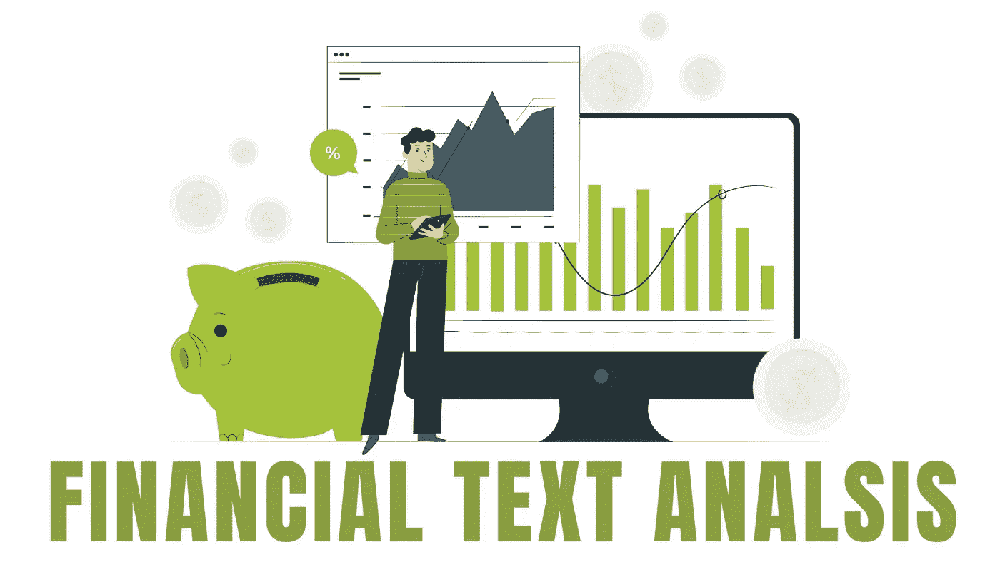

# 金融文本分析

> 原文：<https://medium.com/geekculture/financial-text-analysis-f30bcda957cd?source=collection_archive---------19----------------------->

自远古以来，金融一直是人类文化的基石。从物物交换时代到今天的加密货币，金融总是与数据的生成相关联，如银行交易、信贷、保险和投资报告。金融业的日常运营需要从各种来源产生和使用大量非结构化文本数据。然而，随着时间的推移，手动数据处理方法的使用和重要性已经降低。

由于这种文字分析，近年来需求大幅增加。文本挖掘领域伴随着人工智能不断发展。对公司、政府和公众来说，分析大量财务数据既是一项要求，也是一项优势。

如今，人们通过文本分析来预测和管理风险，根据事实数据做出决策，让客户满意并战胜竞争对手。

诸如 [**字节视图**](https://www.bytesview.com/) 之类的高级文本分析解决方案允许相关人员分析来自各种来源的大量非结构化文本数据。这些工具帮助他们将大量文本数据转化为情报。

# **金融文本分析的应用**

**企业融资**

它包括对所有财务和投资报告的分析，以及检测欺诈的可持续性评估。

**财务预测**

文本分析有助于股市预测和预报。这使得相关人员能够根据事实而不是纯粹的猜测做出决定。

**银行业务**

洗钱和风险管理等应用程序被财务经理用于文本分析。

# 金融文本分析面临的挑战

1.由于涉及机密数据，分析永远无法达到完全准确

2.文本分析模型缺乏对金融术语的明确理解。

3.金融数据本质上是高度非结构化和冗余的。

4.没有专门为金融操作设计的动态文本分析模型。

# **金融文本分析模型**

## [**主题**](https://www.bytesview.com/topic-labeling) **标注**

分析文本数据以识别新出现的主题，从而识别上升和下降的金融市场趋势。

## [情绪](https://www.bytesview.com/sentiment-analysis)分析

分析从多个来源提取的客户反馈，识别市场对品牌市场声誉的看法。这有助于预测股市趋势。

## [特征](https://www.bytesview.com/text-extraction)提取

银行交易需要大量的文本数据处理。特征提取是一种从各种来源中识别和构造文档的技术。

## [实体](https://www.bytesview.com/entity-extraction)提取

从非结构化文本和文档中识别实体。你可以用它从文本数据中提取有价值的金融见解，或者跟踪你的竞争对手。

## [语义](https://www.bytesview.com/semantic-similarity)相似之处

比较所有金融产品和解决方案，看看它们有多相似。确定相似的数据，并使用该工具避免财务报告重复。