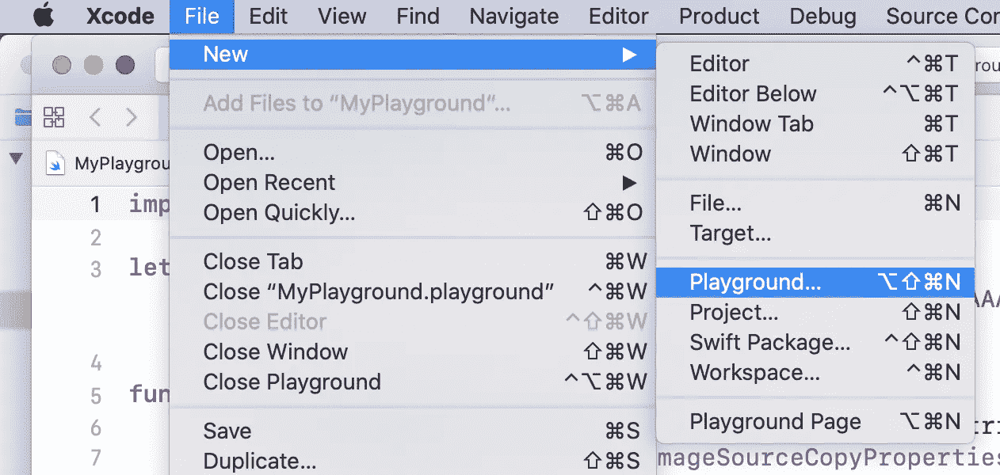
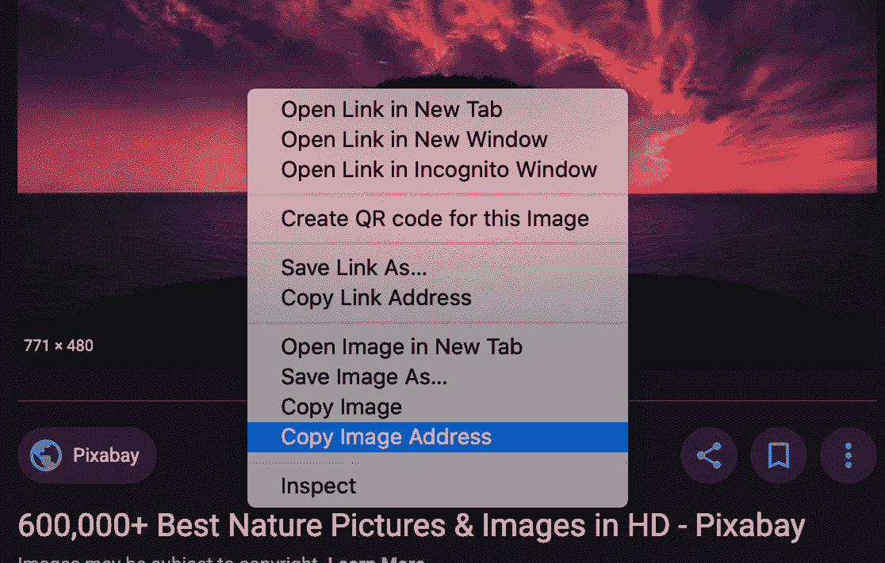
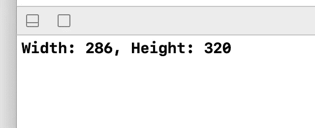

# 从 IOS 中的 URL 查找图像尺寸(SWIFT)

> 原文：<https://medium.com/geekculture/find-image-dimensions-from-url-in-ios-swift-a186297e9922?source=collection_archive---------8----------------------->

在这个博客中，你将学习如何使用 Swift 语言在 IOS 中从 URL 中找到图像尺寸。请阅读完整的博客以获得更好的理解。

# 第一步

首先，从 Xcode 创建一个简单的 playground 文件，如下图所示。

# 第二步

像这样在文件顶部导入 SwiftUI

# 第三步

现在创建一个 **let** 变量，并给它一个图片 **URL** 。

对于 **imageUrl，**只需像下图一样从浏览器中复制图像地址，然后像字符串一样粘贴到这里。

 [## 三星 Galaxy S21 超 5G 出厂解锁安卓手机 128GB 美版智能手机…

### 三星 Galaxy S21 Ultra 5G 手机在各方面都是史诗般的，具有引人注目的新设计，迄今最快的 Galaxy 处理器，以及…

amzn.to](https://amzn.to/35knqeL) 

# 第四步

之后，编写一个名为“**imagedimensions**的函数，该函数带有一个名为“ **url** 的字符串参数。这个函数最终会返回字符串。

首先，我们需要一个图像源，我们将从**CGImageSourceCreateWithURL**函数中获得。**cgimagesourcecreatewithrul**函数接受两个参数，一个是 CFURL 类型的 **url** ，另一个是 **CFDictionary** 。你知道我们的 **url** 是**字符串**类型。因此，要将其转换为 CFURL 类型，请将其包装在 **URL(string: )** 函数中，然后强制将其**解包装为 CFURL** 。这将把 **url** 类型**字符串**转换成 **url** 类型 **CFURL** 。目前，我们不会使用 CFDictionary 参数，所以将其赋予 **nil** 值。

现在将这个 **imageSource** 用于**cgimagesourcecopypropertiatindex**函数，它将返回图像属性的**字典**。

> 设 pixel width = image properties[kCGImagePropertyPixelWidth]为！（同 Internationalorganizations）国际组织
> 
> 设 pixel height = image properties[kCGImagePropertyPixelHeight]为！（同 Internationalorganizations）国际组织

现在通过使用这两条线，你可以得到图像的**宽度**和**高度。**

# 第五步

然后调用这个函数并打印它的值。

现在你可以看到 **imageUrl** 的尺寸输出。

所以你可以看到 **imageUrl** 的**宽** & **高**。

**希望你理解。如果你有任何问题，请在下面评论。:)**

## 订阅模式

 [## 米（meter 的缩写））阿巴斯正在创建 IOS 开发者| Patreon

### 立即成为 M.Abbas 的赞助人:获得世界上最大会员的独家内容和体验…

www.patreon.com](https://www.patreon.com/abbasgujjar)