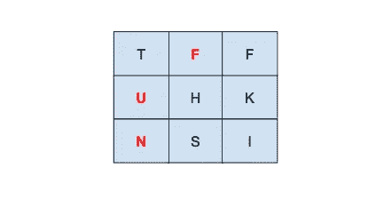

# 6.找到词语

> 原文：<https://medium.com/geekculture/find-the-words-d0fb1a13b1fa?source=collection_archive---------11----------------------->

## 问:在字符矩阵中找出单词(从给定的列表中);请注意，字符可以向所有八个相邻方向移动。

例如，给定["这个"、"是"、"好玩"、"非常"、"东西"]和[["T "、" F "、" F "、]、["U "、" H "、" K "、]、["N "、" S "、" I "、]，应该返回["是"、"好玩"、"这个"]