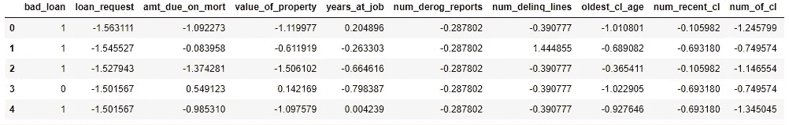
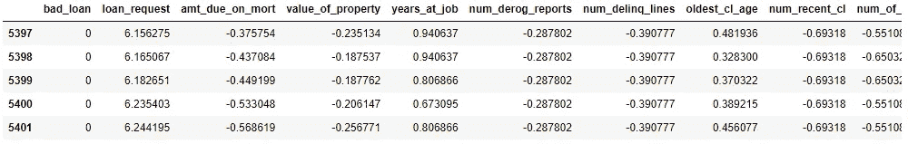
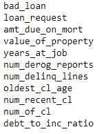
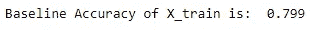
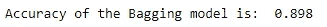
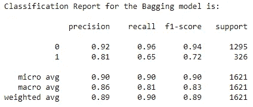
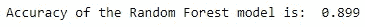
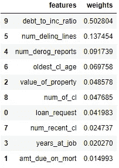

# 寻找特征集的重要特征:使用 sklearn 算法的分类任务

> 原文：<https://medium.com/geekculture/finding-the-important-features-of-a-feature-set-a-classification-task-with-sklearns-algorithms-3003f740faf9?source=collection_archive---------7----------------------->


Photo by [Tanuj Dargan](https://unsplash.com/@tanuj_dargan?utm_source=unsplash&utm_medium=referral&utm_content=creditCopyText) from Unsplash

# 介绍

在大多数机器学习任务中，分析师需要了解特征集中的重要特征，这些特征对目标变量有较大的影响。在为任务准备好初步模型之后，这些关于重要特征的知识肯定有助于通过丢弃一些“不相关”的特征来使模型变得更好——尽管这也取决于使用哪个分类器来建模。

在本文中，我们将查看一个分类任务，其中我们将使用一些 [sklearn](https://scikit-learn.org/stable/) 的分类器对我们的目标变量进行分类，并尝试为我们的数据集准备一个分类模型。然后对于“最佳”模型，我们将找到特征重要性度量。

# 数据集

我们将使用的数据集基于银行贷款，其中目标变量是取值为 0 或 1 的分类变量“bad_loan”。我们还有 10 个连续变量的特征。我们有大约 5400 次观察。*如果我们的任何读者想要数据集，请通过* [*LinkedIn*](https://www.linkedin.com/in/pritam-kumar-patro-1098b9163/) 告诉我。我们数据集的头尾看起来像这样:



# 用 sklearn 的算法用 Python 编程

在本文中，我们将分析数据，并使用 sklearn 的一些算法将分类模型拟合到我们的数据中。我们开始吧！！！

```
import numpy as np
import pandas as pd
from sklearn.model_selection import train_test_splitfile=pd.read_csv("D:/TDS1_Data.csv")
df=pd.DataFrame(file)
```

有了这个代码块，我们已经将数据集加载到机器中进行分析。然后让我们看看数据集中的变量。

```
for columns in df.columns:
    print(columns)
```



对于下一组代码行，我们将把数据集分成训练集(70%)和测试集(30%)。

```
X = df.drop(‘bad_loan’, axis=1)
y = df[‘bad_loan’].copy()features=[]
for columns in X.columns:
    features.append(columns)rand_seed = 42X_train, X_test, y_train, y_test = train_test_split(X, y, test_size=0.3, stratify=y, random_state=rand_seed)
```

在我们将数据集分成训练集和测试集之后，让我们使用来自 sklearn 的一些分类器来建模和拟合我们的训练集。我们将使用[装袋分类器](https://scikit-learn.org/stable/modules/generated/sklearn.ensemble.BaggingClassifier.html)、[随机森林分类器](https://scikit-learn.org/stable/modules/generated/sklearn.ensemble.RandomForestClassifier.html)和[梯度推进](https://scikit-learn.org/stable/modules/generated/sklearn.ensemble.GradientBoostingClassifier.html)分类器来完成任务。但是首先，我们将使用一个[虚拟](https://scikit-learn.org/stable/modules/generated/sklearn.dummy.DummyClassifier.html)分类器来确定我们的训练集的准确性。

```
from sklearn.dummy import DummyClassifierdummy_clf = DummyClassifier(strategy=”most_frequent”)
dummy_clf.fit(X_train, y_train)dummy_clf.predict(X_train)print(“Baseline Accuracy of X_train is:”,””, dummy_clf.score(X_train, y_train).round(3))
```

我们发现精确度为:



在下一组代码行中，我们将使用一些分类器来建模我们的训练数据集。我们从装袋分类器开始。我们还将举例说明如何制作分类模型的分类报告:)

```
from sklearn.ensemble import BaggingClassifier
from sklearn.metrics import accuracy_scorebagg_clf = BaggingClassifier(random_state=rand_seed)
bagg_model = bagg_clf.fit(X_train, y_train)
bagg_model_fit = bagg_model.predict(X_test)print(“Accuracy of the Bagging model is:”,””, accuracy_score(y_test, bagg_model_fit).round(3))from sklearn.metrics import (
 classification_report,
 recall_score,
 precision_score,
 accuracy_score
)
print(‘Classification Report for the Bagging model is:\n’)
print(classification_report(y_test, bagg_model))
```

上述代码行的输出是:



我们看到集合方法对提高模型的准确性帮助很大。与训练模型相比，bagging 模型的准确率提高了 10%左右。现在我们转向随机森林分类器。

```
from sklearn.ensemble import RandomForestClassifierranfor_clf = RandomForestClassifier(n_estimators=10, max_features=7, random_state=rand_seed)
ranfor_model = ranfor_clf.fit(X_train,y_train)
ranfor_model_fit = ranfor_model.predict(X_test)print(“Accuracy of the Random Forest model is:”,””, accuracy_score(y_test, ranfor_model_fit).round(3))
```

我们发现精确度为:



我们可以看到，随机森林分类器的准确性仍然有所提高，但可以忽略不计。在大多数情况下，这是一个很好的指标，表明在当前的设置下，我们不会获得任何合理的更好的精度。让我们看看梯度提升分类器是否能帮助我们获得更好的准确性。

```
from sklearn.ensemble import GradientBoostingClassifiergradboost_clf = GradientBoostingClassifier()
gradboost_model = gradboost_clf.fit(X_train,y_train)
gradboost_model_fit = gradboost_model.predict(X_test)print(“Accuracy of the Gradient Boosting model is:”,””, accuracy_score(y_test, gradboost_model_fit).round(3))
```

我们发现精确度为:


现在我们可以得出结论，使用集合方法，90%是我们可以挽救的最好精度:)*请不要这样，这不是提高模型精度的终点。*

随着梯度增强分类器在三个分类器中实现最高的准确性，现在让我们根据特征的重要性来寻找特征的各个权重。

```
imp_features = gradboost_model.feature_importances_for i in imp_features:
    print(i.round(3))df_imp_features = pd.DataFrame({"features":features}).join(pd.DataFrame({"weights":imp_features}))df_imp_features.sort_values(by=['weights'], ascending=False)
```

我们得到一个输出:



# 结论

我们看到“债务与公司比率”和“债务数量”是梯度推进模型中两个最重要的特征。我们还看到 sklearn 没有直接找到重要特性名称的方法，因此我们必须手动找到它们。