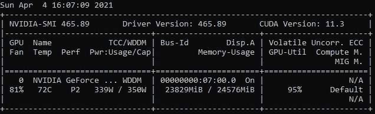
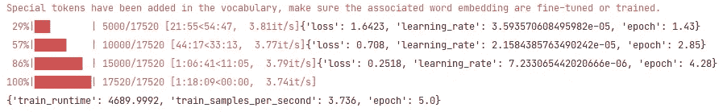
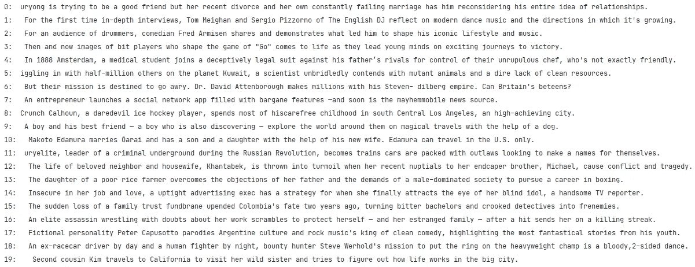
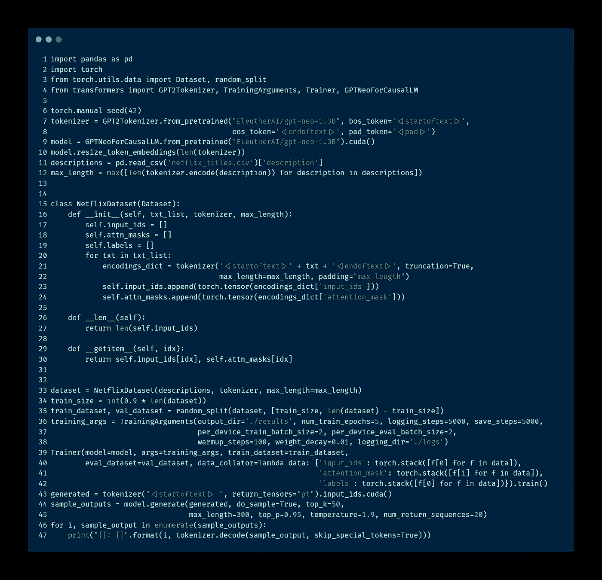
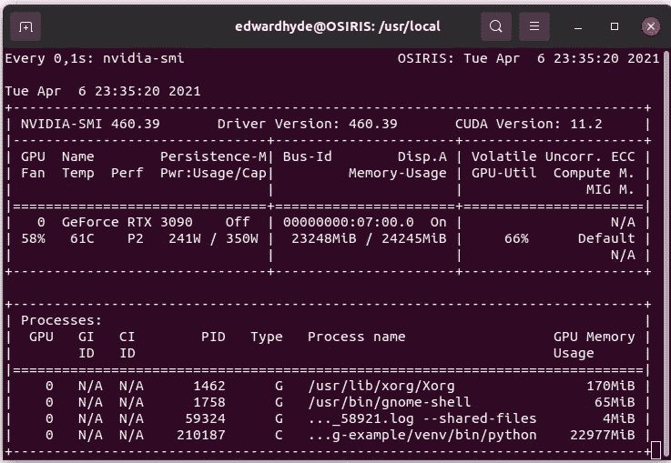
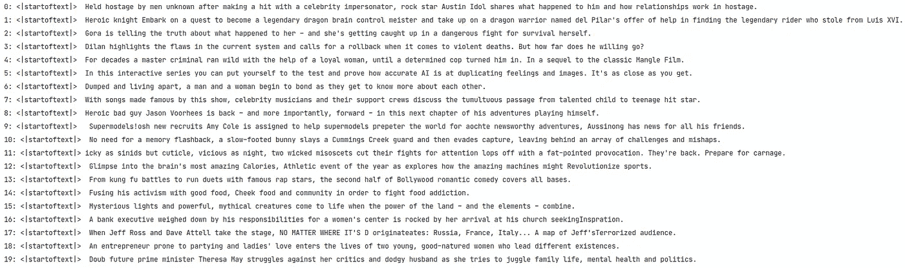

# 微调伊柳瑟雷 GPT 尼奥生成网飞电影描述只有 47 行代码

> 原文：<https://medium.com/geekculture/fine-tune-eleutherai-gpt-neo-to-generate-netflix-movie-descriptions-in-only-47-lines-of-code-40c9b4c32475?source=collection_archive---------2----------------------->


Photo by [**freestocks**](https://unsplash.com/@freestocks) on Unsplash

最近， [**EleutherAI**](https://www.eleuther.ai/) 发布了他们的类似 GPT-3 的模型 [**GPT-Neo**](https://github.com/EleutherAI/gpt-neo/) **，**而前几天，又是 [**发布了**](https://huggingface.co/EleutherAI/gpt-neo-1.3B) 作为 [**抱脸**](https://huggingface.co/) 框架的一部分。在撰写本文时，这个模型只在 [**变形金刚**](https://github.com/huggingface/transformers) 库的主分支可用，所以你需要这样安装它:

```
pip install git+[https://github.com/huggingface/transformers@master](https://github.com/huggingface/transformers@master)
```

主要目标是向您展示微调 GPT-尼奥模型的最简单方法，以使用网飞电影和电视节目的数据集[](https://www.kaggle.com/shivamb/netflix-shows)**生成新的电影描述。**

****

**CUDA device used for this project, please note that the GPT-Neo is a very VRAM demanding model!**

**首先，我们需要下载并准备好 GPT 近地天体模型:**

```
**# Set the random seed to a fixed value to get reproducible results** torch.manual_seed(42)
**# Download the pre-trained GPT-Neo model's tokenizer
# Add the custom tokens denoting the beginning and the end 
# of the sequence and a special token for padding** tokenizer = GPT2Tokenizer.from_pretrained(“**EleutherAI/gpt-neo-1.3B**”,    
                            bos_token=’**<|startoftext|>**’,
                            eos_token=’**<|endoftext|>**’,
                            pad_token=’**<|pad|>**’)
**# Download the pre-trained GPT-Neo model and transfer it to the GPU** model = GPTNeoForCausalLM.from_pretrained("**EleutherAI/gpt-neo-1.3B**")
                         **.cuda()**
**# Resize the token embeddings because we've just added 3 new tokens** model.resize_token_embeddings(len(tokenizer))
```

**下一步是读取网飞数据集，并计算数据集中电影描述的最大可能长度:**

```
descriptions = pd.read_csv(‘**netflix_titles.csv**’)[‘description’]
max_length = max([len(tokenizer.encode(description)) for description in descriptions])
```

**这个自定义的 [**数据集**](https://pytorch.org/docs/stable/data.html#torch.utils.data.Dataset) 类便于使用 [**训练器**](https://huggingface.co/transformers/main_classes/trainer.html) 工具进行微调:**

```
**class NetflixDataset(Dataset):**
    def __init__(self, txt_list, tokenizer, max_length):
        self.input_ids = []
        self.attn_masks = []
        self.labels = []
        for txt in txt_list:
            **# Encode the descriptions using the GPT-Neo tokenizer** encodings_dict = tokenizer(‘**<|startoftext|>**’ 
                                        + **txt** +    
                                        ‘**<|endoftext|>**’,
                                        **truncation=True**,
                                        **max_length=max_length**, 
                                        **padding=”max_length”**)
        input_ids = torch.tensor(encodings_dict[‘**input_ids**’])    
        self.input_ids.append(input_ids)
        mask = torch.tensor(encodings_dict[‘**attention_mask**’])
        self.attn_masks.append(mask)**def __len__(self):**
 return len(self.input_ids)**def __getitem__(self, idx):**
 return self.input_ids[idx], self.attn_masks[idx]
```

**现在初始化数据集:**

```
dataset = NetflixDataset(**descriptions**, **tokenizer**, **max_length**)
```

**接下来，您需要将整个数据集分成**训练(90%)** 和**验证(10%)** 集合:**

```
**train_size** = int(**0.9** * len(dataset))
**train_dataset, val_dataset** = random_split(dataset, 
                            [train_size, len(dataset) — train_size])
```

**拥抱脸工具包提供了一个有用的 [**训练器**](https://huggingface.co/transformers/main_classes/trainer.html) 工具，帮助用户在大多数标准用例中微调预训练的模型。所有的训练参数都应该使用 [**训练参数**](https://huggingface.co/transformers/main_classes/trainer.html#transformers.TrainingArguments) 进行配置:**

```
**# Here I will pass the output directory where 
# the model predictions and checkpoints will be stored, 
# batch sizes for the training and validation steps, 
# and warmup_steps to gradually increase the learning rate**
training_args = TrainingArguments(output_dir=’**./results**’,
                                  num_train_epochs=**5**,
                                  logging_steps=**5000**,
                                  save_steps=**5000, **                                  
                                  per_device_train_batch_size=**2**,
                                  per_device_eval_batch_size=**2**,
                                  warmup_steps=**100**,
                                  weight_decay=**0.01**,  
                                  logging_dir=’**./logs**’)
```

**最后，剩下的就是微调我们的模型并检查结果！**

```
trainer = Trainer(model=**model**, args=**training_args**,  
                  train_dataset=**train_dataset**,
                  eval_dataset=**val_dataset**, 
                  **# This custom collate function is necessary 
                  # to built batches of data** data_collator=lambda data: 
              {‘**input_ids**’: **torch.stack([f[0] for f in data])**,       
               ‘**attention_mask**’: **torch.stack([f[1] for f in data])**,
               ‘**labels**’: **torch.stack([f[0] for f in data])**})
**# Start training process!** trainer.train()
```

****

**Training process**

**训练后，我们可以使用内置的 [**生成**](https://huggingface.co/transformers/main_classes/model.html#transformers.generation_utils.GenerationMixin.generate) 函数来评估结果:**

```
**# Start every description with a special BOS token**
generated = tokenizer(“**<|startoftext|>** “,   
                      return_tensors=”pt”).input_ids.cuda()
**# Generate 3 movie descriptions** sample_outputs = model.generate(generated, 
                 **# Use sampling instead of greedy decoding** 
                 do_sample=True, 
              **# Keep only top 50 token with 
                 # the highest probability** top_k=50, 
                 **# Maximum sequence length**
                 max_length=300, 
                ** # Keep only the most probable tokens 
                 # with cumulative probability of 95%**
                 top_p=0.95, 
                 **# Changes randomness of generated sequences** temperature=1.9,
                 **# Number of sequences to generate   **              
                 num_return_sequences=20)
**# Print generated descriptions** for i, sample_output in enumerate(sample_outputs): 
    print(“{}: {}”.format(i, tokenizer.decode(sample_output, 
                               skip_special_tokens=True)))
```

**以下是一些生成的示例:**

****

**正如你所看到的，拥抱脸框架为各种 NLP 任务提供了一个非常友好的 API，并允许我们与许多预先训练好的强大模型一起工作— **这就是为什么** **这个项目只用了 47 行代码！****

****

****This code is also available** [**on my GitHub**](https://gist.github.com/dredwardhyde/8419b8adc130075ba82ffe75bbe0a819)**.****

**同样，可以使用**[](https://github.com/microsoft/DeepSpeed)**[**对【GPT-尼奥-2.7B】**](https://huggingface.co/EleutherAI/gpt-neo-2.7B)**型号进行微调。** [**这里有一个例子**](https://github.com/dredwardhyde/gpt-neo-fine-tuning-example) 对这个批量相当大的型号进行了微调 **RTX 3090** ！******

****************

****Some samples generated by the GPT-Neo-2.7B model****