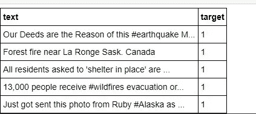
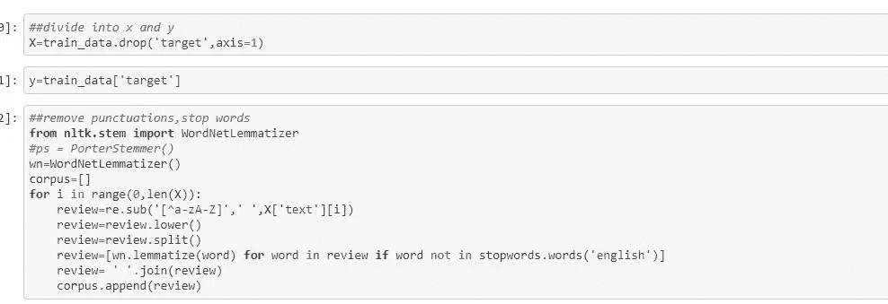
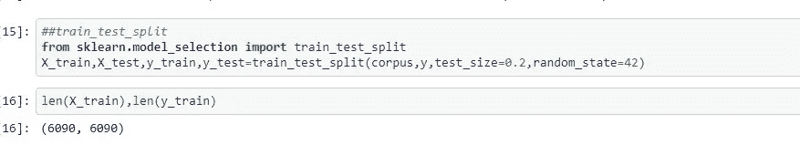
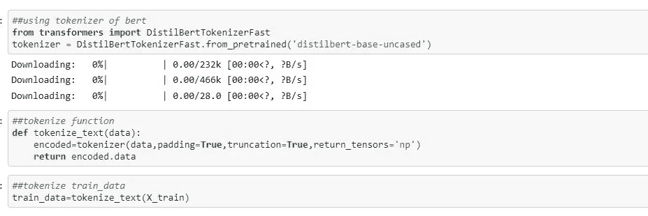
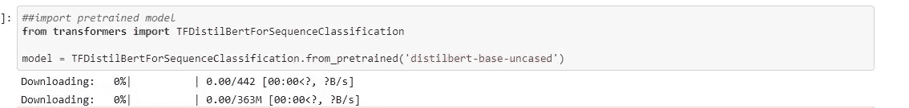
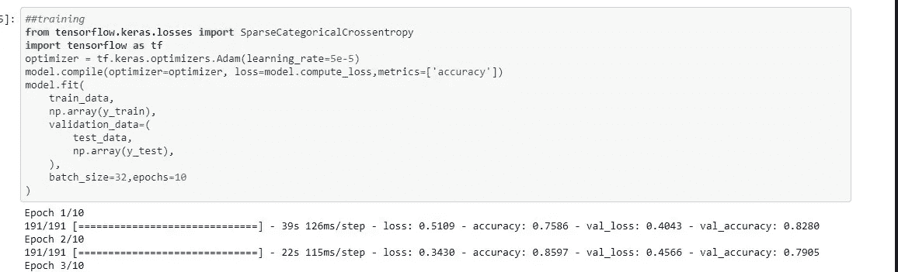
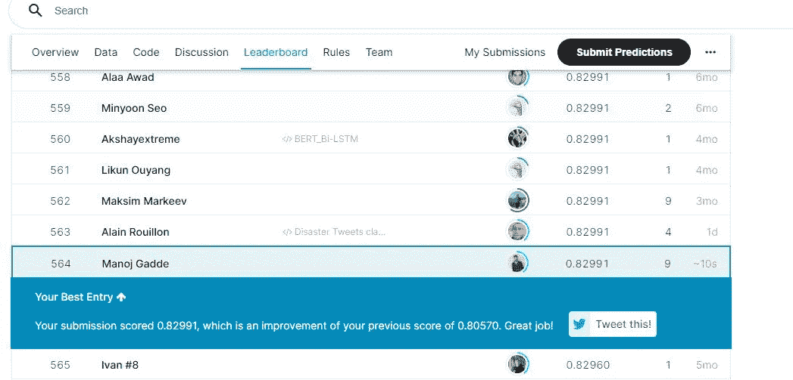

# 用 5 行代码微调 BERT！

> 原文：<https://medium.com/geekculture/fine-tuning-bert-with-5-lines-of-code-78803a51c14b?source=collection_archive---------18----------------------->

在这篇博客中，让我们试着了解如何在 Kaggle 竞赛之一“灾难推文预测”中微调预训练模型(BERT)。到本文结束时，您将能够在自己的数据集上使用 BERT。

所以让我们开始吧！

Google-BERT

**数据理解:** 在这个数据集中我们有 tweets 和它们对应的标签比如 0 和 1。如果推文属于灾难，那么它被标记为 1，否则为 0。因此，在模型训练之后，我们的模型应该能够预测推文是否属于灾难。

Data

但在训练之前，让我们也对文本做一些常规的预处理，如删除停用词、标点符号等。

## **文本预处理:**

Text Processing

在这里，我将两列分成 X 和 y，然后执行预处理步骤，如删除停用词、标点符号和文本的词条化。预处理后，我做了训练和测试分裂。

train and test split

## **使用预先训练的模型标记器:**

这是最重要的一步，到目前为止，我们还没有将原始文本转换成模型可以理解的数值。为了将我们的原始文本转换成数值，我们需要使用一个**预训练模型记号赋予器**，记住记号赋予器对于不同的模型是不同的，这里我们使用“**distilt Bert 记号赋予器 fast** 用于“**distilt Bert-base-un cased**”预训练模型。

tokenizer

在创建了 tokenizer 对象之后，我们只需要将原始文本传递给 tokenizer 对象。

**注意:** tokenizer 只接受列表格式的输入文本序列。

## **导入预训练模型:**

导入模型很简单，我们只需要从 transformers 库中导入' TFDistilBertForSequenceClassification '(因为我们的任务是序列分类)，并使用 **from_pretrained 加载预训练的模型。**

model

## **模特培训:**

training

最后，我们正在编译我们的模型，使用损失函数来计算损失，使用优化器来更新权重。之后，我们将我们的火车数据和相应的标签传递给。通过指定时期和批量大小来拟合()。

通过使用这种方法，我在这次比赛中以 0.82 的分数获得了 564/3000 的排名。

在 BERT 之前，我尝试了其他架构，如 LSTM 和 GRU，但这些模型仅达到 70%的验证准确性。

这个博客到此为止！谢谢你

你可以在这里找到我的 Kaggle 笔记本和数据集:

 [## 初学者:伯特|微调|灾难推文🤗

### 使用 Kaggle 笔记本探索和运行机器学习代码|使用自然语言处理中的数据应对灾难…

www.kaggle.com](https://www.kaggle.com/manojgadde/beginner-bert-fine-tuning-disaster-tweets) 

我的另一篇博客是关于“我如何利用深度学习帮助我的乡村农民”

 [## 我如何使用深度学习帮助我的乡村农民！

### 1.项目创意，它是如何开始的？

medium.com](/analytics-vidhya/how-i-helped-my-village-farmer-using-deep-learning-ecb1f8d5533c)